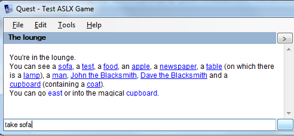
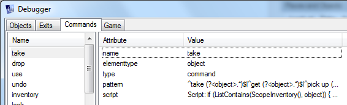

Recently a bug was added to the [Issue Tracker](http://quest.codeplex.com/workitem/list/basic) which sounded like a great one for somebody new to the project to dive into. The issue was that commands with upper-case characters didn't work - you could type "take box" but not "TAKE BOX". Unfortunately, nobody took the opportunity to fix it, so I've fixed it myself. But I thought it would be a good idea to take you through the process from the beginning, so you can see exactly what's going on here. Hopefully by documenting this it will make it easier to join in with the project if you're interested, as I realise all that code can be a bit daunting at first.

This blog post will give you an overview of how Quest 5.0 processes user commands, without prior knowledge of how the system works - I'll try and guide you through the system assuming you've never seen the code before.

For this tutorial I'll assume you have Visual Studio 2010 installed, and that you've checked out the Quest 5.0 source code on [CodePlex](http://quest.codeplex.com). You should also read the [Introduction for Developers](http://quest5.net/index.php?title=Developers) - although the Technical Overview may make more sense _after_ reading this tutorial, so don't be put off just yet!

Note that I have not yet checked in my fix for the bug, so you can still see the bug in action and follow the steps below to fix it on your own machine. **Update:** The fix for this was checked in on 4th December 2010, so if you want to follow these instructions yourself, update to an earlier revision in SVN.

## Reproducing the problem in the debugger

Fire up Visual Studio and open the solution file. Make sure that the "Quest" project is set as the StartUp project, then Run.

We could easily reproduce this issue in any game, and the SVN repository contains example ASLX game files under WorldModelWorldModelExamples-Public. To debug this I chose test.aslx.

Using this game, I did a bit of experimentation with a few different ways of writing the same command, and got this output:

```
> TAKE SOFA
I don't understand your command.

> Take sofa
I don't understand your command.

> take SOFA
You can't take it.

> take sofa
You can't take it.

```

This is interesting - it looks like Quest correctly handles different capitalisation for object names (it handled both "SOFA" and "sofa" in the final two commands, without telling us that it couldn't see an object of that name), but it seems to be having trouble with "TAKE" vs "take". So the problem is with capital letters in the first part of the command, rather than the object name.

## What happens when we type a command

So, which part of the code handles commands? Let me take you on a tour...

First, we're typing commands into a textbox at the bottom of the Quest window, but where does that textbox live in the code?

[](http://new.textadventures.co.uk/wp-content/uploads/2010/11/bug1.png)

The Quest project has a form called Main.vb that contains everything - not just the game playing interface, but the game editor, and the game launcher that you see when you first start Quest. But it's quite a thin wrapper - each of these components is implemented as a user control. The game playing interface is ctlPlayer, which is an instance of Player.vb in the Player project.

Go to Player.vb and you'll see this contains:

- a WebBrowser control, used for the game output
- a Label control at the top, used to display the current location
- two ElementList controls, defined in the same project. These are used for the "Inventory" and "Places and Objects" lists on the right of the screen.
- a Compass control, also defined in the same project.
- aha! A **TextBox and Button**, which is where we're typing in our commands.

So we now know where the chain of execution begins.

## Passing the command from the GUI into the game

If you look at the code behind the button (cmdGo\_Click), you'll see it simply calls the EnterText sub, which in turn calls RunCommand, which calls m\_game.SendCommand(). The same thing gets called when you hit the Enter key inside the textbox (although it happens via a timer so that the KeyDown event code finishes before we send the command).

m\_game is an instance of an object which implements the IASL interface. The idea of the interface is that, in future, we may well want to hook up different "engines" to the same Player interface. This would let the same Quest front-end handle games for potentially different systems entirely, or more likely just different versions of the Quest engine. So we never directly link the Player front-end to the WorldModel project, which in this case is the engine driving test.aslx - we only ever talk to it through the IASL interface.

The IASL interface is defined in the IASL project, and it defines a few methods and events but the really important ones are:

- SendCommand(string) which is how we pass a command into the game
- PrintText event which is how the game tells the GUI what text should be printed

So let's see what happens next. The WorldModel project has WorldModel.cs, which is our implementation of the IASL interface for Quest 5.0 games. If we go here and navigate to SendCommand, we can see that we print the command back, so the user knows what they just typed, and then we call RunProcedure and pass in various arguments.

```
RunProcedure("HandleCommand", new Parameters("command", command), false);
```

What's happening here is that instead of using C# code to handle the command, we're actually going into the ASLX file. WorldModel expects the ASLX file to provide a "HandleCommand" function, which will do all the work of processing what the user typed in. This is part of the design philosophy behind Quest 5.0 - a game author or Quest library author could define their own command parsing logic, or enhance the default logic, without having to make any changes to the Quest code itself.

So what we have here seems to be a bug in the Core library, in the HandleCommand function which is written in ASL, rather than a bug in the C# code.

## Handling the command in the Core library

The default "HandleCommand" function appears in all ASLX games via Core.aslx, which is included in test.aslx (and probably will be in every Quest game) via the include tag:

```
<include ref="Core.aslx"/>
```

You can find Core.aslx under the Core folder in the WorldModel project. You'll see that it includes various other files, as a way of splitting up the file into more manageable parts. You can use Visual Studio's very handy "Find in Files" feature (Ctrl+Shift+F) to find where HandleCommand is defined - it's in CoreParser.aslx.

The ASL should be fairly easy to read as it's not too dissimilar to C#. All its script commands and functions are documented on the [Quest wiki](http://quest5.net/index.php?title=Main_Page).

Let me talk you through how the function works. The parameter "command" is populated with what the player typed in, such as "take sofa", and the first thing that happens is this:

```
candidates = NewObjectList()
foreach (cmd, ScopeCommands()) {
  if (IsRegexMatch(cmd.pattern, command)) {
    list add (candidates, cmd)
  }
}
```

All commands in Quest are objects, and they can either apply to the whole game or a specific room. In the snippet above, we find out what commands are available by calling ScopeCommands() - this will give us back a list of command objects (the function itself is defined in CoreParser.aslx, so take a look if you're interested).

Each command object has a property called "pattern", which defines a regular expression that the input must match to trigger the command. We loop through all available commands, see if the pattern matches our input, and then we have a list of candidates.

The rest of the function determines which candidate is the strongest match for the input. Then it populates variables and runs the command's script.

The command objects themselves are all defined in CoreCommands.aslx, and the "take" command is right at the top. The command object specifies the pattern regex that must be matched to trigger the command:

```
<command name="take" pattern="[take]">
```

In this case the pattern is in square brackets. Anything in square brackets gets taken from the template. In this case the templates are defined in English.aslx, and if we search for "take" in this file we find three verb templates that match:

```
<verbtemplate name="take">take</verbtemplate>
<verbtemplate name="take">get</verbtemplate>
<verbtemplate name="take">pick up</verbtemplate>
```

Verb templates are a special kind of syntactic sugar to save us the hassle of repeatedly typing very similar (and very ugly) regular expressions. If you run the game and click the Tools menu, then Debugger, you'll see what the effect is. Click the Commands tab and look at the "take" object.

[](http://new.textadventures.co.uk/wp-content/uploads/2010/11/bug2.png)

You'll see that via the magic of these three verb templates, the "pattern" property of our "take" object becomes:

```
^take (?<object>.*)$|^get (?<object>.*)$|^pick up (?<object>.*)$
```

Now we see why both "take SOFA" and "take sofa" work - they both match this regular expression, with the named "object" group being "SOFA" or "sofa" respectively. But a command like "TAKE SOFA" will not be matched, as the regular expression expects the word "take" to be in lower case. This means that when we type "TAKE" in capitals, the "take" command won't even be added to the "candidates" list in the ASL snippet above, hence the command fails.

## How best to fix this?

The problem is with this line in the CoreParser.aslx snippet above:

```
if (IsRegexMatch(cmd.pattern, command)) {
```

We want to perform a case-insensitive comparison, so we have a couple of options:

- lower-case the "command" string before passing in to the IsRegexMatch function
- update the IsRegexMatch function to perform a case-insensitive comparison

The first option is quickest, and would be a simple matter of updating the line like this:

```
if (IsRegexMatch(cmd.pattern, LCase(command))) {
```

However, I can see two problems with this:

- it requires all command patterns to be defined in lower-case
- it might not work in all languages

[This question on StackOverflow](http://stackoverflow.com/questions/234591/upper-vs-lower-case) leads me to think that updating the IsRegexMatch function would be the best approach.

The IsRegexMatch function is defined in QuestFunctions.cs - so in fact we need to do a C# code change after all, and leave Core.aslx as it is!

\[**Update:** This fix was checked in as part of other work which has moved the code that was in QuestFunctions.cs to a new file ExpressionOwner.cs\]

## Designing the fix

Here is the offending line in IsRegexMatch:

```
System.Text.RegularExpressions.Regex regex =
    new System.Text.RegularExpressions.Regex(regexPattern);
```

which we need to update to

```
System.Text.RegularExpressions.Regex regex =
    new System.Text.RegularExpressions.Regex(regexPattern,
        System.Text.RegularExpressions.RegexOptions.IgnoreCase);
```

Bear in mind this will affect all usages of the IsRegexMatch function - but a quick search through the code reveals that it's only used in one place, and that is the HandleCommand function we've been looking at. So I think this is a safe code change to make for now, and it's a reasonably safe assumption that anybody who wants to call this function in Quest is probably using it for command processing and therefore probably wants to do a case-insensitive search as well. But in the future it may be worth making an overload of this function so that we can specify a boolean to make it explicit whether we want a case-sensitive comparison or not. I won't add this now as I don't think there is much point in adding superfluous functions that may not be needed - it will be simple enough to add this later if anyone requires it.

## Conclusion

So there we have it - a simple one-line change for a simple problem. It took quite a lot of explanation to get here, but hopefully now you have a feel for how things hang together. There is a lot more detail we could go into - just how does that ASL script get run, you may be wondering - and maybe I'll cover these another time. But now you have an overview of how it works, the best thing may be to step through the code yourself and see exactly what's happening at each level.

As I said above I have not yet checked in my fix for this, so for now you can still see the bug in action and step through the code yourself using the tutorial above. **Update:** You can still step through this code if you update to a revision prior to 4th December 2010, or you could still step through the current version - just bear in mind that the fixed code now appears in ExpressionOwner.cs.

I'm happy to answer any questions you may have, so please feel free to add comments to this blog or [ask for help in the forum](http://www.axeuk.com/phpBB3/viewforum.php?f=10). If there is an entire area of the system that you feel needs some more explanation, please let me know and I'll write another blog post to give you an overview.
