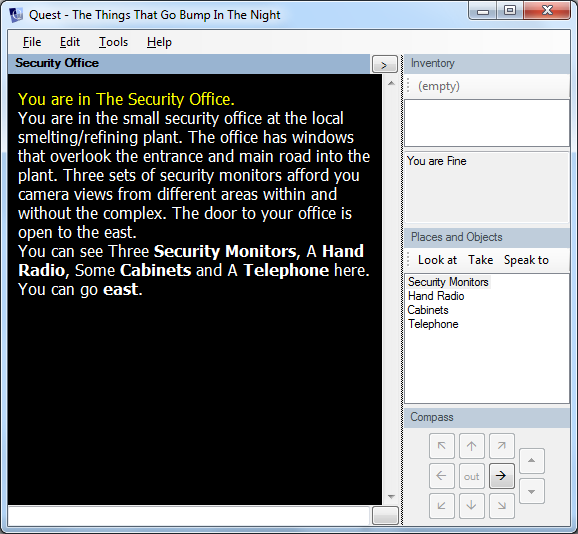
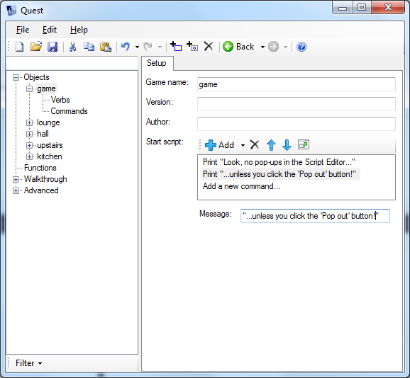

I've just updated the [Quest 5.0 technical preview](http://quest5.net). This new version can play all games written for previous versions of Quest, right back to version 1.0.

Please download it and let me know if you see any error messages, or if anything behaves differently.

The code for running "legacy" ASL games is based on the code for Quest 4.1.4 - it has been converted from VB6 to VB.NET 2010, which is quite a jump, so it is highly likely that some things will need fixing. The code has been refactored to strip out all the old VB6 GUI code, to make a new LegacyASL component which implements Quest 5.0's IASL interface. Doing this has meant adding support for pictures and sounds to the Quest 5.0 Player, so these features will be coming soon to Quest 5.0 ASLX games too.

One thing I've found is that the new .NET code is significantly faster than the old VB6 code. Commands seem to be processed quicker, and if you've ever tried to load a large game into Quest only for it to hang for several minutes, you'll be pleased to hear that Quest 5.0 loads games pretty much instantly. One packaged CAS game which took about 10 minutes to load in Quest 4.1.4 on my machine takes a couple of seconds in Quest 5.0!

So please download the new Technical Preview version at [http://quest5.net](http://quest5.net) and let me know if you encounter any problems.

## Editor Preview

This new release has a preview of the Editor. It is currently _very_ limited - so much so that I considered disabling it entirely for this release, but some people said they were interested in seeing how things were shaping up.

So, bear in mind that you can't really do much with the Editor yet. What you can do is open an _existing_ ASLX file (no support for creating a new game yet), and see the treeview of all elements in the game. If you click the "game" element, you can play with a limited preview of the Script Editor.

Some features that _do_ work:

- There is full support for undo and redo
- The Script Editor lets you add and delete commands. I've refined the design from Quest 4.x - there are no pop-out windows at all, although you can click the "Pop out" button if it all gets a bit crowded. The "If" editor is a work in progress, so you will probably crash the application quite quickly if you start playing with it.
- You can change the Filter at the bottom of the treeview to see elements that are loaded from libraries such as Core.aslx.

