Quest 5.0 has finally reached beta stage!

You can download Beta 1 from [http://quest5.net/index.php?title=Downloads](http://quest5.net/index.php?title=Downloads)

This is the first "full-featured" release, in the sense that it's the first release of Quest 5.0 which you could use to create a game from scratch.

It will be quite buggy though, as all Beta releases generally are. Also, although it's version 5.0, don't forget that as this is a complete rewrite, it's a fundamentally brand new system, so this is more like a v1.0 beta. But if you like Beta software, that's a good thing, because there will be even more bugs for you to find! You can report bugs on the [forum](http://www.axeuk.com/phpBB3/viewforum.php?f=10) or the [Issue Tracker](http://quest.codeplex.com/workitem/list/advanced) or you can email me at [alex@axeuk.com](mailto:alex@axeuk.com).

New features since the last technical preview version:

- a fully working Editor
- a game browser allowing easy and direct access to games on textadventures.co.uk
- support for graphics and sounds
- German and Dutch translations

Read on for full details...

## Quest is growing quickly

I left my job a couple of months ago to work full time on Quest. There's just so much that I want to do, and it would take forever to get there otherwise, so I'm taking a short-term hit to invest in the long-term future of Quest (I haven't _quite_ worked out how to make any money from a free open-source system, so this may not necessarily be a clever idea).

Open-source site Ohloh have just improved their code analysis graphs, and Quest's graph is [pretty interesting](http://www.ohloh.net/p/quest) - it has grown 50% since the end of March. (You can see one other big jump in December 2010 when I checked in the port of LegacyASL to handle older Quest games)

[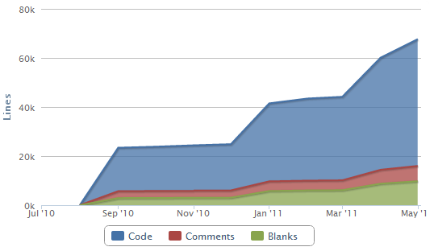](http://blog.textadventures.co.uk/wp-content/uploads/2011/05/codeanalysis.png)

I've been working hard to get to the point where Quest 5.0 is now of "initial beta" quality. There are still quite a lot of outstanding tasks, but it's now at least possible to load Quest, create a new game from scratch, add things to it and play it. The foundations for all features are at last in place, and we have a solid base from which to build.

So, what's new since the last technical preview?

## Making it easy to get games

Quest now features an integrated download manager. You don't need to go to a website, download a game, find it on your hard disk and then open it - instead, as soon as you open Quest, it will grab a list of games from textadventures.co.uk, which you can download within the program and play immediately.

[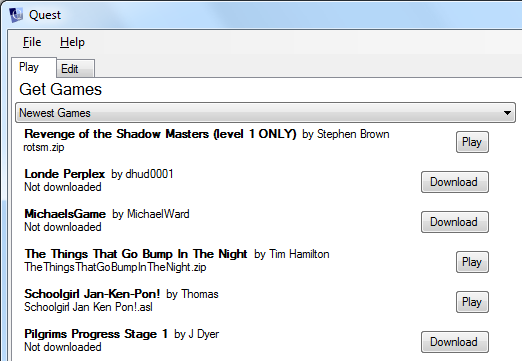](http://blog.textadventures.co.uk/wp-content/uploads/2011/05/gamebrowser.png)

## Editing games

The Editor has been the main thing I've worked on over the last few weeks. You can now create a new game from scratch, add rooms, objects, exits, verbs, commands, functions and walkthroughs, and then play your created game - all within one application.

### The Tree

Every kind of thing in Quest is an element - an object, a verb, an exit, a function... they're all elements, and they're all displayed in the tree on the left hand side of the Editor window. It will be familiar to Quest 4 users, but it's even better in Quest 5 - if you have objects inside objects inside other objects, you can see the full hierarchical relationship within the tree, and you can click and drag to move elements around. It also has a search feature.

[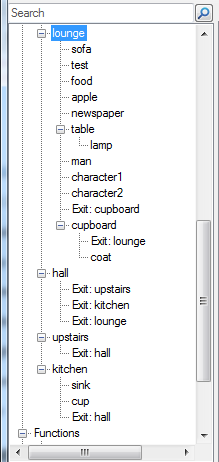](http://blog.textadventures.co.uk/wp-content/uploads/2011/05/tree.png)

Element Editors

When you select an element from the tree, you'll see the relevant editor, such as the one below for an object:

[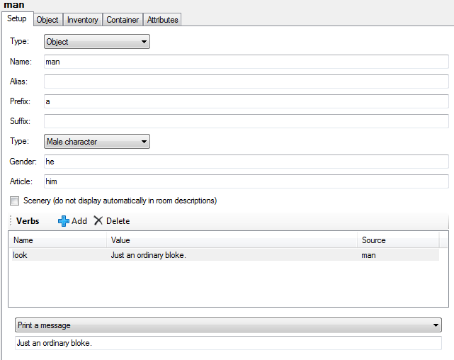](http://blog.textadventures.co.uk/wp-content/uploads/2011/05/objecteditor.png)

The element editors have been designed from the outset to be completely extensible. Every element editor is in fact loaded from the Core library, which means that it's easy to add functionality such as a new checkbox for a particular object feature. The Core library therefore defines not just the standard game behaviour, but the standard game editors. This means that:

- as the Core library gains features, it's easy to update the editor to reflect them
- new editor checkboxes, textboxes etc. automatically gain standard functionality such as undo/redo, and inheriting attributes from included types
- if you write a Quest extension, you can add editor support easily, and it will be just as rich as the standard functionality
- if you want to entirely replace the Core library, you can create your own Editor screens to go with it

### Script Editor

The Script Editor is probably the most important part of the Editor, and the most complex. Behind Quest 5 lies a much more powerful version of the ASL scripting language than was present in previous versions, yet I want the Script Editor to be even easier to use.

The general aim is to make it possible for you to edit complex scripts, just a complex as in any "full" programming language, but in plain English. Quest takes a slightly different approach compared to other systems such as Inform. In Inform, the syntax is very "English-like", making it easy to read Inform code, but you have to know the "correct" way to express yourself as you type in code. In Quest, you don't type commands - instead, you select them from a searchable, categorised list, and you fill in the blanks.

**Step 1. Choose a command...**

[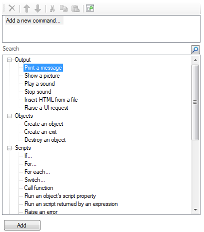](http://blog.textadventures.co.uk/wp-content/uploads/2011/05/scripttree.png)

**Step 2. Click "Add", then fill in the blanks...**

[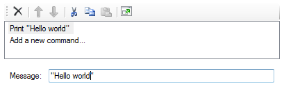](http://blog.textadventures.co.uk/wp-content/uploads/2011/05/scriptcommand.png)

**Step 3. Lather, rinse, repeat if desired.**

You can add as many script lines as you like, and you can build up arbitrarily complex scripts if you add something like an "if" command or a loop.

I think the current design is far more user-friendly than the Script Editor in Quest 4. There are no pop-up windows, and you can't accidentally change the command you're editing into a completely different command with a misplaced mouse click. The list of scripts updates in real-time as you type, even as you update nested scripts (such as "Print a message" commands inside an "if" script's "then" block).

You don't need to scour the list to find the script command you need - you can quickly search for it. For example, search for "picture" to find any commands relating to pictures:

[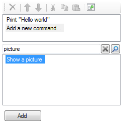](http://blog.textadventures.co.uk/wp-content/uploads/2011/05/scripteditor.png)

There's still some way to go with the Script Editor, though. A major part of the complexity of a script is in creating expressions - calling functions etc. The current beta doesn't give you _any_ help with that. Eventually I want there to be drop-down lists of functions, but for now you'll have to type in expressions yourself.

Also, the Script Editor is currently implemented in WinForms, which seems to be quite glitchy when you have a complex script containing multiple "if" commands as it's creating quite a lot of window elements. I'll probably work on a WPF version of the Script Editor for Beta 2.

### Undo, redo, cut, copy, paste

The Editor supports unlimited undo and redo. Didn't mean to delete that object? Pasted a script in the wrong place? Now you can go back in time to correct your misdeeds - your text adventure editing ones anyway.

You can cut, copy and paste any element. In QDK 4 you were limited to objects - now you can copy and paste everything.

[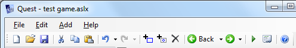](http://blog.textadventures.co.uk/wp-content/uploads/2011/05/toolbar.png)

As both the Player and the Editor are the same program, when you click Run you'll be able to play your game in the same window. Typing "quit", pressing Ctrl+F4 or choosing "Stop Game" from the File menu brings you back to the Editor.

### Code Editor

QDK 4 had an ASL viewer which wasn't too useful - now you can quickly drop into the code viewer and edit by hand. Useful for those comfortable getting their hands dirty with code. You get XML syntax highlighting too.

[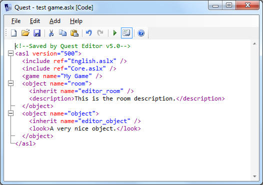](http://blog.textadventures.co.uk/wp-content/uploads/2011/05/codeeditor.png)

If you reference any JavaScript in your game to customise your interface, you can also edit that within the Editor, again with syntax highlighting.

### Library Elements

Most of the standard game functionality comes from the Core library, and the Core library consists of elements, so it makes sense to be able to view these in the editor too. If you turn on "Show Library Elements" from the Filter menu at the bottom of the tree, you can see all elements defined in the library. If you select one of these, you can see its entire definition, and copy it to your game if you want to customise it yourself.

For example, the default implementation of the "take" command is defined in the Core library, and here it is in the Editor:

[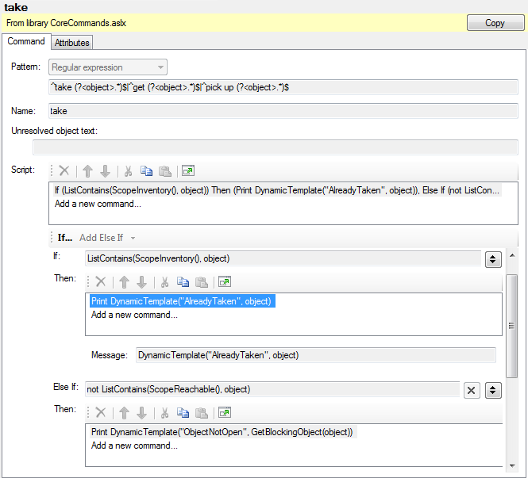](http://blog.textadventures.co.uk/wp-content/uploads/2011/05/library.png)

### Attribute Editor

The "Attributes" tab on elements allows you to enter your own arbitrary attributes. All element data is stored in attributes, so you can in fact edit every aspect of an element here.

If an attribute is greyed out, it's because it's inherited from a type instead of being defined on the element itself. You can still edit them though - they'll be copied to your element if you do so, which will mean you're overriding the default value from the type.

[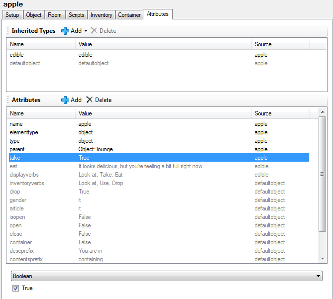](http://blog.textadventures.co.uk/wp-content/uploads/2011/05/attribute.png)

## Translations

I've designed Quest 5 from the beginning to support games in other languages. No game text is hard-coded - it all comes from a library. When you create a new game in the Editor, you'll be prompted to choose a template, and already in Beta 1 you can choose from English, German or Dutch templates.

Many thanks to Lina Anna and Pertex respectively for providing the Dutch and German translations - I'm very keen for Quest to support as many languages as possible, so I'd be happy to receive any other translations! You can edit a copy of the English.aslx file in your Program FilesAxe SoftwareQuest folder.

## What's next?

Beta 1 is just the beginning - there's plenty of work to do. I already have a fairly extensive list of things to implement for Beta 2 - see the [Beta 2 items on the Issue Tracker](http://quest.codeplex.com/workitem/list/advanced?keyword=&status=Open%2b%28not%2bclosed%29&type=All&priority=All&release=Quest%2b5.0%2bBeta%2b2&assignedTo=All&component=All&sortField=LastUpdatedDate&sortDirection=Descending&page=0) for full details.

I'm hoping to be able to iterate through releases fairly quickly, so hopefully it won't be too many weeks before Beta 2 becomes available.

I almost have too many ideas for Quest, so it's important to avoid "scope creep". Version 5.0 will be good, but I don't want it to be like Duke Nukem Forever - so I'm planning to release the final version within a few months, with more goodies to come in versions 5.1, 5.2, 6.0 etc.

## Keep up to date

You can download Beta 1 from [http://quest5.net/index.php?title=Downloads](http://quest5.net/index.php?title=Downloads) - it will give you an update notification on the game browser screen when a new version is available.

You can also [subscribe to the Quest announcements mailing list here](http://www.textadventures.co.uk/lists/?p=subscribe&id=1).

You can also get updates on Twitter via [@TextAdv](http://twitter.com/textadv) (for Quest and textadventures.co.uk announcements) or by following me at [@alexwarren](http://twitter.com/alexwarren) (there are some Quest announcements, but it's mostly other rambling and ranting).

If you have any questions or problems, please ask in the [Quest 5 Forum](http://www.axeuk.com/phpBB3/viewforum.php?f=10) or check the [Quest 5 documentation wiki](http://quest5.net). Please report any bugs on the [forum](http://www.axeuk.com/phpBB3/viewforum.php?f=10) or the [Issue Tracker](http://quest.codeplex.com/workitem/list/advanced), or email me at [alex@axeuk.com](mailto:alex@axeuk.com).
