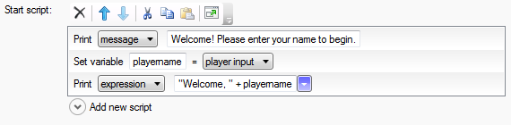
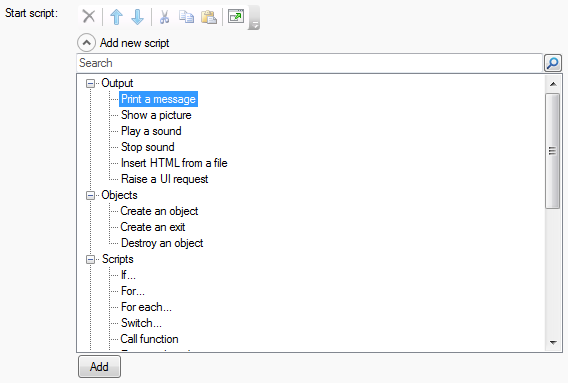
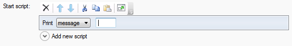
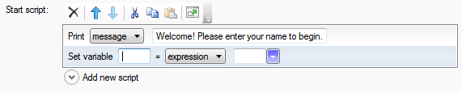
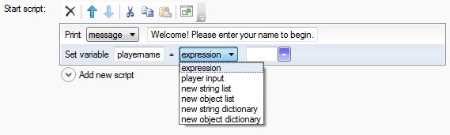
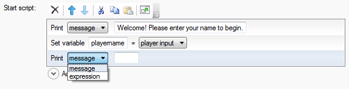
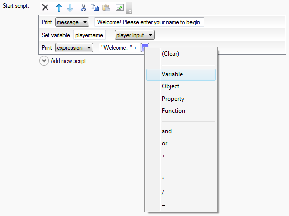

I've often described Quest as allowing you to create text adventure games "without programming", but of course that's not strictly true. While you _could_ create a game without using any scripts at all, you'd only be able to tap into very basic, default behaviour, so it would be quite a boring game.

What Quest has always aimed to do is to make creating scripts easy, by taking a different approach to programming. You still enter commands, use variables, functions and so on, just as in "real" programming, but the Script Editor guides you through the process and tries to make it as intuitive as possible. There's no need to remember syntax, type in strange punctuation or even remember the names of commands, because the Script Editor shows you all the available commands, and guides you through entering their parameters.

It essentially presents a graphical layer in front of the underlying code. The underlying code is still there, and in Quest 5 it looks pretty much like any other programming language, but the Script Editor shields you from all of that, and displays as much as it can in plain English. The aim of this approach is that you should be able to get started quickly, even if you've never programmed before, but also know that you have as much power as you could ever need if you delve a little further.

With the new Script Editor appearing soon in Quest 5.0 Beta 2, I think I have achieved my aim of improving on the design of the Script Editor in Quest 4, making it both quicker and easier to use for beginners, but exposing the full power of Quest 5's new scripting language for those that need it. At the same time, the Script Editor is flexible enough that new libraries can hook into it to allow the game author to easily use all of the library's features.

In Beta 2, I have rewritten the Script Editor UI from Beta 1, so it now looks quite a bit different. Here's an example of the Script Editor showing the kind of script that often appears at the beginning of a game - it prompts the player to enter their name, and then welcomes them to the game:

[](http://blog.textadventures.co.uk/wp-content/uploads/2011/06/scripteditor.png)

Behind the scenes, this the script that has been created:

```
msg ("Welcome! Please enter your name to begin.")
playername = GetInput()
msg ("Welcome, " + playername)
```

Let's look at each of these commands in turn, and how the Script Editor helps you to create this kind of script.

First, there's a command which simply prints a message to the screen. Starting with a blank Script Editor, the only option we have is to expand the "Add new script" section, which gives us a searchable, categorised tree of all the commands we can use:

[](http://blog.textadventures.co.uk/wp-content/uploads/2011/06/scriptadder.png)

We can click "Add" or double-click to add this command. Now the Script Editor looks like this:

[](http://blog.textadventures.co.uk/wp-content/uploads/2011/06/scriptaddmsg.png)

We can simply start typing the message. No need to worry about closing quote characters, or indeed including quote characters within the message - the Script Editor handles all of that, ensuring the underlying script is created correctly (with any quote characters in the message escaped if necessary).

Next, we want to add a command which will store the next thing the player types in at the command prompt. We click "Add new script" again, and add the "Set a variable or property" command, which can be found in the "Variables" category (or by typing "set" in the search box).

[](http://blog.textadventures.co.uk/wp-content/uploads/2011/06/scriptaddset.png)

We can type in a name for our variable, "playername" for example. Next we need to enter the value for the variable. We can enter any expression, such as "2", "foo", "3+8", "SomeFunction()" etc. So we could call the function ourselves, but the Script Editor has another trick up its sleeve - expression templates.

Expression templates appear for a number of script commands, and provide access to common functions. They are context-specific, so you see different expression templates for the "set" command than for the "if" command. If you click the "expression" drop-down, you'll see the available templates. Currently, for "set" you will see this:

[](http://blog.textadventures.co.uk/wp-content/uploads/2011/06/scriptexpressiontemplate.png)

(This list may well be expanded before Beta 2 is released, and the templates are defined in the core library, meaning that the list can be easily extended)

Selecting "player input" completes the command, and now we can add the final "print" command to welcome the player. But this time we don't want to print a static message - we need an expression, so we can include the value of the "playername" variable we created earlier.

A similar dropdown on the "Print" command allows us to switch to an expression:

[](http://blog.textadventures.co.uk/wp-content/uploads/2011/06/scriptprintexpression.png)

We can now add the expression ""Welcome, " + playername", and the Script Editor will give us a bit of help with that, too. The blue triangle to the right of the expression contains a menu which allows us to add things to our expression:

[](http://blog.textadventures.co.uk/wp-content/uploads/2011/06/scriptexpression.png)

Selecting "Variable" from the menu gives us a drop-down list of all variables in the current scope - in this case, just the "playername" variable we created earlier. Of course, we can simply type the expression too.

To experienced programmers, this may seem like quite a lot of pointing and clicking to create a simple script. You may think that nobody would want to program this way - but the evidence from previous versions of Quest shows that's not the case. When I first added a visual editor to Quest, way back in 1999, it was far from clear that people would want to program in this way, but people do - the visual editor is by far the most popular way to create games for Quest 4, and while I've always supported the ability to "hand code" games using a text editor, pretty much nobody uses Quest in this way. In Quest 5, the Script Editor is even easier to use, and more powerful, so I hope it will allow both experienced programmers and novices alike a way to get started making games quickly. Quest 5 also features a Code View, so the "hardcore" version is just a click away anyway - you can switch back and forth easily.

The new Script Editor will be available in Beta 2, which I'm hoping to release within the next couple of weeks. If you can put up with buggy code and have Visual Studio, you can try it out now by downloading and building the latest trunk code from [CodePlex](http://quest.codeplex.com).
