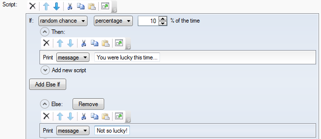
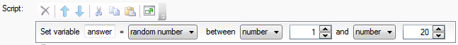

It's been another busy month of Quest development, and I've just released Beta 2.

The main change in this release is a substantial redevelopment of the Editor UI - it is now written in WPF, which has made laying out dynamically sized controls much easier. In particular, this is what has enabled me to implement the new-look Script Editor, as described in [last week's blog post](http://www.textadventures.co.uk/blog/2011/06/13/programming-visually-the-script-editor-in-quest-5-0-beta-2/ "Programming visually – the Script Editor in Quest 5.0 Beta 2").

Aside from that, all bugs that were logged against Beta 1 have now been fixed, and I have also implemented a few other features:

**Static Picture**

You can now keep a picture at the top of the screen, while the text scrolls beneath. This has been a common request for years, and I'm glad to have finally implemented it. Using HTML means that you can use any picture size you like, and the frame will resize accordingly. It means that it works the same wherever your game is being played - whether in the Quest desktop software, or online via the WebPlayer. It also means that in upcoming versions I'll be able to extend this functionality to enable things like using a YouTube clip in the static frame instead.

**Timers**

Timers are now implemented, and you can use them in a couple of different ways. First, you can use them in the same way as in earlier Quest versions, where you can run a script at specified intervals. But there's a new simpler way of creating a "one off" timer, which will run one time only, after a certain time period has elapsed. This creates a timer object behind the scenes, so even if the player saves the game and reloads it later, the timer will still be triggered at the correct time.

**Turn scripts**

Turn Scripts are analogous to timers, but instead of running a script at specified time intervals, you can run a script every time the player enters a command. You can create multiple turn scripts in the game or in different rooms, and enable/disable them at will, so it's a bit more flexible than the "afterturn" scripts from previous Quest versions. Also, just as you can now run a script after X seconds have elapsed, you can now run a script after X turns.

**Random Numbers and Expression Templates**

I've added functions to generate an integer in a range (say, from 1 to 10) and to generate a random floating point number (between 0.0 and 1.0). With the new Expression Templates (covered in the [previous blog](http://www.textadventures.co.uk/blog/2011/06/13/programming-visually-the-script-editor-in-quest-5-0-beta-2/ "Programming visually – the Script Editor in Quest 5.0 Beta 2")), I was able to easily add some nice templates to the editor:

- When adding an "if" script, you can choose "random chance" from the dropdown. You can then enter a percentage between 0 and 100, and that script will then have X% chance of running.

- When setting a variable value, it's very easy to say you want to choose a random number:

**Packaging games**

In Beta 1 you could save your game as an ASLX file, but there was no safe way to distribute your game. Beta 2 comes to the rescue with a new ".QUEST" file format, which is similar to the CAS format in previous versions. It will take your game, including all libraries and external sound, picture files etc., and output one .QUEST file. This will be the file format you'll have to use to upload your game to textadventures.co.uk. This will ensure that games written for one version of Quest will still work in future versions, as the entire Core library will be included within the .QUEST file, so there won't be any incompatibility problems as features are added and changed in the Core library.

**Other features**

You can now put what the player types next into a string variable, ask the player a "yes or no" question, and there's a full-screen option if you want to go completely old-school and get your Windows taskbar out of the way.

**Download now**

You can download Beta 2 now from the [Quest 5.0 Downloads](http://quest5.net/index.php?title=Downloads) page.

You can [subscribe to the Quest announcements mailing list](http://www.textadventures.co.uk/lists/?p=subscribe&id=1), and get updates on Twitter via [@TextAdv](http://twitter.com/textadv) and [@alexwarren](http://twitter.com/alexwarren).

If you have any questions or problems, please ask in the [Quest 5 Forum](http://www.axeuk.com/phpBB3/viewforum.php?f=10) or check the [Quest 5 documentation wiki](http://quest5.net/). Please report any bugs on the [forum](http://www.axeuk.com/phpBB3/viewforum.php?f=10) or the [Issue Tracker](http://quest.codeplex.com/workitem/list/advanced), or email me at [alex@axeuk.com](mailto:alex@axeuk.com).
