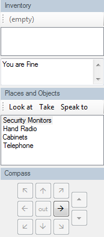
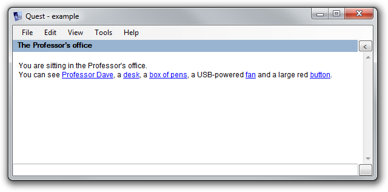
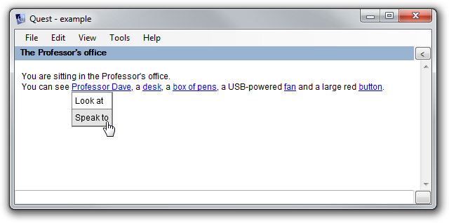
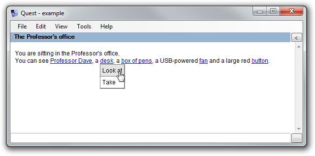
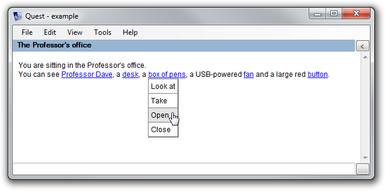
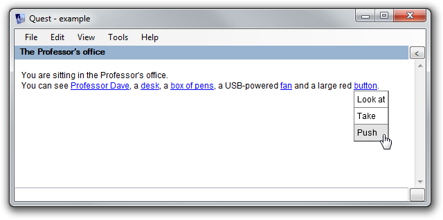
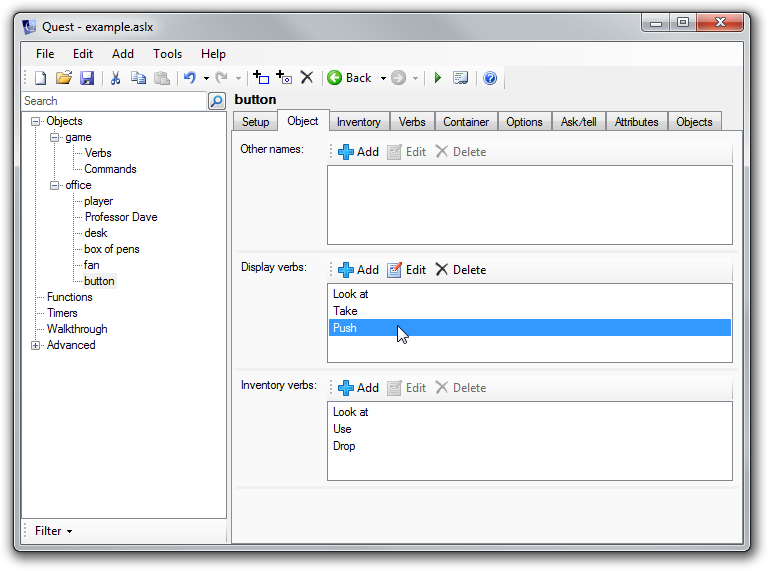

Two classic problems of text adventure games:

1. ["Guess the Verb"](http://www.ifwiki.org/index.php/Guess-the-verb). When you want to do something in the game, it should understand you, and if you're trying to solve a puzzle, you shouldn't also have to figure out the particular sentence formation that the game author was expecting you to use.
2. Players who are new to text adventures often don't know what kinds of things they can type in.

**An old solution**

To address these problems, Quest has always featured lists and a compass to the right of the game window. These show the objects in the player's inventory, and objects and exits in the current room. The idea is that, to a large extent, the player can interact with the game using the mouse.

However, these have always been a little inflexible. Firstly, there was a hard-coded list of verbs ("Look at", "Take", "Speak to") displayed on the buttons. Secondly, not everybody likes the look of the panes, but if you turn them off, you've removed a lot of the help that the player might get.

**A new solution**

Quest 5 introduces another approach - you can dispense with the lists entirely, and use hyperlinks.

When you click one of the links, you get a menu showing the **display verbs** for that object. Each object can have its own display verbs, tailored to the type of object.

Quest provides default display verbs for various object types. For example, **characters** such as Professor Dave:

**Objects** such as the desk:

**Containers** such as the box of pens:

**Switchable** objects, such as the fan:

You can also add **custom verbs** to the list. For example, here we've added "push" to the button:

Apart from the final example, all of the display verbs were set up automatically using the functionality built in to Quest's Core library. When you mark an object as "Male character" for example, you get the relevant display verbs ("Look at", "Speak to") which are different to the display verbs you get for "Inanimate object" ("Look at", "Take"). When you mark an object as being able to be switched on or off, you get "Switch on" and "Switch off" added to the display verbs list.

Any type can add to the list of display verbs. Quest supports multiple inheritance, and the resulting display verbs list can be extended by multiple types. This means that if an object is both a male character, a container and can be switched on/off, you will get the full list of display verbs that you would expect. Any future libraries can also easily add to the list.

From the Object tab, you can customise the display verbs list entirely - adding or removing the default verbs.

 

You can turn hyperlinks off by selecting "game" from the tree, then on the Options tab deselect the "Enable hyperlinks" options. But first consider why you would want to do this - if it's because seeing a list of verbs spoils your puzzle, it probably means it's not a very good puzzle.

Note that the display verbs is _not_ the full list of verbs for an object, so you can easily support additional verbs for detail, without cluttering up the display list.

As with all Quest user interface features, the pop-up list works both on the desktop and via the web. So whichever way people play your game, they will get the same experience. I believe this feature will be especially important for web-based games, because if text adventures are to attract a new (and like it or not, more casual) audience, they have to be easy for people to start playing, and of course hyperlinks provide a very intuitive way to to get web users started.

(The hyperlink feature is available in the current Beta 2 release of Quest 5.0. "Display verbs depending on object type" is a new feature in Beta 3, which will be available soon - or you can [download the latest source code from CodePlex](http://quest.codeplex.com/))
