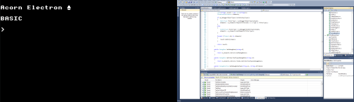

\[Cross-posted from [my Gamasutra blog](http://www.gamasutra.com/blogs/author/AlexWarren/5812/)\]

_We are going to need vastly more programmers over the coming decades. Where are they going to come from? How can we get children started programming at an early age? I have some ideas._

With the proliferation of app stores - first on the iPhone, then Android, Mac OS X and soon Windows - it's easier than ever for people to download games and other types of software. On the web, too, increasing access to broadband and mobile internet around the world means that developers of web apps and games have vast potential audiences, as it's now entirely normal for most people to have web access whenever and wherever they are.

This is a _huge_ opportunity for software developers. With more people using more software more often, one thing is clear - we are going to need a _lot_ of programmers. The potential market is already absolutely enormous. Just imagine how big it's going to get over the coming years - and how valuable programming skills will be.

But it is already very difficult to find good developers. HR departments and recruitment agents rarely have much of a clue about the skills required for the jobs they're trying to fill, so they're pretty ineffective filters - which means plenty of people who can barely program are still able to get interviews. I've had candidates stare pretty blankly at me when I've asked them reasonably basic questions - yet amazingly, in many companies, these people still get hired. There are more jobs than qualified developers out there - at least, that is my experience in London anyway, _and_ we're in a recession.

**Making Developers**

So, there is already a developer shortage, and it's only going to get worse. How can we fill the developer gap?

To answer that, we need to know what makes someone become a developer. Many people, myself included, got started on the home computers of the 1980's - the [C64s](http://en.wikipedia.org/wiki/Commodore_64) and [Acorn Electrons](http://en.wikipedia.org/wiki/Acorn_Electron) of the time often booted up straight into a BASIC command prompt. Programming was something that pretty much all computer users did to some extent, and it was relatively easy to get started, as the computers and languages were simple. One boy in his bedroom could create software that was of a similar quality to that which could be bought for 99p on a cassette tape down at the local newsagent. Those were the days.

Fast forward to today, and we've lost that. The vast majority of computer users will never go anywhere near anything resembling a programming language, so they won't even poke around out of curiosity. Even if they wanted to, it is much harder to get started now. Where do you begin? You started up an Electron and you were presented with a very simple screen that threw you straight into programming, and there was even a book in the box called "Start Programming with the Acorn Electron". You almost couldn't stop yourself from programming on one of those. But today, how can you get started on a PC? You can download [Visual Studio Express](http://www.microsoft.com/visualstudio/en-us/products/2010-editions/visual-basic-express) for free - but check out what Microsoft thinks is a [friendly introduction](http://msdn.microsoft.com/en-gb/ff380143). Just go to that page and ask yourself what somebody who has never attempted programming before is likely to make of it.

**One of these is easier to get started with than the other**

**In Schools**

If it weren't for that Electron, I doubt I would be a software developer now. I remember the IT lessons I had at school in the mid 1990's, pre mass adoption of the web, and it was all about using Word and Excel. Very uninspiring. It doesn't sound like much has changed since then, apart from a rebrand of the subject as "ICT" - they're still not teaching programming.

Google's Eric Schmidt [criticised this state of affairs](http://www.guardian.co.uk/technology/2011/aug/26/eric-schmidt-chairman-google-education) recently:

Schmidt said the country that invented the computer was "throwing away your great computer heritage" by failing to teach programming in schools. "I was flabbergasted to learn that today computer science isn't even taught as standard in UK schools," he said. "Your IT curriculum focuses on teaching how to use software, but gives no insight into how it's made."

Recently though, it seems the tide is beginning to change, and people are waking up to what has surely been obvious for years now - we need to [get kids programming again](http://pozorvlak.livejournal.com/169225.html), and we need to act now.

There are plans to [pilot a programming GCSE and A-Level](http://www.independent.co.uk/news/education/education-news/pupils-learn-to-write-computer-programs-2355558.html), but I think programming concepts could be taught even earlier. I started when I was 8 years old, and there must be plenty of kids out there who have the aptitude for it and could do the same thing. We just need to make programming accessible and appealing.

**Simplified Languages**

There are some simplified languages, such as [Scratch](http://scratch.mit.edu/) and Microsoft's [SmallBasic](http://smallbasic.com/). I think there are more creative ways to introduce programming into the curriculum though, and I think the software I have been working on, [Quest](http://www.textadventures.co.uk/quest/), has a role to play here. Quest is designed to [revive the text adventure](http://www.gamasutra.com/blogs/AlexWarren/20110905/8342/Reinventing_text_adventure_games_for_the_modern_web.php), and I think it also has a wide variety of [potential uses for education](http://www.textadventures.co.uk/blog/2011/07/27/teaching-with-text-adventures/), one of which is as a way of introducing the fundamentals of programming.

Quest presents a visual editor so it doesn't have off-putting syntax and crazy punctuation all over the place - all programming script commands are displayed in plain English. There's no need to remember what to type, because the possible script commands can be selected from a searchable list. You can create a very simple game without using any script commands at all, so the programming side of things can be introduced gradually. Underneath is a fully featured, powerful programming language - it has all the fundamental concepts that you would expect, such as variables, functions, loops, expressions and objects.

Because it's not a "pure" programming tool I think it could even be sneaked into other areas of the curriculum - for example, in an English creative writing lesson, pupils creating a text adventure game would be exposed to a few programming concepts, and it wouldn't even hurt a bit.

By playing each other's creations over the web or a school network, that will encourage competition between pupils as to who can make the best game. From the evidence I've seen so far, creating games with Quest is something that school children can really get excited about - some year 7's (11-12 year olds) were so keen they were even [skipping breaks](http://twitter.com/#!/chrisleach78/status/81758927074758656) to continue working on their games.

So if you're a teacher or parent and want to introduce your children to programming, why not [give Quest a try](http://www.textadventures.co.uk/quest/). It is free and open source.

I still have more work to do on Quest to make it even more education-friendly. I'm currently working on version 5.1, and one of my plans is to have a "simple mode" in the Editor, to hide the more advanced features which could be distracting. I hope that this will make it even more suitable for children of primary school age. There is also work to do developing course materials for teachers and pupils - [Kristian Still](http://www.kristianstill.co.uk/wordpress/), an assistant head teacher in Southampton, is currently developing a Moodle course for Quest.

I'm very keen to hear from teachers who may be thinking about using Quest in the classroom, so please get in touch if you have any questions or feedback.
