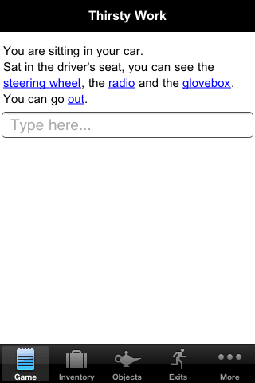
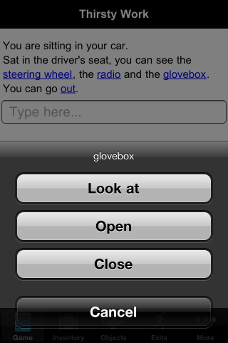
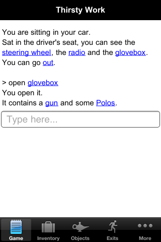
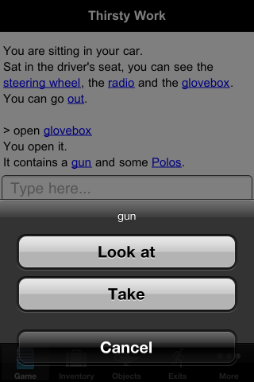
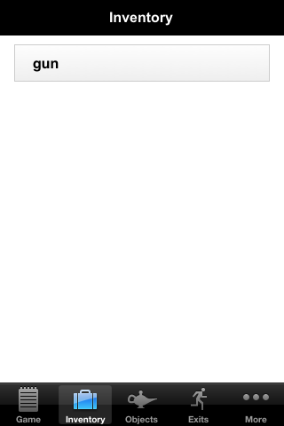
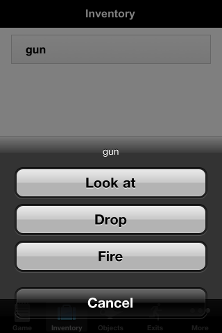
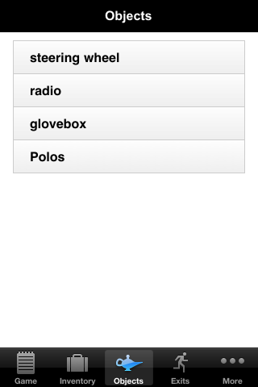
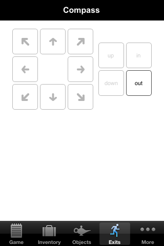
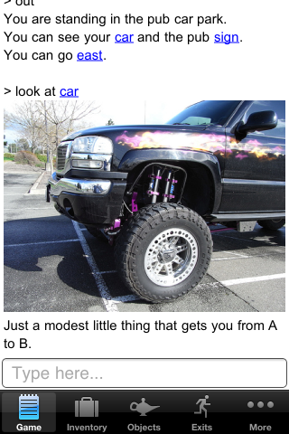

You can already use Quest to create text adventure games for desktop PCs and web browsers. But the big area of growth for games (and indeed software of all types) in recent years has been smartphones, and I'm pleased to report that I am making good progress in bringing Quest games to the iPhone. The way it works is a tool which I am developing to convert Quest games into pure Javascript. By taking the output of this tool and combining it with [PhoneGap](http://www.phonegap.com/), it is possible to create native applications for iPhone, iPad, Android, Blackberry and more, which we can then submit to the App Stores. So far, I've created an iPhone UI which uses a combination of HTML and the [NativeControls](https://github.com/phonegap/phonegap-plugins/tree/master/iPhone/NativeControls) PhoneGap plugin for added iPhone-native slickness (there is still some way to go before pure HTML UIs are really good enough). I'm pretty happy with the results - by using [Quest's existing hyperlink support](http://www.textadventures.co.uk/blog/2011/07/11/eliminating-guess-the-verb/ "Eliminating “Guess the Verb”") to cut down on the amount of typing required, I think I have come up with a design which makes text adventures work nicely on a mobile phone. First, here's a screenshot showing the start of an example game. Objects and exits have hyperlinks, and there is a clearly marked textbox for typing in commands. There are tabs at the bottom of the screen for Inventory, Objects, Exits and "More".  Tapping a hyperlink brings up a standard style iPhone menu. In this screenshot, we've just tapped the "glovebox" object link, and we see the display verbs:  If we tap "open", the "open glovebox" command is inserted, complete with another hyperlink to make it easier to perform further actions on the same object.  Tapping the gun in the output above again gives a pop-up menu. It's a different set of options this time- in a Quest game, each object can have its own set of "display verbs", and I think it is especially important for the mobile phone version of a game that each object has relevant display verbs.  If we tap "take", we're now carrying the gun. If we switch to the Inventory tab, we can now see it listed.  If we tap the gun in the inventory, we again get a list of verbs. This time it's Quest's "inventory verbs" that are used, so we get a different list of relevant actions now that we're carrying the gun.  The Objects tab is laid out in a similar fashion to the Inventory tab, and shows the objects in the current location.  The compass tab shows the familiar Quest compass, with available exits highlighted. You can tap an exit to move in that direction. You could also simply tap the exit's hyperlink on the Game tab.  Images are resized to fit the screen. In this example, looking at the car triggers a script to show a picture and print a message. 

\[[Car picture by skrotmumrik, CC licence](http://www.flickr.com/photos/xmoln/5562585594/)\]

So far, this only works on iPhone, but an obvious next step is to make the UI work nicely for iPad too - which is the perfect excuse for me to go out and buy one! Because I'm using PhoneGap, it will be straightforward to create similar apps for Android too - although the UI would need to be developed for that platform. PhoneGap also supports Blackberry, WebOS, Symbian and soon Windows Phone, so it would be possible to bring Quest games to those platforms too - although it makes more sense to focus on iOS and Android as the main ones. **Let's make it happen** If we're going to find new audiences for text adventure games, we need to make them easy to find, install, and play. Right now, App Stores are a great way of making that happen. I believe they also provide a realistic opportunity to make money from text adventure games - for the first time in years. Think of how many people are happy to buy games for their smartphone, who may never purchase software for their desktop PC. With a few tweaks to the conventional parser-based interface, I hope I've shown that text adventures can work well on a mobile phone. I think they're a great fit for mobile gaming - you can play a text adventure game at your own pace, for a few minutes at a time, whenever it suits you.
