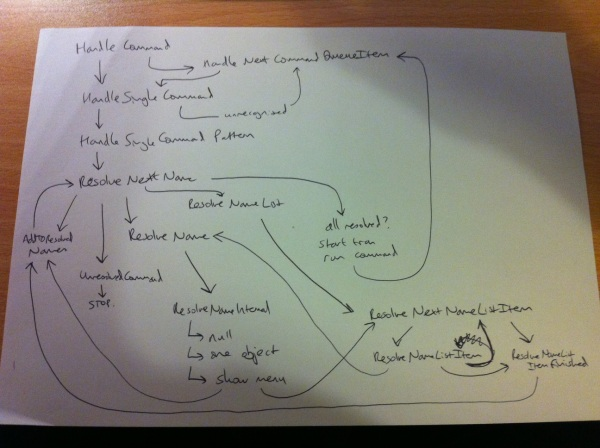

The first Quest-powered smartphone app will be released soon. It is an updated version of Tim Hamilton's [The Things That Go Bump In The Night](http://www.textadventures.co.uk/review/346/), currently one of the top-rated games on [textadventures.co.uk](http://www.textadventures.co.uk/ "Home"), and will be available for both iPhone/iPod Touch and Android devices.

This is the first time that a Quest game has been converted into a native application. As I've explained in a [previous blog post](http://www.textadventures.co.uk/blog/2011/09/30/using-quest-to-create-text-adventures-for-iphone-ipad-android/ "Using Quest to create text adventures for iPhone, iPad, Android"), the way it works is by using a tool which I've built to convert Quest games into pure Javascript. Using [Phonegap](http://www.phonegap.com), this HTML/JS is then wrapped into a cross-platform app.

That's the theory, but it has taken a bit longer than I initially expected to get this first app ready for release, for reasons which I'll go into below. The good news is that subsequent conversions should now be much quicker and easier.

**Two Conversions**

The first step was actually a pre-conversion - the app converter works with games written for Quest 5, but Tim's game was written for Quest 4, which is effectively a completely different system (although sharing some of the same design). So the first thing to do was convert a Quest 4 game into a Quest 5 game.

I wrote a converter application which converts most of a game correctly, although there were still a few manual tweaks to do - even some Quest 4 bugs to emulate! What really helped was to have a complete walkthrough for the game - Quest 4 has a "transcript" feature which is similar to Quest 5's [walkthrough](http://quest5.net/wiki/Using_walkthroughs) feature. This meant I could have Quest 4 and 5 automatically play the game through to completion, and compare the output, fixing things as I went along.

I then sent Tim the converted Quest 5 game, and he made a few more tweaks and corrections. He also adapted the game to make better use of [hyperlinks](http://www.textadventures.co.uk/blog/2011/07/11/eliminating-guess-the-verb/ "Eliminating “Guess the Verb”") - something which is really important for the smartphone version of the game. Tim's enhancements mean it is possible to play the game through in its entirety, without having to type anything.

By the way, now that I have an internal Quest 4 to Quest 5 conversion tool, please [get in touch](http://www.textadventures.co.uk/help/contact-us/ "Contact us") if you have an old game you'd like to convert. The conversion isn't perfect (which is why this won't become part of Quest itself), but it can get you most of the way.

**Re-engineering Quest**

The next step was to convert Tim's enhanced Q5 version of the game to Javascript, using the converter which I announced back in September. I'd thought the converter was 90% done, but as is the case with so much in the software world, the last 10% took far longer than the first 90%.

The main difficulty has been threading. Javascript is single-threaded, which means you can't pause a running thread while you wait for some user input. This meant I needed to re-work all of Quest's functions for displaying menus, waiting for keypresses, asking questions etc. The result of this is new asynchronous versions of various functions, which are implemented in Quest 5.1 and used by the Core Library, as the old synchronous versions of the functions cannot be converted to Javascript.

Being unable to block the thread to display a menu meant that I had to rewrite the parser, as this often needs to display menus to resolve the typed-in object names. I drew myself the diagram below and almost descended into insanity in the process:

So, that was annoying, but it's actually a better design for the future (especially when playing a game via the web, as the server will no longer need to keep a thread hanging around if it's waiting for the user to respond to a menu).

Eventually I had a pure HTML/JS version of the game which could be played in any web browser. I implemented the walkthrough feature to verify the game was working correctly, and again I sent it to Tim so he could check for any "off-walkthrough" problems.

**Performance**

Now the game was working in HTML/JS, it was straightforward to wrap it in Phonegap and create a functioning app. Even here there were unexpected problems - although the app ran at a respectable speed on my iPhone 4, when I ran it on my old iPhone 3G I was horrified to find that it would sometimes take 10 seconds to respond to a command. The fix was again some re-engineering of Quest 5 and the Core Library, this time adding the ability to cache regular expressions, and improving the performance of the scope functions.

**Saving**

The desktop/web version of Quest 5 saves games by writing out the entire game state. The JS app version takes a different approach, saving a delta instead - only changed attributes are saved to local storage. This is quicker, requires much less local storage, and also means that the app can be safely updated without breaking existing games. The delta is automatically saved after each turn. Again I found some performance issues here, so it took a bit of time to get this right. With a Phonegap app on the iPhone, you get no warning if your app is going to be terminated, so I had to make saving robust enough that it wouldn't break things horribly if the game started saving but never finished (instead, there are effectively two save slots that are used alternately, so the worst that can happen is you lose one turn).

**Android**

By now I had the game working pretty well on iOS, and sent it to a few beta testers using [TestFlight](http://testflightapp.com), which I highly recommend as it takes much of the pain out of ad-hoc distribution on the iPhone. I thought it would be a good idea to get it working on Android too, and I was pretty pleased when only two days after I took delivery of the cheap but surprisingly capable Samsung Galaxy Ace, I had a version that worked on that too.

The Android version looks pretty similar to the iOS version. There is no NativeControls plugin for Android, and Android doesn't "do" iOS-style tabs at the bottom of the screen anyway, but it didn't take long to create a native menu which can be used to switch between screens instead. When tapping an object link, I had to create a Javascript menu to display the verbs, but that was only a small amount of work too, made relatively easily using a [jQuery UI](http://jqueryui.com/) dialog.

I was pleased with the overall Android development experience - it seems so much more developer-friendly than iOS. The documentation is laid out in a way that a mortal can understand, and it's so much easier to send a build to beta testers - just email an APK file. Much more pleasant than dealing with certificates and distribution profiles on iOS.

**Ready**

So it is now ready - the first Quest-powered iOS and Android app, which is also my own first app for these platforms. The iOS version has been submitted to Apple, and I'll submit the Android version as soon as it's approved, so both versions will be available on the same day - watch this space!
