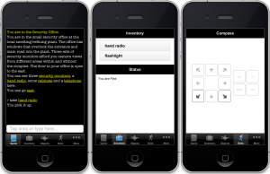

The Things That Go Bump In The Night is now available for [iOS](http://itunes.apple.com/us/app/the-things-that-go-bump-in/id483544547?ls=1&mt=8) (iPhone, iPod Touch, iPad) and [Android](https://market.android.com/details?id=com.axeuk.android.bump) devices.

In this game, written by Tim Hamilton, you are a security guard settling down to a quiet night shift, when things start to go wrong. You must make your way around the compound, solving puzzles and dispatching mysterious beasts.

This is the first Quest game to appear for smartphones, and I believe it is the first text adventure to be specifically designed for a pocket-sized touch screen - you can play the entire game without typing, instead using the hyperlinks and tabs to navigate and interact with the game world.

You can find out more about how the game was made in my [earlier blog post](http://www.textadventures.co.uk/blog/2011/11/29/the-things-that-go-bump-in-the-night-coming-to-iphone-and-android/ "“The Things That Go Bump In The Night” coming to iPhone and Android"). The game is fairly difficult - if you get stuck, check out the comments on the [original textadventures.co.uk game page](http://www.textadventures.co.uk/review/346/) for some tips! Also check out the Twitter hashtag [#ttgbitn](https://twitter.com/#!/search/%23ttgbitn).

More games will be released soon. Maybe you'd like to write one? Any game written for [Quest 5](http://www.textadventures.co.uk/quest/ "Quest") can now be converted into an app, so if you're interested, please [get in touch](http://www.textadventures.co.uk/help/contact-us/ "Contact us")!
