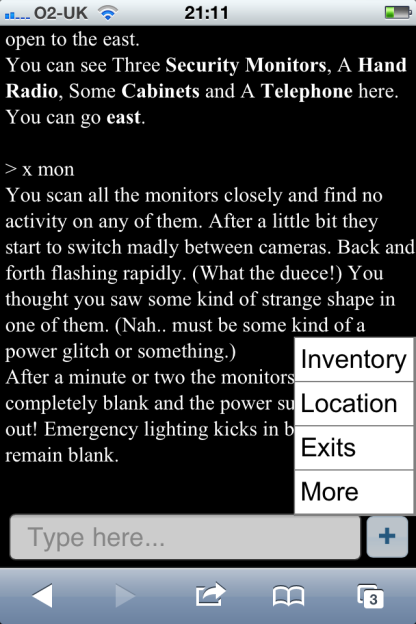
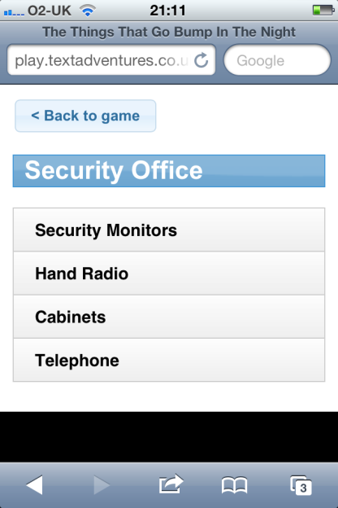
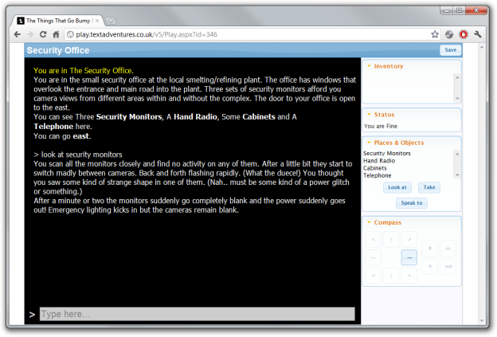

All games on [textadventures.co.uk](http://www.textadventures.co.uk/) can now be played online via iPhone, iPad and Android browsers, and on desktop browsers the player has a fresh new look.

Although the main website isn't particularly mobile-optimised (just yet!), if you click the "Play online" link for a game and are using a mobile browser, you'll see the new mobile-friendly version of the player.

The inventory, compass etc. are moved off onto separate screens, which you can access by tapping the "+" button next to the input box.

This means the experience of playing a game via a mobile web browser is similar to what you get with a stand-alone Quest game app. So that's (currently) 356 games which are now playable through a mobile web browser - plenty of choice for gaming on the move, as long as you have an internet connection.

If you log in first, you can save your progress as you go along by tapping the "Save" button on the "More" tab. The game is then saved under your account, which means if you later log in from a desktop machine, you can resume your game from there.

Mobile browser games support pictures, which are resized to fit the size of the screen. You can also use hyperlinks for those games which have them (although most of the games currently on the site were written for older versions of Quest which didn't support hyperlinks). You can use the Inventory and Location panes to give you quick access to objects without typing. Also, games written for Quest 4.x and later support abbreviations, so you can type "x mon" instead of "look at security monitors" for example.

The mobile player will automatically adjust to the resolution of your device, so it works nicely on tablets too.

The desktop browser player now also has a fresher look:

I hope you enjoy the experience of playing text adventures on your smartphone - don't forget about the [stand-alone smartphone apps](http://www.textadventures.co.uk/apps/ "Apps") as well, allowing you to play on your phone even without an internet connection. I hope to release more games as apps in the near future, and if you're interested in having your game converted into an app, please [get in touch](http://www.textadventures.co.uk/help/contact-us/ "Contact us").
