I was hoping to announce the world's very first online text adventure maker - but, dammit! [Playfic](http://playfic.com/) got there first, by a matter of days. So, what I am announcing today may be the world's second-ever online text adventure maker, but it is also rather different to Playfic as you will see.

The Quest WebEditor is the world's first online _visual_ text adventure maker. It is (almost) the entire desktop version of [Quest](http://www.textadventures.co.uk/quest/ "Quest"), but transplanted into a web browser. So, now you can create a text adventure game, with no prior programming experience, and without downloading any software. You have access to the full range of Quest functionality, including multiple languages, the ability to use hyperlinks in your game (to make it easier to play without typing), and the ability to embed videos, pictures and sounds for a modern text game experience (personally I'm fairly tired of text adventures being thought of as "retro" all the time - there's no need for them all to look like MS-DOS).

Let me take you on a tour!

First, you'll need to log in to [textadventures.co.uk](http://www.textadventures.co.uk/). You'll then be able to access the "Create" page, which looks like this:

[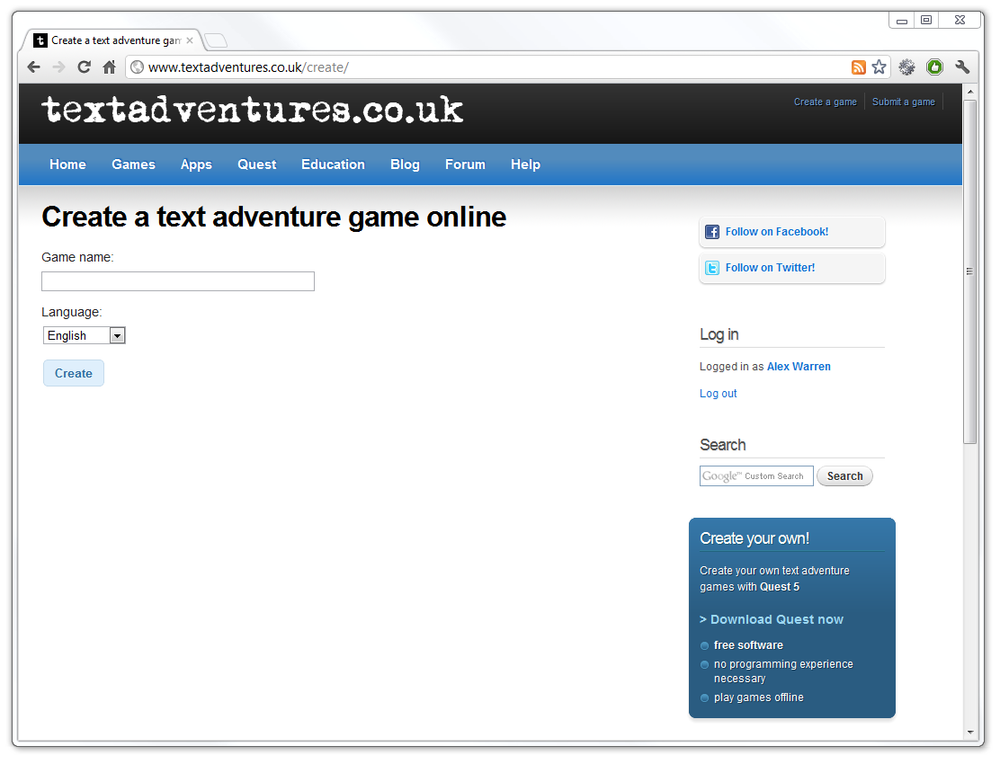](http://blog.textadventures.co.uk/wp-content/uploads/2012/02/01-create.png)

Enter a name for your game (you can always change it later), and choose a language.

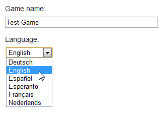

Hit the Create button, and your game will be created. This is what it looks like in the editor:

[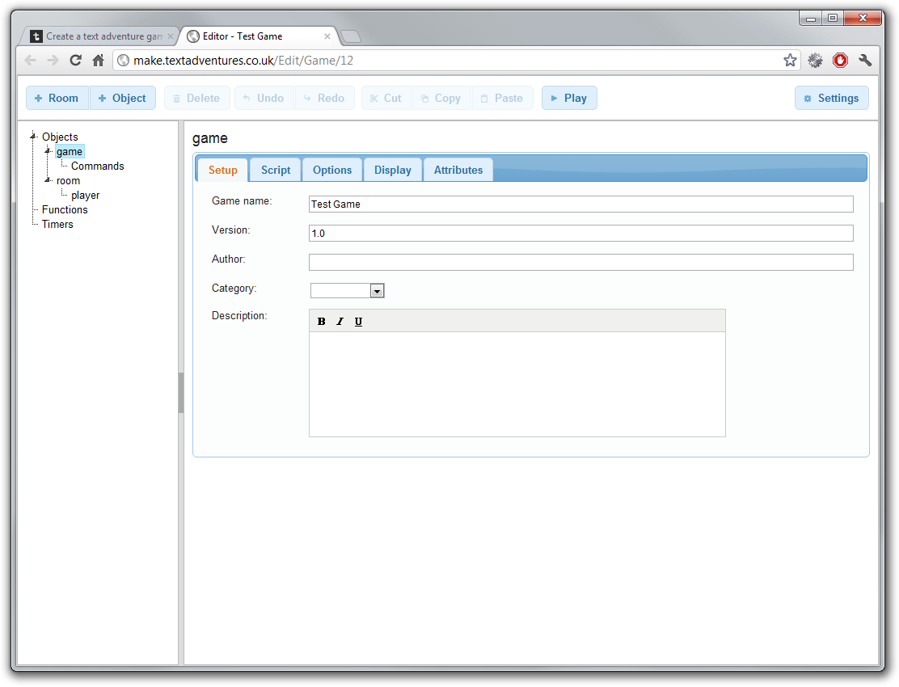](http://blog.textadventures.co.uk/wp-content/uploads/2012/02/03-blank-game.png)

This is a similar layout to the desktop software, and the full range of functionality is available - including cut/copy/paste and undo/redo.

The Settings button lets you turn on Simple Mode - as in the desktop software, this hides away some of the functionality to make it easier to get started.

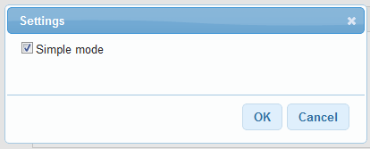

I've renamed the initial "room" to "lounge", and I've clicked the "+ Room" button to add another location to the game, a kitchen. Now, with the lounge selected, I can add an exit to the kitchen from the Exits tab:

[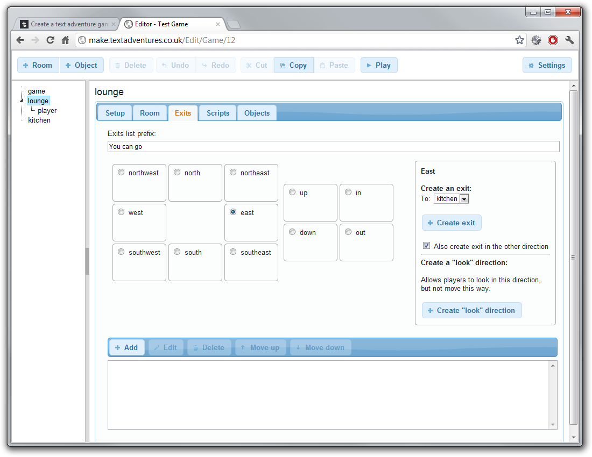](http://blog.textadventures.co.uk/wp-content/uploads/2012/02/05-create-exit.png)

I can add an object by clicking the "+ Object" button. Here I've added a sofa, and entered a text description:

[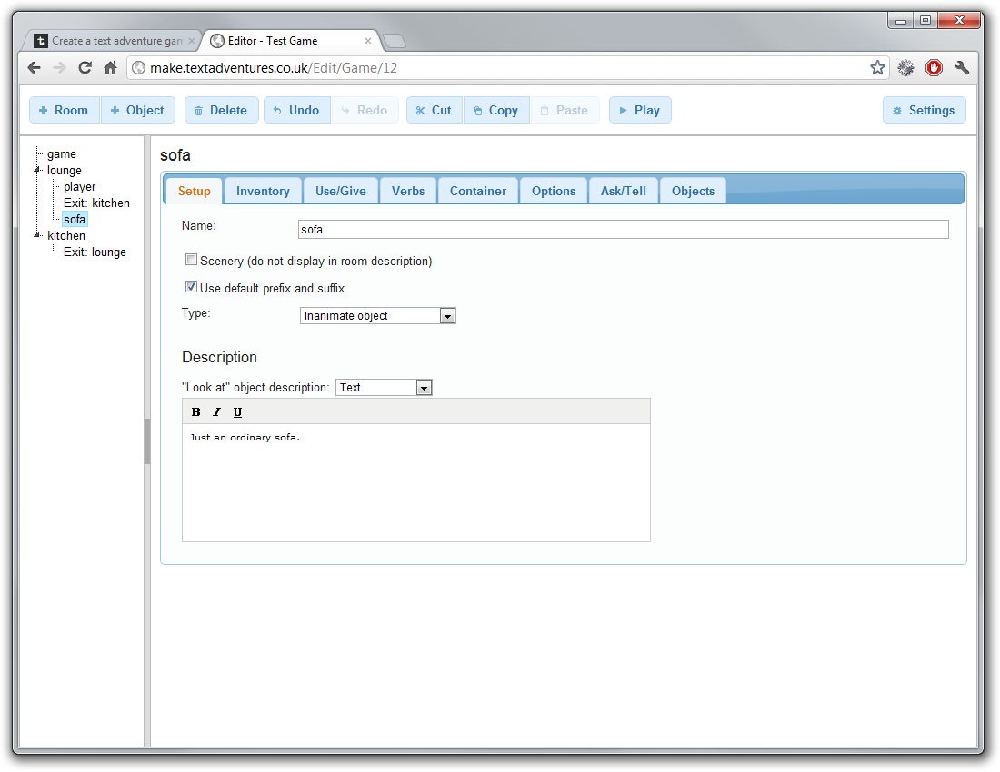](http://blog.textadventures.co.uk/wp-content/uploads/2012/02/06-add-object.png)

I can try the game by clicking the Play button. It appears in a new tab, using the same "play online" interface as the published games on the site.

[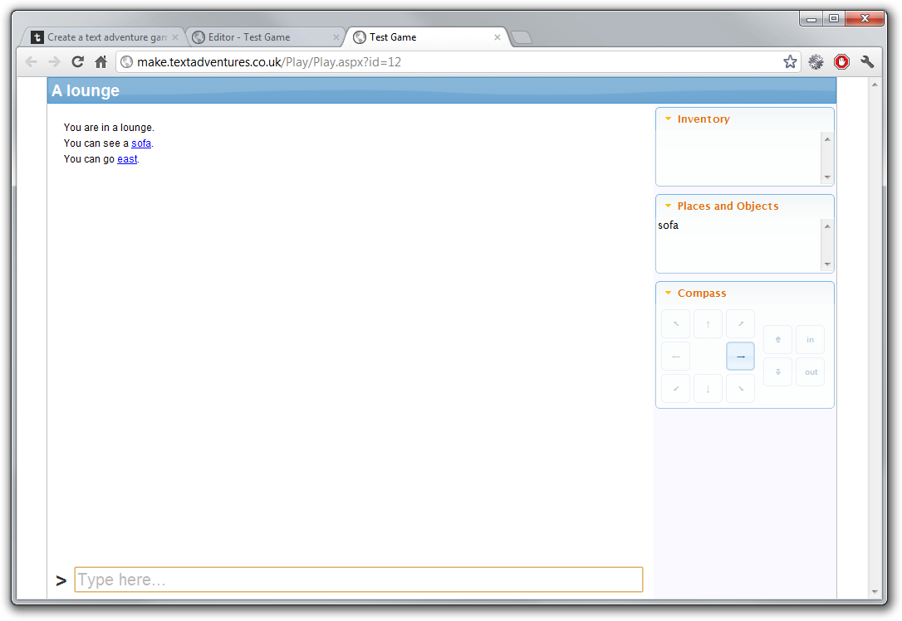](http://blog.textadventures.co.uk/wp-content/uploads/2012/02/07-play-game.png)

I can interact with the game just like all Quest games. There's no need to force your players to type commands - the hyperlinks allow you to make a game which can be played with a click of the mouse, or a touch of the screen:

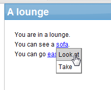

Here's the game output after looking at the sofa, and moving east into the kitchen.

[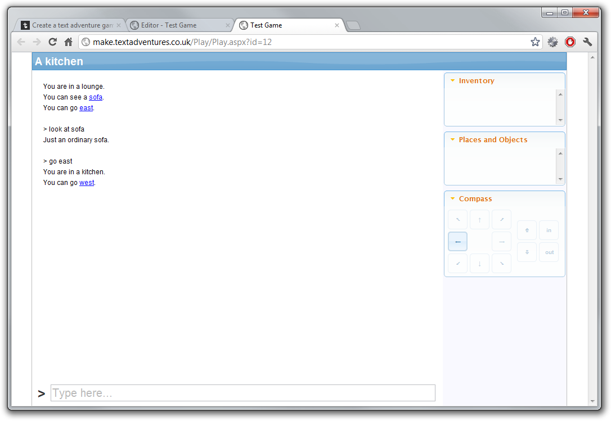](http://blog.textadventures.co.uk/wp-content/uploads/2012/02/09-game.png)

The real power of Quest comes from _scripts_, which let you control anything in the game - move the player, change responses according to what the player has done before, set up puzzles, show pictures and more. Back in the editor, let's change the description of the sofa so that it runs a script instead of just displaying text:

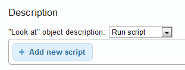

Now we can click the "Add new script" button to choose from various options. This is the Simple Mode list - there is a much bigger list if we turn this off:

[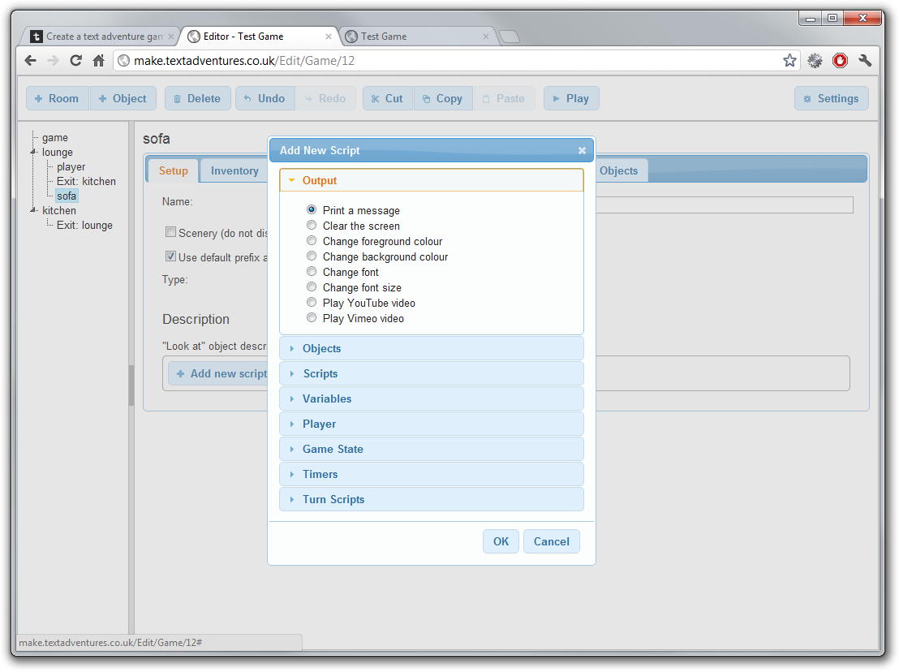](http://blog.textadventures.co.uk/wp-content/uploads/2012/02/11-add-script.png)

Let's play a YouTube video when the player looks at sofa. I choose "Play YouTube video" from the "Add New Script" dialog, and then I can enter a video ID. I found a clip of a TV sofa advert:

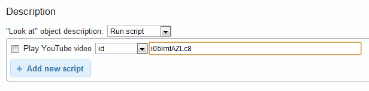

And here's what the game looks like if we run it now:

[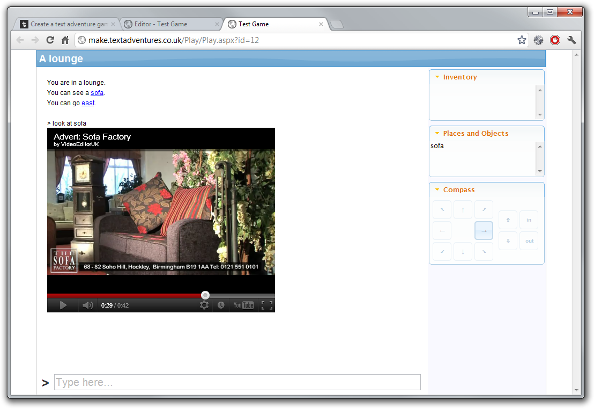](http://blog.textadventures.co.uk/wp-content/uploads/2012/02/13-play-youtube.png)

So there you have it!

This is currently in private beta - [email me](http://www.textadventures.co.uk/help/contact-us/ "Contact us") if you're very keen to test it. Otherwise, I will make it available as a public beta in a few weeks.
