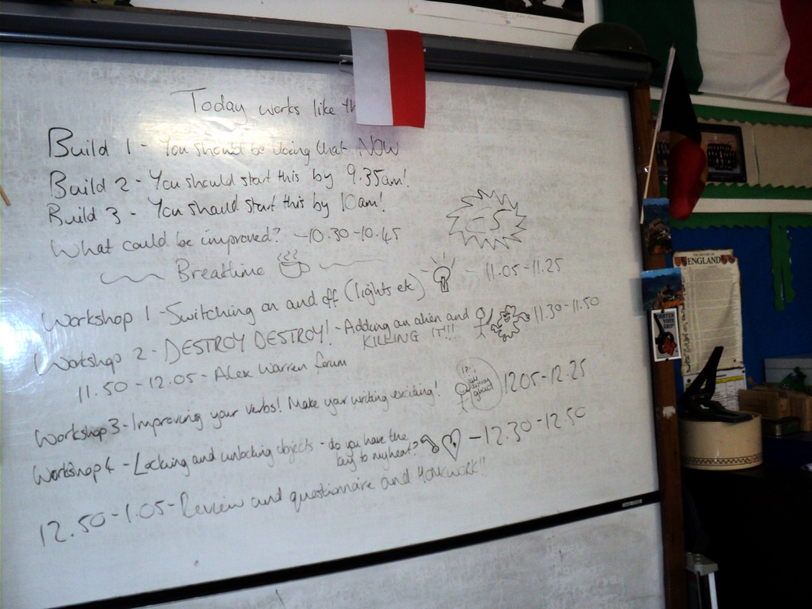
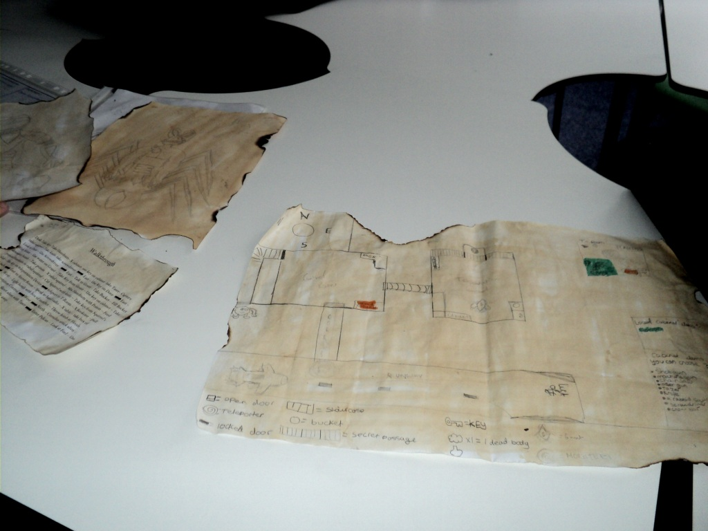
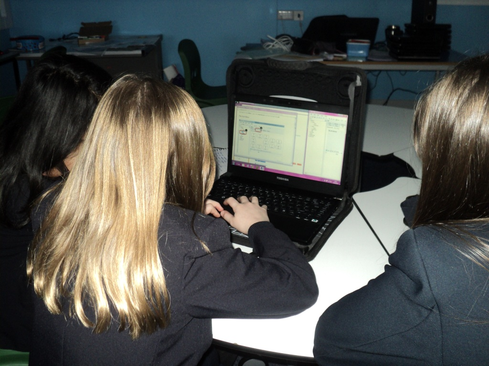
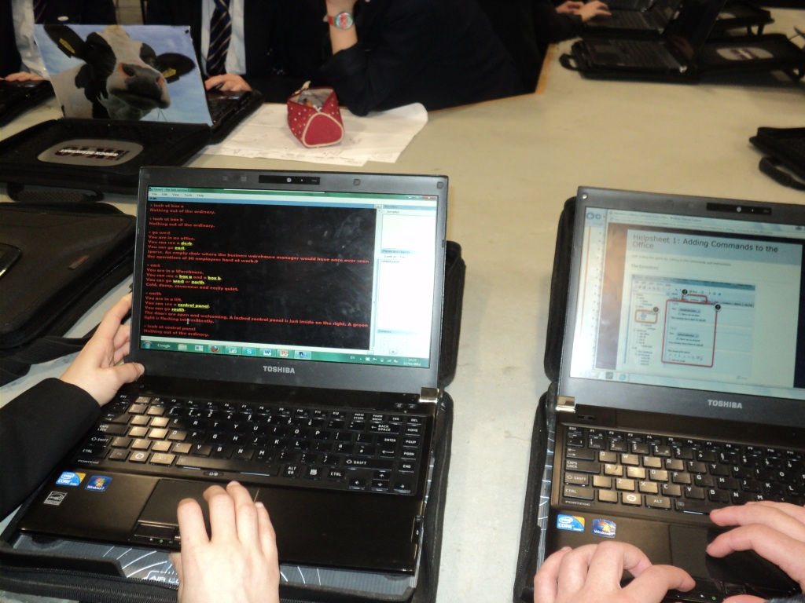

I had the pleasure of spending Wednesday at [Perins School](http://www.perins.net/) in Alresford, Hampshire, where the entire Year 7 (11-12 year olds) went off-timetable for the day to start creating their own text adventures with Quest.

\[caption id="attachment\_1138" align="alignleft" width="625"\] Timetable for the day\[/caption\]

This was part of their "Transform" programme spread over five Wednesdays. In the first week, the school had a visit from a local author to talk about writing and creating characters. In week two, they started looking at text adventures, playing [The Things That Go Bump In The Night](http://www.textadventures.co.uk/review/346/). In week three, they started planning their own games on paper (limiting themselves to four rooms to give a realistic chance of being able to implement the entire game).

\[caption id="attachment\_1137" align="alignleft" width="625"\] Student plans for their own game\[/caption\]

I joined them for week four, where the pupils got to create a Quest game for the first time.

To get everybody up to speed, instead of diving in to create their own pre-planned games, the students were given the same game to implement. This was split up into various "Builds" consisting of step-by-step helpsheets, with only about 30 minutes for each Build:

- Build 1: Creating a new game, setting font and colour options, adding rooms, exits and objects
- Build 2: Adding descriptions to rooms and objects
- Build 3: Taking and dropping, containers, lockable objects, adding verbs, winning/losing the game

\[caption id="attachment\_1136" align="alignleft" width="625"\] Students learn about creating exits\[/caption\]

After the break, various workshops run by myself and Kristian Still. We covered destroying objects, switching objects on and off, locking and verbs, and any other questions the students had such as keeping a score.

I must admit, I thought the timetable was pretty ambitious - these students hadn't seen the Quest Editor at all before the day, yet by the end of it, most of them were getting on really well. They had covered everything they needed to implement their own games next week.

Kristian grabbed a few of the students for some quick "phonecast" interviews, and asked them how they found the day:

- [Overview of the day](http://www.kristianstill.co.uk/wordpress/2012/02/22/ipadio-quest-coding/)
- [Planning their own games](http://www.kristianstill.co.uk/wordpress/2012/02/22/ipadio-quest-coders-of-the-quest/) "I found it was so simple, I just couldn't really resist - I'm doing one at home now. It's a very fun system."
- [Is it difficult?](http://www.kristianstill.co.uk/wordpress/2012/02/22/ipadio-quest-overview/) "It's great fun. It was exciting trying to think up ideas". According to this student, coming up with the ideas is the hard bit, and implementing them is just pressing some buttons! I guess that means they found the software pretty easy to use.
- [Switching objects on and off](http://www.kristianstill.co.uk/wordpress/2012/02/22/ipadio-switched/)

\[caption id="attachment\_1139" align="alignleft" width="625"\] Testing the game\[/caption\]

It was really great to see the students getting on well with the software, and I look forward to seeing their finished games.
