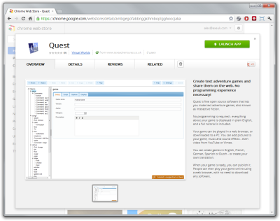
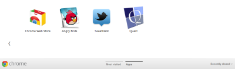

If you use Google Chrome, you can now add the new web-based version of Quest into it as an app, via [this link](https://chrome.google.com/webstore/detail/ambgegofabbnggkihmboplgghoocjaka).

Once you've done that, Quest will appear on your Apps tab:

That's all there is to it - it's pretty much just a link for now. In the future, it could be enhanced to log you in automatically with your Google account, giving you quick and easy access to your games simply by logging in to Chrome.
