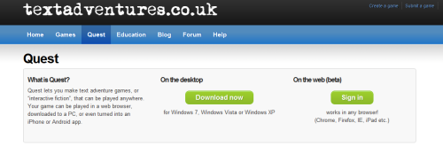

The [web-based version of the Quest editor](http://www.textadventures.co.uk/create/) is now available publicly for the first time. Many thanks to all those who tested it during the closed beta - your feedback has been really useful. Please keep it coming!

I've redesigned the [Quest page](http://www.textadventures.co.uk/quest/ "Quest"), to reflect the fact that for the first time Quest is now available on more than one platform. Whereas before it was a Windows-only download, now you can access Quest from anywhere, in any browser.

I don't expect the desktop software to be disappearing any time soon, but with the increasing popularity of always-connected devices such as tablets, it's clear that any popular software will really need to be available as a web app.

Quest was the first system to allow people to play text adventure games online (as far as I can tell - Quest has had this since [February 2007](http://www.textadventures.co.uk/blog/2007/02/02/quest-games-online-beta/), and I can't find any references to Parchment before 2008), and now it's the first _full_ text adventure editor to appear on the web (i.e. it's much more than a big text box!). Currently, about 10 times as many people play games through the web than download them to play offline, and I'm hoping that the new web-based editor will similarly increase the reach of Quest. It's not just about extending the editor to Mac, Linux, iPad, etc. - many people simply can't (or won't) install software even on Windows PCs.

But it's also more than just making the software easier to access on any device - it opens up new possibilities too. For the first time, you can start editing a Quest game at home on your PC, continue it on your iPad in the bedroom, and pick it up again during your lunch hour at work. If you've got good mobile coverage, and even better eyesight, you can continue on the bus home!

It also means collaborative game editing will become possible, and this is something I plan to look into soon. I'm keen to hear any more suggestions, so please add your comments below or [drop me an email](http://www.textadventures.co.uk/help/contact-us/ "Contact us").

You can find out more about the web version in the [original announcement](http://www.textadventures.co.uk/blog/2012/02/16/introducing-quest-webeditor-create-text-adventures-online-in-your-browser/ "Introducing Quest WebEditor – create text adventures online in your browser"), but why not [sign in and start using it now](http://www.textadventures.co.uk/create/)?

**What's not implemented**

This is still a beta version, so a few features are not implemented yet. Most importantly, at the moment you can edit and play games while logged in, but there's no way to publish them on the site yet. This is partially because I've simply not implemented that feature yet, but also because the web version is Quest 5.2, and the desktop version of this is not in beta yet (so that would mean any games you published would not be playable on the desktop). Both Quest 5.2 Beta for desktop, and the ability to publish games, are coming soon - probably within the next few weeks.

Also, some of the more advanced features of the Quest desktop editor are not yet implemented on the web version. These will probably be added later, after the first "non-beta" release (probably as part of Quest 5.3 later this year). These are:

- walkthrough editor
- attributes editor
- verb definition editor
- "Advanced" section (libraries, templates, dynamic templates, object types, JavaScript)

I look forward to hearing your feedback! You can [email me](http://www.textadventures.co.uk/help/contact-us/ "Contact us") or send feedback via [Uservoice](http://quest.uservoice.com).
