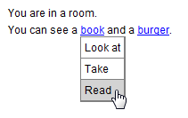
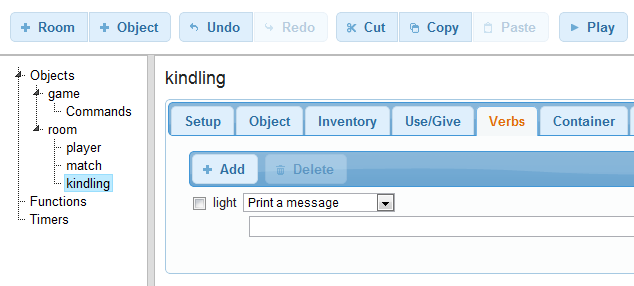
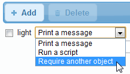
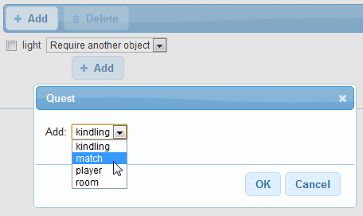
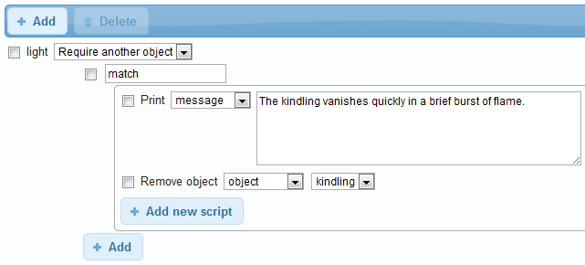
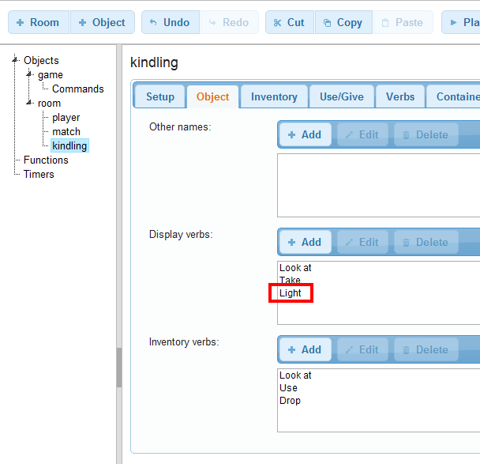
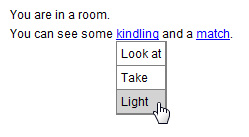
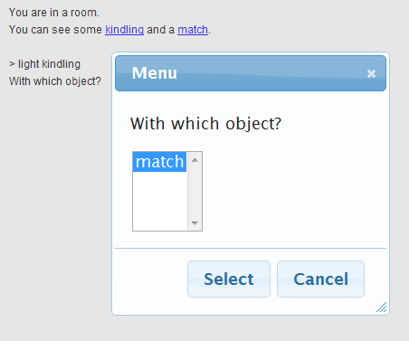
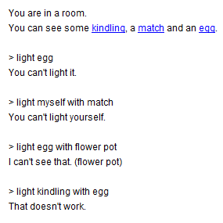

Quest lets you add verbs to objects, so you can provide the player with varied and interesting ways of interacting with things in your game. You might add a "read" verb to a book to allow the player to type "read book", or add an "eat" verb to a burger. By adding these verbs to the "display verbs" list for an object, they appear on the hyperlink menu:

But what if you wanted to do something a little more complicated? Light the kindling with the match for example, or inspect the flock of hair under the microscope? In Quest 5.1 and earlier, you would have to set up a command - "light #object1# with #object2#" - and then add some script to see if object1 and object2 made sense. And then, you would be making your game harder to play, because the player is forced to type that command - there's no way of clicking or touching to trigger a command requiring two objects.

Quest 5.2 makes this easier by introducing **two-part verbs**. These fit in with the existing verbs mechanism, making them very easy to set up. Best of all, they're mouse and touchscreen friendly.

**Setting up a two-part verb**

The process for setting up a two-part verb is very similar to setting up a normal one-part verb. Just go to an object's Verbs tab and add the verb you want. In the screenshot below, we've added a "light" verb to the "kindling" object:

(Note - these screenshots are from the web-based Editor, but the steps are the same on the desktop version)

The next step is to set the verb option to "Require another object" - a new setting in Quest 5.2.

This will then give us an editor where we can add objects which can be used to the light the kindling.

We can now set the script that runs when we light the kindling with the match:

Finally, let's add "light" as a display verb for the kindling object, to make this verb usable with mouse or touchscreen.

**Playing the game**

When we play the game, we can type in "light kindling with match", and we get the expected result - in this case, we see the message "The kindling vanishes quickly in a brief burst of flame", and then the kindling disappears.

But we can also activate this command using the mouse or touch instead. We added "Light" as a display verb, so we can select that:

Selecting this brings up a menu of things we can use to light the kindling with:

This menu shows all visible objects, excluding the object we just tapped on - in this case, we only have one other object in the room, the match. We can tap Select to trigger the command:

**Sensible defaults**

By setting this up as a verb, we get a lot of functionality for free. Previously, in Quest 5.1 and earlier, if we'd set up a custom command for this, we would have had to manually deal with the case where the player tried to light the wrong object. Here though, Quest sensibly handles the full range of things a player might type in - "light flower pot", "light kindling with egg", "light myself with match", etc.

**Use and Give**

The existing "use" and "give" commands have been updated in Quest 5.2 to display a menu like the "With which object?" menu shown above if the player tries to use them on their own. This means these commands can now also be used without typing.

**Try it out now**

This functionality is part of Quest 5.2, which will be in beta soon. In the meantime, I have already deployed this new feature to the web-based editor preview, so you can [try it out online](http://www.textadventures.co.uk/create/ "Create a text adventure game").

Please let me know your feedback in the comments!
