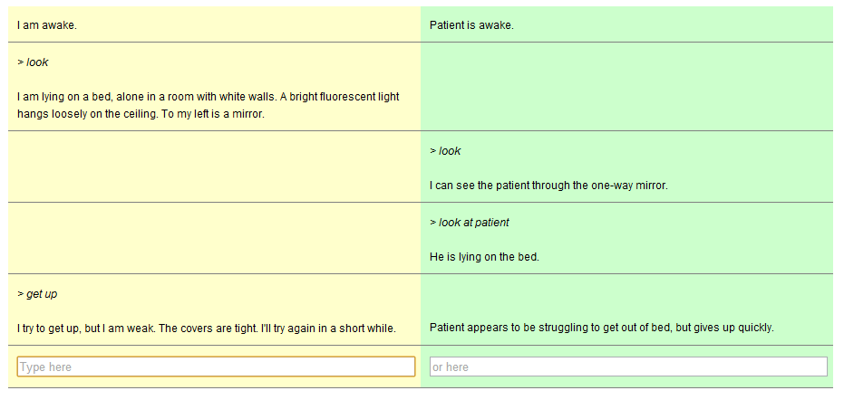
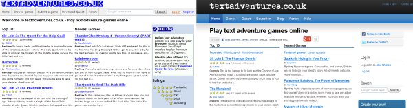

Just over one year ago, at the end of March 2011, I left my job to work on [Quest](http://www.textadventures.co.uk/quest/) full-time. One of the nice things about not working for an employer has been a complete absence of such time-wasting exercises as conducting an annual performance review. However, there is something to be said for periodically taking stock, and seeing how far and how quickly things have progressed. So, here's a review of one year of working on Quest.

**A Brief History of Quest**

By way of introduction, let's wind the clock back not one year, but almost fourteen. Quest has been part of my life for a long time. I started work on [Quest 1.0 in 1998](https://groups.google.com/d/topic/rec.arts.int-fiction/EP4N9x3fBs4/discussion) - I was a bored 16 year-old looking for a coding project during the summer holidays, and I wanted to create something using Visual Basic 5. I thought a text adventure would be a simple way to start, but I didn't want to hard-code the entire game - some sort of engine would be what I needed... I never actually wrote a text adventure in the end, because writing the engine was too much fun.

I kept tinkering with Quest in my spare time while I went through sixth form, university and my first job - which was doing technical support. I got bored of that - solving the same problems over and over again has never really been my thing - so in October 2006 I quit my job and decided to work full-time to create Quest 4.0, which at the time I was selling on a "shareware" or "try before you buy" basis.

I failed to really make much money doing that, and from May 2007 Quest became a spare-time project again as I got my first "proper" developer job.

**Rip it up and start again**

I definitely learned a lot in the first couple of years working on "someone else's" software - it taught me a lot about how large software should be structured. It also taught me a lot about what _not_ to do - the company I worked for was stuck with a huge legacy codebase which nobody fully understood, and was liable to break in all kinds of subtle ways.

I carried on working on Quest 4, but I was becoming increasingly frustrated with it. I had a lot of ideas for things that I wanted to do, but which were simply impossible given that its design had never really been thought through particularly well, and it had grown a lot over the years into what was approaching an unmaintainable mess. It was also written entirely in Visual Basic (version 5, and later 6), which meant it was getting painfully out of date - that language not having received an update since Quest was first created a decade previously.

Around April 2009 I started playing with some ideas for how Quest ought to be, writing the bare bones of an entirely new system in C#. This [grew into Quest 5.0](http://www.textadventures.co.uk/blog/2010/01/30/an-overview-of-quest-5-0/), announced in January 2010 - a completely new text adventure system, sharing pretty much just a name with Quest 4.

By July 2010 I'd got fed up with my job, and quickly found a job with another company. Too quickly, as it turned out, and I got pretty fed up there too, so in March 2011 I handed in my notice. By this time I had refactored the old Quest 4 VB6 code into a component that plugged into the new Quest 5 architecture, and I had announced that [the new system was to be open source](http://www.textadventures.co.uk/blog/2010/10/18/quest-5-0-is-now-open-source/). The new Quest was shaping up nicely, and I submitted a couple of examples of its new "play online" interface to the [IF Demo Fair at PAX East](http://emshort.wordpress.com/2011/03/19/if-demo-fair-themes-interface/).

Alongside the demo of the regular "play online" interface was a [split-screen demo](http://play.textadventures.co.uk/v5/Play.aspx?file=twohalves/twohalves.quest), showing off the flexibility of the new system - I think this kind of customisability of the Quest 5 interface is an area which still hasn't really been fully explored yet, which shows the potential of Quest which still remains untapped.

\[caption id="attachment\_1309" align="alignleft" width="625"\] Split-screen text adventure prototype\[/caption\]

**The year in review**

So we finally reach the start of the year. It was the start of April 2011 and I was working on Quest full-time, without much in the way of a business plan - I was just really sure that I wanted Quest 5 to exist, and, if nothing else, it would probably add a lot more to my CV than working for somebody else for the equivalent amount of time.

One of my first tasks was to [redesign the website](http://www.textadventures.co.uk/blog/2011/04/28/new-quest-and-textadventures-co-uk-websites/ "New Quest and textadventures.co.uk websites"), moving the main Quest site from the old axeuk.com domain to bring it together with the games at textadventures.co.uk. This was light relief from the meatier task of working on the Quest 5 Editor, the bare skeleton of which was already in place, but most of the editor controls and functionality had not yet been implemented.

\[caption id="attachment\_1303" align="aligncenter" width="600"\] textadventures.co.uk website, old and new\[/caption\]

In May, I carried on working mostly on the Editor, culminating in the release of the [first beta](http://www.textadventures.co.uk/blog/2011/05/24/quest-5-0-beta-1-now-available/ "Quest 5.0 Beta 1 now available") near the end of the month. The Script Editor looked a bit different in this Beta compared to later versions:

\[caption id="" align="aligncenter" width="409"\] The Script Editor from Quest 5.0 Beta 1\[/caption\]

This Editor was written using [Windows Forms](http://en.wikipedia.org/wiki/Windows_Forms), and although it mostly worked, it could be quite glitchy. Screen elements would often not draw correctly, and I was also not entirely happy with the design - in the screenshot above, you have a list of script commands, and the editor for the selected command appears below the list. This was similar to the design of the Script Editor in Quest 4, but it looked harder to use than it could be. Wouldn't it be better if the "Hello world" in the list was directly editable in-place?

Windows Forms was clearly never going to be up to the job - [WPF](http://en.wikipedia.org/wiki/Windows_Presentation_Foundation) looked like the more flexible and modern solution. It was going to be a pain to throw away a lot of the code I'd been working on, but I'd been careful throughout to separate the UI from the underlying Editor logic, so it was "simply" a matter of entirely replacing the user interface.

So, in June, I sat down and taught myself WPF. In total it only took about two weeks to redevelop the WinForms code. It felt painful at the time to do two weeks of work and essentially stand still, but it was well worth it. All the weird layout glitches went away, and I was able to implement the design I wanted for the Script Editor:

\[caption id="attachment\_1320" align="aligncenter" width="385"\] The Script Editor in Quest 5.0 Beta 2 (and now)\[/caption\]

I released [beta 2](http://www.textadventures.co.uk/blog/2011/06/20/quest-5-0-beta-2-released/ "Quest 5.0 Beta 2 released"), and by now was eyeing the final release of version 5.0. A lot of the "nice to have" features logged on the Issue Tracker were moved to later versions - it was much more important for Quest 5 to be "out there" than perfect. Over July 2011, I released [beta 3](http://www.textadventures.co.uk/blog/2011/07/17/quest-5-0-beta-3-and-tutorial-available/ "Quest 5.0 Beta 3 and Tutorial available") and [beta 4](http://www.textadventures.co.uk/blog/2011/07/28/quest-5-0-beta-4-released-approaching-the-final-release/ "Quest 5.0 Beta 4 released – approaching the final release"), and worked on getting the documentation done, in particular the [tutorial](http://quest5.net/wiki/Tutorial). I decided that it was time to stop adding things, and declared that beta 4 was feature complete - after a few months of working on Quest it was time to tie up everything and release a production quality version.

Over August, I released various release candidates, and finished up the documentation. I also squeezed in a week up at the [Edinburgh festival](http://www.edfringe.com), and while I was up there I [met up](http://forum.adrift.co/viewtopic.php?f=6&t=7416) with my nemesis/arch-rival/fellow text adventure engine creator Campbell Wild, the man behind the [ADRIFT](http://www.adrift.co/cgi/adrift.cgi) system.

Finally at the end of the month, [Quest 5.0 was ready](http://www.textadventures.co.uk/blog/2011/08/30/quest-5-0-is-out-now/ "Quest 5.0 is out now").

**Trying to reach a bigger audience**

So, I had created the software. The next focus then had to be getting people to hear about it and use it! I submitted a [press release](http://www.prweb.com/releases/2011/9/prweb8764118.htm), which perhaps inevitably didn't really get very far. I attracted more visitors with a short [blog post about Quest on Gamasutra](http://www.gamasutra.com/blogs/AlexWarren/20110905/8342/Reinventing_text_adventure_games_for_the_modern_web.php).

In hindsight, perhaps this isn't surprising. "A new piece of Windows desktop software that gives you the ability to write a text adventure game" somehow doesn't have a great "hook" to it - I think it's much easier to announce _a game_ than it is to announce _a system for making a game_, as with a game you've immediately got something to demonstrate - a game system is harder to get your head around. Furthermore, nobody gives a crap about Windows desktop software in this day and age - when was the last time any such software was newsworthy?

It was this realisation that fuelled the subsequent Quest projects. It was time to move beyond the desktop.

**Pick up the phone**

In September 2011, I started work on getting Quest games onto smartphones. While I was working on Quest 5.0, I'd thought I might achieve this using [MonoTouch](http://xamarin.com/monotouch) for iOS and [MonoDroid](http://android.xamarin.com/Welcome) for Android. However, these products are fairly expensive, and I wondered if having a Quest game running on top of the Quest platform running on top of the Mono platform running on top of the underlying mobile OS was a recipe for terrible performance.

Fortunately I had a bit of an epiphany while cycling one lunchtime and realised that an even better platform would be JavaScript, because this can be wrapped with [PhoneGap](http://phonegap.com/) to create "native" apps for all major mobile OSes. Quest's ASLX programming language is conceptually pretty similar to JavaScript, so the "only" effort required would be to reimplement Quest's C# platform code in JavaScript, and then write a converter to convert ASLX into JavaScript. The UI would be relatively straightforward because I could just use HTML, and Quest was already written with that as a target output format.

It only took a couple of weeks to get the basics up and running, implementing a converter plus the necessary code to [get a game running](http://www.textadventures.co.uk/blog/2011/09/30/using-quest-to-create-text-adventures-for-iphone-ipad-android/). This would only work for Quest 5.0 games though - if I wanted to actually release a Quest game as a mobile app any time soon, I had a problem because all the existing games were for Quest 4.x and earlier. So I spent a while working on another converter, so that with Tim Hamilton's help we could convert his Quest 4 game "[The Things That Go Bump In The Night](http://www.textadventures.co.uk/review/346/)" first into a Quest 5 game, and then into an mobile app.

In October, I released the first bug-fix for Quest - v5.0.1. I was quite pleased that nothing too serious had come up in the six weeks since the original 5.0 release - all those betas and release candidates had been worthwhile. I'd also started working on Quest 5.1, adding the enhanced game browser (converting it to WPF along the way), and adding a Simple Mode based on feedback from Kristian Still, who was starting to use Quest in the classroom.

The major changes in Quest 5.1 though were brought about by the requirement to be able to convert to JavaScript - the inability of JavaScript to use threads turned out to be a significant limitation, as a lot of the 5.0 code was written assuming that there would never be a problem with stopping a thread from processing in order to ask the user a question, for example. This meant that the app conversion didn't turn out to be quite as simple as I thought it would be, and it was the end of November before the [first Quest iPhone app was submitted](http://www.textadventures.co.uk/blog/2011/11/29/the-things-that-go-bump-in-the-night-coming-to-iphone-and-android/ "“The Things That Go Bump In The Night” coming to iPhone and Android") to the iOS App Store.

Interest was picking up in using Quest as an educational tool, fuelled mostly by [Kristian Still's enthusiasm](http://www.kristianstill.co.uk/wordpress/tag/quest/). I presented Quest at the [Changing the Game](http://www.textadventures.co.uk/blog/2011/11/14/quest-in-education-changing-the-game-conference/ "Quest in Education – “Changing the Game” conference") conference in Birmingham, all about teaching through creating and playing games, and was pleased at the response - it seemed my ideas about [teaching with text adventures](http://www.textadventures.co.uk/blog/2011/07/27/teaching-with-text-adventures/) had at least some merit! One bit of feedback struck me though - it's not always easy for schools to roll out software across Windows desktops. It can often be expensive, if a school is locked into an IT contract with an external supplier. This, and my general feeling that Windows desktop software is probably a bit of a dead end in this day and age, moved my vague plan for a web-based Quest Editor way up my "to do" list.

So, the web Editor has been pretty much what I've spent most of the last three months doing. I've done a couple of other things on the side - releasing Quest 5.1 and also enhancing the web-based player (adding the ability to save, and also making it work nicely on mobiles and tablets). I'm also nearly ready to release a beta of Quest 5.2 - notable new features being the [Gamebook mode](http://www.textadventures.co.uk/blog/2012/01/16/gamebook-mode-choose-your-own-adventure-in-quest-5-2/ "Gamebook mode (“Choose Your Own Adventure”) in Quest 5.2") and [two-object verbs](http://www.textadventures.co.uk/blog/2012/03/20/shoot-monster-with-ray-gun-burn-corpse-with-incinerator-two-object-verbs-in-quest-5-2/ "Shoot monster with ray gun, burn corpse with incinerator – two-object verbs in Quest 5.2").

I'm continuing to present Quest whenever I get the opportunity - in January I was [at LWF](http://www.textadventures.co.uk/blog/2012/01/23/game-based-learning-interactive-fiction-at-lwf-free-festival/ "Game Based Learning – Interactive Fiction at LWF Free Festival"), in February I helped out [year 7 using Quest at Perins school](http://www.textadventures.co.uk/blog/2012/02/24/text-adventures-in-the-classroom-quest-day-at-perins-school/ "Text adventures in the classroom – Quest day at Perins School") and presented it to the [London Educational Games meetup](http://www.meetup.com/The-London-Educational-Games-Meetup-Group/events/45215902/), and in March I did an [online TeachShare](http://www.textadventures.co.uk/blog/2012/03/22/teachshare-on-27th-march-using-text-adventure-games-in-the-classroom/ "TeachShare on 27th March: Using Text Adventure Games in the Classroom"). There should also be a workshop [Games Britannia](http://www.gamesbritannia.com/2012/) in July - hopefully more details on that soon.

**What's next?**

After the release of Quest 5.2 (including the web Editor), what's next? The Issue Tracker has many items [logged for Quest 5.3](http://quest.codeplex.com/workitem/list/advanced?keyword=&status=All&type=All&priority=All&release=Quest%205.3&assignedTo=All&component=All&sortField=Id&sortDirection=Ascending&page=0), and there is still work to do on the smartphone apps - bringing them to Windows Phone 7, a better layout on iPad, and converting more games.

However, the clock is ticking, and my bank balance is emptying. It is likely that I will have to return to some more regular form of paid employment pretty soon, which will mean Quest becomes a spare-time activity again, and the pace of updates will slow down a lot.

If you think all of this is worthwhile, you can help make more of it happen sooner. **Please consider [making a donation towards the development work](http://www.textadventures.co.uk/quest/donate/ "Donate")**. Maybe you'd like to sponsor me to work on a feature? I would love to hear your thoughts - please [get in touch](http://www.textadventures.co.uk/help/contact-us/ "Contact us") and let me know.

Alternatively, if you're a developer - with knowledge C#, VB.NET, ASP.NET or JavaScript etc. - why not [join in the open source project](http://quest5.net/wiki/Developers)? If you need help, drop me an email or go to the [Developer Forum](http://www.textadventures.co.uk/forum/viewforum.php?f=15).

In the next blog post, I will continue my "appraisal" of Quest, looking at what works well, and also at what an HR department would euphemistically call its "areas for improvement".
