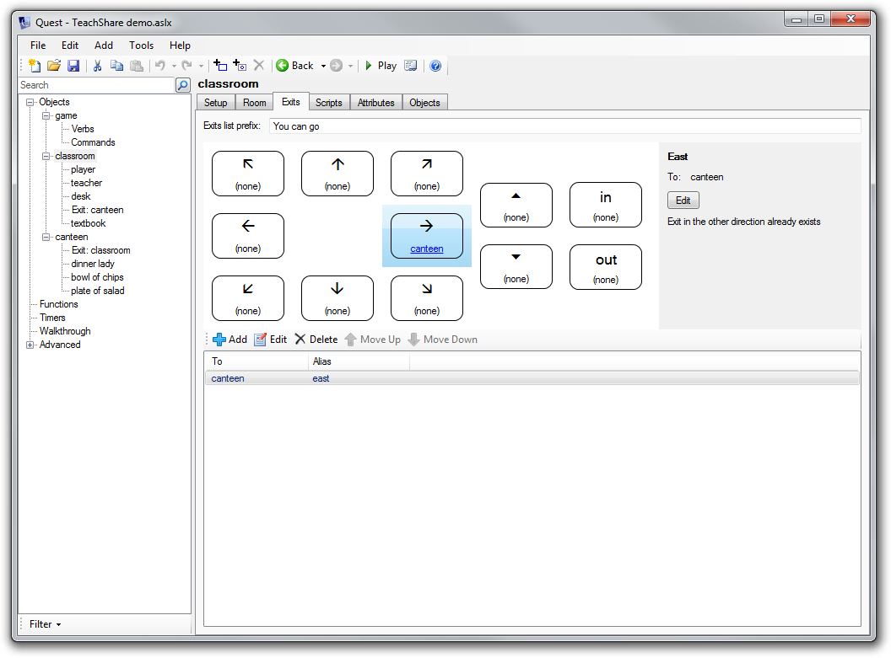
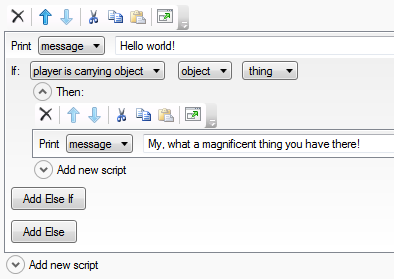
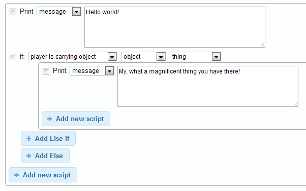
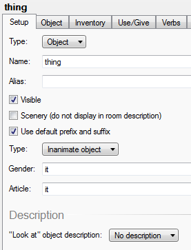

In [Part 1 of this blog](http://www.textadventures.co.uk/blog/2012/04/03/a-year-of-full-time-questing-part-1/ "A year of full-time Questing – Part 1"), I looked back over the last year of working on Quest full-time. That covers the "what", and for this second part, I want to take a look at "how well". What have been the good and bad parts, and what are my aims for Quest in the future?

I'm interested to hear your own views on this too, so please add your thoughts to the comments!

**The Good**

My Britishness makes me shy away from blowing my own trumpet too much, but I think it's worth saying that I'm really happy with the general design of Quest. Joel Spolsky may have said many years ago that the [worst strategic mistake any software company can make](http://www.joelonsoftware.com/articles/fog0000000069.html) is to rewrite the code from scratch, but I think in this case it was totally the correct decision. We now have quite a flexible architecture that handles creating and playing games across multiple platforms.

There are two "engines":

- the Quest 5 ASLX engine (called WorldModel)
- the legacy component for running old Quest games (LegacyASL)

There are currently three different user interfaces:

- the [desktop](http://www.textadventures.co.uk/quest/download/ "Download Quest") Quest software
- the "play online" software (WebPlayer), which has different modes for desktop and mobile browsers
- a simple console-mode player (QuestConsole), in source code only - the idea being that this can be used an example or foundation for building other UIs in the future, e.g. an implementation using Mono for Mac and Linux

The Quest 5 WorldModel component itself is used not just when playing games, but also when editing them. This means that the player and editor can make use of the same code - for example, for performing undo/redo, and for saving and loading games. The standard game logic doesn't appear in the WorldModel component, but exists in a separate Core library. This Core library defines not just the behaviour in the player, but also the editor interface. The editor logic itself sits in a separate EditorController component, which has two user interfaces:

- the Editor component of the desktop Quest software
- the [web-based Editor](http://www.textadventures.co.uk/create/)

Having the Core library define how the editor looks, and the EditorController exposing that to the user interface, has massively cut down on effort getting the web-based editor to work. There is definitely a tendency towards over-engineering in software development, but in this case creating my own editor forms framework, supporting both desktop and web, has reaped dividends:

\[caption id="attachment\_1305" align="alignleft" width="625"\] The desktop editor design...\[/caption\]

\[caption id="attachment\_1306" align="alignleft" width="625"\] ..can mirror the web editor design\[/caption\]

New features can be added to the Core library, and to the editor, entirely within ASLX library files - no need to change any C# code, no worries about breaking existing games (when published, game files include all the library code they're using), and both the desktop and web editors instantly handle the new feature.

This design made the migration of the desktop editor from WinForms to WPF between Beta 1 and Beta 2 much simpler. In addition, Gamebook mode is able to use this design to define its own entirely separate Editor interface. I think this design will continue to prove its merit as more third-party libraries are created, which will be able to both add additional functionality to Quest _and_ be instantly supported by both versions of the Editor without requiring any of the system code to be modified.

I was also glad that I created the Core library from the beginning to be language-agnostic. There is no hard-coded English text - instead all language text comes from a template. We have templates for 5 languages now (6 as of Quest 5.2) - we just need to see some games being published which make use of them!

HTML was a good choice for the player interface. I designed Quest 5 from the start so that games could be played online, so it made perfect sense for HTML to be the output format. This opened up a lot of flexibility, making it easy to implement things such as hyperlink verbs - which I think work very well, and have translated very nicely into the smartphone UI. HTML also means that it was easy to implement things such as embedding YouTube videos.

So, overall I'm pleased with how the design has panned out. Pretty much any new feature that is requested can slip fairly neatly into the existing architecture - in fact many features now can be implemented entirely within the Core library, which means minimal risk and they "just work" everywhere - truly a software developer's dream!

**The Not So Good**

There is always room for improvement. Although I'm fairly pleased with the Script Editor, sometimes I feel it can be a bit inflexible. I think it handles the majority of scripts well, but some things feel more difficult than they could/should be such as including "and"/"or" in an "if" expression - currently you have to switch to "expression" to do that, but then the helpful dropdown lists of objects etc. aren't available.

It's been interesting creating the web version of the Script Editor - somehow, to me it actually feels a bit easier to use than the desktop version, which is a surprise. It just feels cleaner to me - the user interface doesn't get in the way so much, because things like the cut/copy/delete buttons only appear when you've actually selected something. And maybe the web UI idiom of using tickboxes to select things is actually better than the desktop version's "rich listbox" approach?

\[caption id="attachment\_1376" align="aligncenter" width="394"\] The desktop Script Editor is OK, but...\[/caption\]

\[caption id="attachment\_1377" align="aligncenter" width="602"\] ...the web-based Script Editor feels nicer to me\[/caption\]

The web editor's psuedo-popup script adder also feels easier than the desktop adder, which often seems "slippery" to me as it expands beyond the bottom of the current scroll area. I also think I prefer how the web editor places the "Add new script" button where the resulting script will actually be added - in comparison, the desktop's adder expander feels a bit more detached from the script you're actually editing. So, maybe one way to improve the desktop Script Editor would be the make it more web-like. I also think it would be nice to have a code view toggle for the Script Editor, so you can quickly dive in to the code without having to reload the entire game - this would also be another step towards pushing the "use Quest to learn to code" side of things.

I do wish I'd been a bit more careful with some of the terminology used with Quest, but it's probably too late to change much of it now. Sometimes things are ambiguous and in at least one case the terminology is just plain wrong. The word "type" has at least four meanings - a class, a data type, "Object" vs "Room", and "Inanimate" vs "Animate". It even appears twice on the same editor screen - on an object editor you have one place to specify "type" as "Object", "Room" or "Object/Room", and then a few lines down you can choose a "type" from "Inanimate object", "Male character", "Female character" etc. The usage of the word "article" is simply incorrect - it should be something like "subject pronoun", as "article" means something entirely different. I would also prefer "Room" to be "Location", as that would be more accurate. I probably won't be able to change any of these until there is such a thing as Quest 6.

\[caption id="attachment\_1365" align="aligncenter" width="277"\] Spot the mistakes!\[/caption\]

Staying on the object editor, there are probably too many tabs here already, and as more features are added, and third-party libraries are created, this could start to become a problem. Most of the tabs are not relevant for most objects though, so the fix will probably be to make certain tabs context-sensitive, only appearing at all for particular object types, which could be specified on the Setup tab maybe.

\[caption id="attachment\_1367" align="aligncenter" width="571"\] The number of tabs is starting to become a problem\[/caption\]

Having the documentation in wiki format means it is reasonably convenient to write and maintain, but it's a pain for anybody who wants an offline version. There are various options for converting a wiki to PDF but they are all complicated - mostly requiring the installation of plugins on the server which need root access. But every wiki page has a "Printable version", so surely it can't be hard to write a little app which can be run externally and just spiders these? There's an idea for someone out there!

Accessibility is more of a pain than it really ought to be. [JAWS](http://www.freedomscientific.com/products/fs/jaws-product-page.asp) is probably the most widely used screen reader for people who are visually impaired, and it works with Quest - but only up to a point, and it's not been smooth sailing. Sometimes it reads text out automatically and sometimes it doesn't, so I had to add code to ensure game output was always read out. I am not a JAWS customer myself so that makes my support options limited. There is also a problem with labels in the Editor not being read out, and this is still unsolved - [StackOverflow](http://stackoverflow.com) is usually good for this kind of thing, but even though some people have offered help, [my question](http://stackoverflow.com/q/9846910/31280?stw=1) still doesn't have a satisfactory answer. The web version of the editor should be easier for a screen reader to handle, which mitigates this somewhat, but it's still hugely frustrating that what should be a great platform for visually impaired gaming isn't as good as I want it to be.

**Things That Changed**

Windows Forms was a bad choice for the initial Editor implementation, and as I wrote [yesterday](http://www.textadventures.co.uk/blog/2012/04/03/a-year-of-full-time-questing-part-1/ "A year of full-time Questing – Part 1") it took a few weeks to redo this, but it was well worth it.

In implementing the JavaScript converter to allow games to made into apps, a load of synchronous (i.e. thread-blocking) functions had to be deprecated. This was a pain, in particular because I had to substantially re-engineer the parser - I [wrote more on this at the time](http://www.textadventures.co.uk/blog/2011/11/29/the-things-that-go-bump-in-the-night-coming-to-iphone-and-android/). Could this have been foreseen earlier? Possibly - suspending a thread in the background while awaiting on user input wasn't ideal for the "play online" server for example, although it had never been a problem.

My initial implementation of "static picture frame" attempted to demonstrate that the player UI could be completely customised with HTML and JS, without the underlying Quest code knowing anything about it. However this didn't work very well as the resulting HTML/JS made assumptions about the rest of the Player HTML, so when this changed, the implementation broke. This was bad because this "detached" implementation was then wrapped up in games packaged with version 5.0. It required adding some Quest code to detect this and replace it with the new implementation. In hindsight, a static frame is such a standard thing that this should have just been "baked in" to the Player from the outset.

For version control, using SVN on [CodePlex](http://codeplex.com) was possibly the wrong choice. I'd chosen CodePlex as apparently the best place to find .net developers - and although I had signups it seemed that a lot of them were people who sign up for a lot of projects, probably to make their profile look good to somebody. SVN on CodePlex runs over TFS, and this was incredibly buggy. It turned out that simple things that you would expect to be able to do in SVN, such as branching, simply weren't possible. Astonishing! I toyed with moving over to [Github](http://github.com), but git is frankly too unpleasant on Windows, and some users who had already been making contributions to the Core library weren't comfortable with it. In the end I settled on sticking with CodePlex and migrating to Mercurial. This has turned out to be a good choice - it works well on Windows, and I didn't have to migrate the non-VCS stuff like Quest's [Issue Tracker](http://quest.codeplex.com/workitem/list/advanced), which is the main way I organise what I'm working on. Recently, CodePlex has started getting a bit of love and attention once more - after languishing for a while, they've started adding more features again, so hopefully it's a good place to stay for the future.

**Other Thoughts**

I've been pleased at the number of people willing to help out by creating [Quest translations](http://quest5.net/wiki/Translating_Quest). Weirdly this hasn't resulted in many non-English games yet though. Also, I was hopeful that more people would join in and contribute to the [C#/VB.net code](http://quest.codeplex.com) - there have been a few contributors, but generally it seems people are far happier to use open source software than contribute to developing it! This is probably an absolutely typical experience though. CodePlex has a system where you can advertise your project as [requiring help](http://www.codeplex.com/site/search/openings) - I was blown away by the number of volunteers who signed up, but _none_ of them subsequently did anything. It is probably a backwards approach to recruiting developers - it's probably the case that existing users who can code are much more likely to help out than people browsing CodePlex for projects that need assistance.

I'm really happy with how well Quest is working in classrooms. It has been something at the back of my mind for a long time, the thought that schools could make use of Quest, and finally [it's happening](http://www.textadventures.co.uk/blog/2012/02/24/text-adventures-in-the-classroom-quest-day-at-perins-school/ "Text adventures in the classroom – Quest day at Perins School"). It seems like the time is right for it, as over the last year it seems everybody has woken up to the fact that we need to teach kids how to code, and we especially need to encourage the girls. There is a lot more work to be done in this area especially.

**Some Numbers**

- I started tracking "play online" counts on 7th February 2011. Since then, the total number of games played online is 166,000. That was 422 days ago, so around **400 games played per day** or about **144,000 per year**.
- Total game download count since the same date is 60,000, so that's about **140 game downloads per day** or **52,000 per year**.
- The desktop version of Quest is launched by about **120 users per day**.
- About **40-50 new users sign up daily** to play or create games at textadventures.co.uk. This is a huge increase from only 1-3 a day last year, as new features like saving games and creating games require a login.
- The web-based Editor only went into public beta three weeks ago, but **over 300 games** are currently in progress.
- There are **380 games** published on the website - **76 games added** in the last year

It will be interesting to revisit these numbers again in a few months or a year's time, especially with the web Editor making it easy for anybody to create games anywhere.

**Your Feedback**

Please add your thoughts to the comments, or [send me an email](http://www.textadventures.co.uk/help/contact-us/ "Contact us")!
