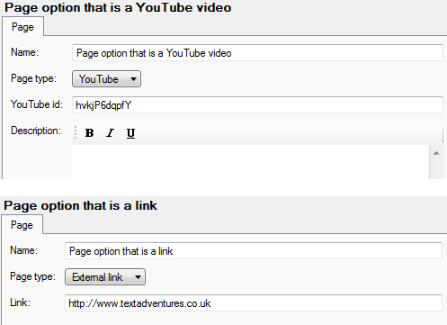
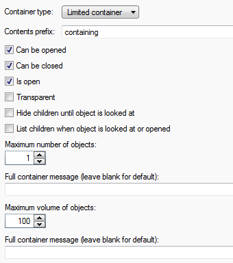
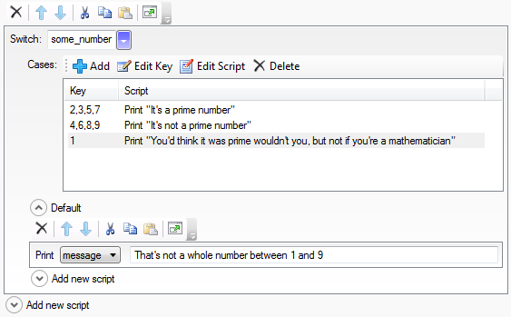
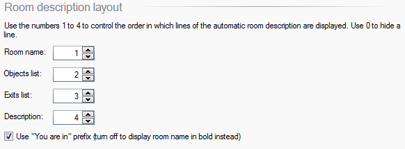
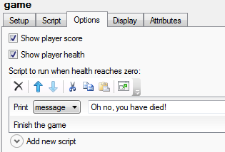
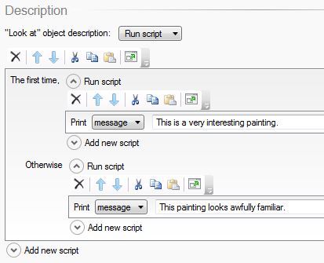

Quest 5.2 Beta is now available. You can [download the Windows version](http://www.textadventures.co.uk/quest/download/ "Download Quest"), or you can [use it in your web browser](http://www.textadventures.co.uk/create/ "Create a text adventure game").

The main focus for this release was adding that second option - Quest 5.1 was Windows-only, and the main new feature of Quest 5.2 is that it is now available [everywhere](http://www.textadventures.co.uk/blog/2012/02/16/introducing-quest-webeditor-create-text-adventures-online-in-your-browser/ "Introducing Quest WebEditor – create text adventures online in your browser").

But I, and a couple of contributors, did find some time to add some other new features to Quest too:

**Gamebook mode**. This lets you create "Choose Your Own Adventure"-style games in Quest, in addition to text adventure games. There is more information in the [announcement blog post](http://www.textadventures.co.uk/blog/2012/01/16/gamebook-mode-choose-your-own-adventure-in-quest-5-2/ "Gamebook mode (“Choose Your Own Adventure”) in Quest 5.2"). I've added a couple of small features since that post - you can now easily add YouTube videos into a gamebook, and you can also incorporate links to external websites.

**Two-object verbs**. It's now much easier to set up commands like "hit nail with hammer" or "light candle with match", using [two-object verbs](http://www.textadventures.co.uk/blog/2012/03/20/shoot-monster-with-ray-gun-burn-corpse-with-incinerator-two-object-verbs-in-quest-5-2/ "Shoot monster with ray gun, burn corpse with incinerator – two-object verbs in Quest 5.2").

**Inventory and container limits** (contributed by Pertex). The concept of a "limited container" has been extended, so you can now limit by volume of objects as well as number. For example, a bag might be able to hold 20 apples but only one bowling ball, and it's now easy to set that up. When an object is a limited container, you can specify the maximum volume that a container can hold. For objects that you might put inside a limited container, on the Inventory tab you can specify their volume.

These limits have also been extended to the player's inventory. Select the player object, and you can specify the maximum number of items that are allowed in the inventory, as well as the maximum volume.

**Multiple switch case expressions** (contributed by James Gregory). When using the "switch" script command, you can now specify multiple cases separated by commas.

**Customisable room descriptions**. On the game editor, Options tab, you can now specify the order of elements in the generated room description. So you can now move the exits list after the description, for example.

**Health and score**. It's now easier to have health and/or score on-screen, as you can now simply turn these on from the game options without having to set up the status attributes yourself.

There are new script commands for increasing and decreasing health and score. Also, when health is enabled, the object options tab has a new "Health" section which lets you specify that an object can be eaten. If the object can be eaten, it can add or subtract health points from the player.

**First time scripts**. It's now easier to run a script just once, the first time something happens - such as the first time the player speaks to a character, uses an object, etc. Previously you would have to create flags for this, but you can now simply add a "First time" script command which handles it all for you.

**Easier introduction scripts**. There was a change to how "wait for a keypress" (and other functions such as asking the player a question) worked in Quest 5.1, which made it difficult to insert a pause before moving the player to a room. This made it difficult to create introductory text in a game, as the player would be moved to the start room before they had pressed a key. This has now been addressed in Quest 5.2, as the core library uses a new "on ready" script command to move the player into the start room only after any waits etc. have been completed.

**Hide/show objects**. Previously, if you wanted an object to appear mid-game, you would have to move it from another room - maybe a dummy room used for the sole purpose of containing objects that aren't "there" at the start of the game. In Quest 5.2, you can now hide and show objects - in a similar way to how this worked in Quest 4.x and earlier. There are new script commands for making an object visible or invisible, and there is a new checkbox on the object setup tab so you can make an object hidden at the start of the game.

**Other new things**:

- When playing a game, game output is saved, so that when you re-load it later, you can see all the text that was there before
- When you double-click an .aslx file in Explorer, Quest opens in Editor mode (.quest files still launch the game)
- The ListExclude function can now exclude multiple items (contributed by James Gregory)
- When playing a game online, as long as your browser window stays open, your game session should no longer time out
- When play-testing a game from the Editor, you can now exit back from the Player into the Editor by hitting the Escape key (feature generously [sponsored](http://www.textadventures.co.uk/quest/donate/ "Donate") by Thomas Hines)
- Better handling of JavaScript errors in desktop Player - now prints error messages in-line with the game output instead of pop-up windows
- New Esperanto translation and updated Spanish translation, both contributed by Francisco Orta
- New word-wrap option in the Code View
- Reduced memory usage
- More helpful error messages when the wrong number of parameters are passed to a function
- Warn before exiting Quest if files are still downloading in the game browser, and added "Delete downloaded file" to context menu
- and of course various bug fixes!

Please try out the beta and let me know what you think. [Download Quest 5.2 Beta for Windows](http://www.textadventures.co.uk/quest/download/ "Download Quest") or [try it in your web browser](http://www.textadventures.co.uk/create/ "Create a text adventure game").

Many thanks to those who have contributed to this release - Pertex, James Gregory and Francisco Orta. If you're interested in contributing, please take a look at the [Developer page](http://quest5.net/wiki/Developers) and [Developer forum](http://www.textadventures.co.uk/forum/viewforum.php?f=15).
