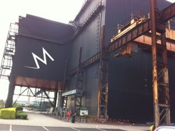
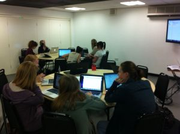
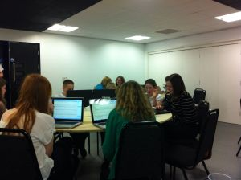

I had the great pleasure on Tuesday of leading two workshops on Quest at [Games Britannia](http://gamesbritannia.com/2012/), the schools videogame festival held at the impressive Magna Science Adventure Centre - a former steelworks in Rotherham.

Each workshop lasted two hours and there were about 15 children in each, with a range of ages maybe from about 8 to 15. Out of 30 children in total, only 3 had ever even heard of text adventure games before.

To get them familiar with how a text adventure works, I got them to spend the first 20 minutes playing [Escape from Byron Bay](http://www.textadventures.co.uk/review/450/). At first the groups were very quiet as they read the introduction to the game and started trying things out, but things quickly became more animated as the children started asking each other for help and shouting out as they solved puzzles. It almost seemed a shame to stop them before they completed the game, but time was tight and I wanted to get them started on creating their own!

Each student had their own laptop - some using the desktop version of Quest and some using the web version. I gave the students a quick overview of how Quest works - how to add rooms and objects to a game, add exits, set object descriptions, and allow objects to be takeable. This only took a few minutes to demonstrate and was enough to get the children started on mapping their own small game worlds.

I certainly didn't need to help anybody choose what to write - the creativity of the children was amazing. They were bursting with ideas, and quickly set about creating their rooms and objects.

I then gave a quick demonstration of scripting - showing how to display pictures, and how to add a small puzzle (using an "if" script to allow an object to be picked up only if the player has already taken another object).

After that, I let the children carry on building their games, answering questions that came up - sometimes giving quick demonstrations to the whole group when topics came up such as containers, or adding verbs. I was impressed at how much ground we covered in the space of a two-hour session, especially given where we had started, from zero knowledge even about the existence of text adventure games in the first place.

It was also really useful for me to see more children using Quest for the first time - a free usability testing session! I've definitely gained some new ideas about things I can improve. One attendee even managed to consistently reproduce a bug in the desktop version of the editor which I hadn't seen before.

The feedback from the sessions was really positive, and I hugely enjoyed them too. I would be happy to run a similar session again, so please do [contact me](http://www.textadventures.co.uk/help/contact-us/ "Contact us") if this is something you'd be interested in (or if you'd like more information on running a similar session yourself).

I'd also like to extend huge thanks and congratulations to the organisers of Games Britannia, who have worked incredibly hard with limited resources to put together an amazing event - truly inspirational. Also thanks to Andy Stratton (who was running his own Quest workshop on Wednesday) for helping the workshop run smoothly.
