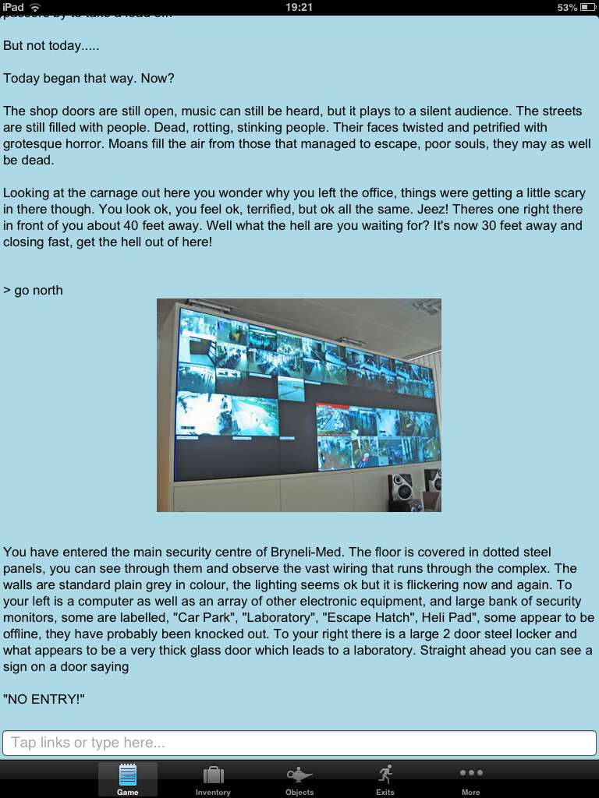

The text adventure game [Escape From Byron Bay](http://www.textadventures.co.uk/review/450/) is now on the App Store.

The game is written by [Allen Heard](http://allenheard.wordpress.com/), a teacher from Wales who wrote the game as an [introduction to interactive fiction](http://allenheard.wordpress.com/2012/02/28/year-8-taste-interactive-fiction/) for his Year 8 class.

It's the game I've been using when running [Quest workshops](http://www.textadventures.co.uk/blog/2012/07/04/quest-at-games-britannia/ "Quest at Games Britannia") - it can be completed within about half an hour by children who have never played any kind of text-based game before.

It will run on any iPhone, iPad or iPod Touch running iOS 4.3 or later.

This is the second Quest-powered iOS app, the first being [The Things That Go Bump In The Night](http://www.textadventures.co.uk/review/346) which was released last year. Over the next few months I'll be releasing even more games into the App Store, and Android versions too, so look out for more games coming soon!

### Text Adventures on Tablets

This is the first text adventure app I've released that resizes properly to fit the iPad screen, and I think it works nicely. With hyperlinks and a dismissable on-screen keyboard, the tablet is the natural home for interactive fiction - it makes the idea of playing a text adventure on a desktop computer or laptop feel like the kind of niche activity it has always been, until now.

### Interested in writing your own game?

Any game written with [Quest](http://www.textadventures.co.uk/quest/) can be turned into an app - see the [Quest Apps Guide](http://www.textadventures.co.uk/apps/) for more information. I really want to bring more high quality games to the app stores, so please [contact me](http://www.textadventures.co.uk/help/contact-us/ "Contact us") if you have any questions or if there's anything I can do to help.

