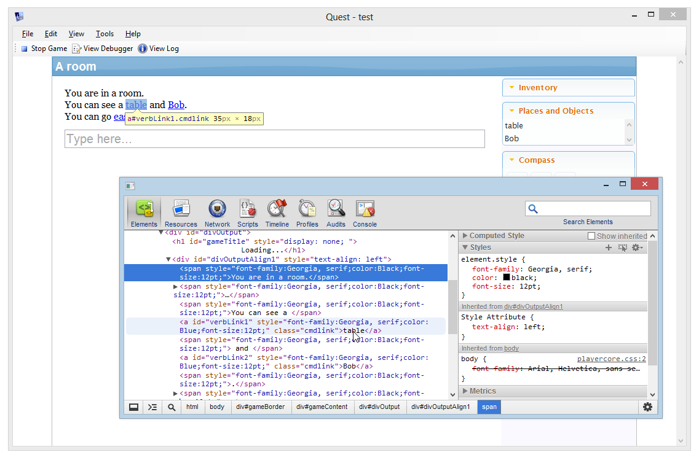
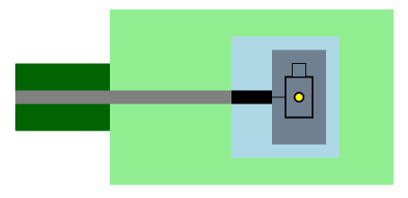
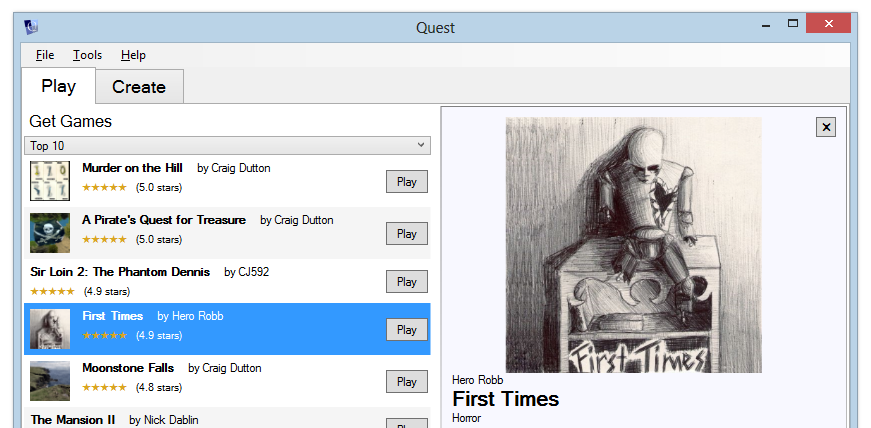
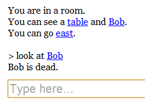
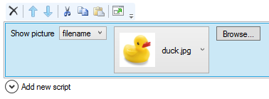

You can now [download Quest 5.3 Beta for Windows](http://www.textadventures.co.uk/quest/download/ "Download Quest"). This release features a number of enhancements - improvements to the look and feel of games, a few new things you can do in games, some additional script functions, and general improvements to make Quest just that little bit easier to use. And of course, quite a few bug fixes.

If you're a user of the web browser version of Quest, stay tuned - you'll be able to use Quest 5.3 Beta in your browser soon. **Update 5th Dec**: The web version of Quest is now running v5.3, so [try it out](http://www.textadventures.co.uk/create/ "Create a text adventure game")!

Read on for all the details about what's new, or [download Quest 5.3 Beta now](http://www.textadventures.co.uk/quest/download/ "Download Quest").

## Improving the look and feel

One of the things that's been annoying me lately is a prevailing attitude that somehow text adventure games are just a retro thing, that the way a text-based game should look is as though it comes from a mid-80's DOS prompt. Well, I think the future of interactive story games is much richer than simply displaying a load of black-and-white text with a command prompt underneath - we have barely begun exploring the user interface for this kind of game. They are still new! The oldest text adventure game was released less than 40 years ago. We had not discovered everything there is to know about film making by 1940 either, and their growth was somewhat more rapid, without the whole being-pretty-much-forgotten-about thing to stymie development. The power that HTML gives us in every computer, tablet and smartphone is immense, and this is something text-based games should be tapping into and experimenting with.

So let's forget the "ZOMG text adventures that's so retro LOL!" nonsense and start to build something other people will actually give a crap about.

With that in mind, one of my aims for this release was to start to make it easier for authors to completely customise the game player interface with HTML and JavaScript. One problem with this was that up until Quest 5.2, there were really two separate UIs - when you play a game in your web browser, the UI is 100% HTML, but the desktop version of Quest rendered the Inventory list, Compass pane, input box etc. using standard Windows forms controls. This meant that the game looked a bit different and didn't offer the ability to customise any of the Windows form elements.

So, the web version of the player UI has now been brought to the desktop version. This means that the entire game playing interface is pure HTML, and the game looks the same whether you play it in the desktop version or in the browser. With custom JavaScript and HTML, you can now do things like implement your own version of the Inventory pane, add your own panes, change the screen layout, create your own input method... and who knows what else. It also means that any enhancements made to the standard interface in future versions will apply to both desktop and web versions of Quest - any built-in "easy customisation" functionality would apply to both.

Furthermore, the desktop version of Quest is no longer dependent on the version of Internet Explorer that is currently installed. Instead, Quest bundles an embedded version of the Chromium browser. This is the browser that underpins Google Chrome, and is based on WebKit (which is also behind Safari and the default Android browser). This means you now get access to the Chrome Developer Tools directly within Quest - so you can play around and see the effects of tweaking HTML while a game is running.

\[caption id="attachment\_1651" align="aligncenter" width="682"\] Chrome Developer Tools in Quest\[/caption\]

Quest 5.3 starts us down the road towards doing more innovative and exciting things within a predominately text-based medium. Of course we're not fully where I want to be yet, and one of my focuses for Quest 5.4 is to extend the customisability of the UI even more, to make it even easier to try out interesting ideas. Keep on eye on [the blog](http://www.textadventures.co.uk/blog/), as I'll be documenting any experiments there, and please do [contact me](http://www.textadventures.co.uk/help/contact-us/ "Contact us") if you have any ideas!

Other new improvements to look and feel include:

- **Grid-based map** (sponsored by Phillip Zolla) - as detailed in [this separate blog post](http://www.textadventures.co.uk/blog/2012/07/22/automatic-mapping-in-quest-5-3/ "Automatic mapping in Quest 5.3"). This is an initial release of mapping functionality, so it's fairly basic at the moment. Future releases will add support for images in the map, and a visual map editor.

\[caption id="attachment\_1651" align="aligncenter" width="453"\]  
Grid-based map example\[/caption\]

- **Google Web Fonts**. You can now choose from over [600 different fonts](http://www.google.com/webfonts), and they will be downloaded on demand.
- **Cover art**. You can now add cover art to your game from within the editor, and some game authors have kindly provided cover art for their existing published games. This is currently displayed in the game browser, and will soon be shown on the website too. Hopefully this will be a nice way of attracting more people to your game, and maybe provide something of an idea of the game's feel and atmosphere.

\[caption id="attachment\_1641" align="aligncenter" width="610"\] Displaying cover art in the game browser\[/caption\]

- **Text effects**. There are new "typewriter" and "unscramble" text effects available from the new "Effects" category in the script editor. They are pretty basic JavaScript effects and work best with a monospaced font. It would be nice to expand this to a more fully featured library in the future as this is really the tip of the iceberg for the kinds of things that I think JavaScript could bring to text adventure games.
- **Background images**. You can now specify a background image as well as a background colour, and you can also set the opacity for the section of background image that appears behind the game text. You could try the [Subtle Patterns](http://subtlepatterns.com/) website for some nice backgrounds.
- **Redisplay hyperlinks in commands**. When using object hyperlinks, the command output now has the same hyperlink in it so the player doesn't have to scroll up again to do other things to the same object. As with most things, as a game author you can turn this off if you don't like it (indeed you can turn off hyperlinks entirely if you want).

\[caption id="attachment\_1646" align="aligncenter" width="242"\] Showing hyperlinks for a command that has been entered\[/caption\]

- **And more**. Customisable object link colour (sponsored by Phillip Zolla), more room description options (by James Gregory), choose a different alias to display on the "Inventory" and "Places and Objects" panes (sponsored by Phillip Zolla), use "ul", "ol" and "li" tags to show numbered and unnumbered lists (sponsored by Phillip Zolla), background sounds for gamebook pages (by Pertex).

## Game behaviour - new things

- **Changable POV** (sponsored by Phillip Zolla) - as detailed in [this separate blog post](http://www.textadventures.co.uk/blog/2012/09/19/pov-support-multiple-player-objects-in-quest-5-3/ "POV support – multiple player objects in Quest 5.3"). I'm looking forward to some interesting games where you can take control of multiple player characters over the course of a game.
- **Light and dark rooms, light sources** (by Pertex). Rooms can now be dark, and lit up by a light source object.
- **Scenery/Invisible exits** (by Pertex). It's now easier to make exits appear or disappear using a script command, and you can also have a "scenery" exit which exists but is not displayed in a room description.

## Script improvements

- **Mathematical functions**. The [.net Math](http://msdn.microsoft.com/en-us/library/system.math.aspx) functions are now available to expressions - including Sin, Cos, Tan, Ceiling, Floor, Log, Sqrt.
- **New sorting functions** (sponsored by Phillip Zolla). Sort an object list by attribute with ObjectListSort(list, attributes...) and ObjectListSortDescending(list, attributes...). Sort a string list with StringListSort(list) and StringListSortDescending(list).
- **And more**. Optional type parameter for "create" command (sponsored by Phillip Zolla), new GetDouble, HasDouble, ToDouble, IsDouble functions (sponsored by Phillip Zolla), names for temporary timers and turnscripts (by Pertex).

## Making it easier

- **Automatic display verbs**. By default, any verb you add to an object is now automatically added to its "Display verbs" list, so you don't need to manually add it. This helps you to ensure that your game can be played without typing, as any custom verb you add will always be selectable from the object's hyperlink menu.
- **Image previews in the editor**. A small thumbnail is shown anywhere you can select an image.

- **Named character types** (by James Gregory). Easier way of making a "named" character (e.g. "Bob", "Dracula") display correctly in a room description - this simply turns off the default prefix so Quest displays "You can see Bob" instead of "You can see a Bob".
- **Editor automatically saves when you click Play**. Being prompted to save all the time was tedious.
- **New toolbar when playing a game from the editor**. Quickly return to the editor, or view the object debugger and log screens.
- **Game log** (sponsored by Phillip Zolla). A place for outputting debug information, instead of writing things in-line with the game output.
- **Find/Replace enhancements to Code View** (by Aleksandar Hummel). You can also search for text using a regex.
- **And more**. Code view word-wrap setting is now saved (by James Gregory), "Source" column in the Debugger shows you which type an attribute was inherited from (sponsored by Phillip Zolla), sortable columns in the attributes editor (sponsored by Phillip Zolla).

It feels like I've been sitting on some of these enhancements for quite a long time, so it's good to finally get Quest 5.3 out, even if it's only in beta form at the moment. I've been busy for the last few months doing some contract work, which has now finished, so hopefully the frequency of updates will increase - until my money runs out again, that is!

Many thanks to Phillip Zolla, Pertex, James Gregory, Aleksandar Hummel and Jay Nabonne for code and contributions towards this release.

Please download Quest 5.3 Beta, and let me know what you think - and of course report any bugs you find! You can email me at [alex@textadventures.co.uk](mailto:alex@textadventures.co.uk), ask questions in the [forum](http://www.textadventures.co.uk/forum/) or you can find me on Twitter: [Follow @alexwarren](https://twitter.com/alexwarren) //
