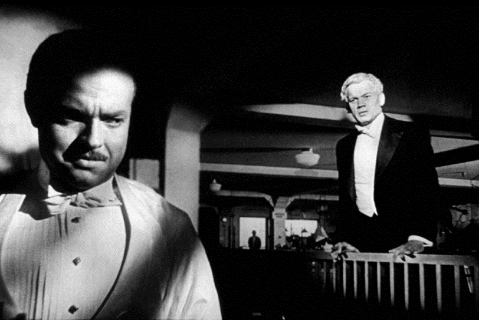
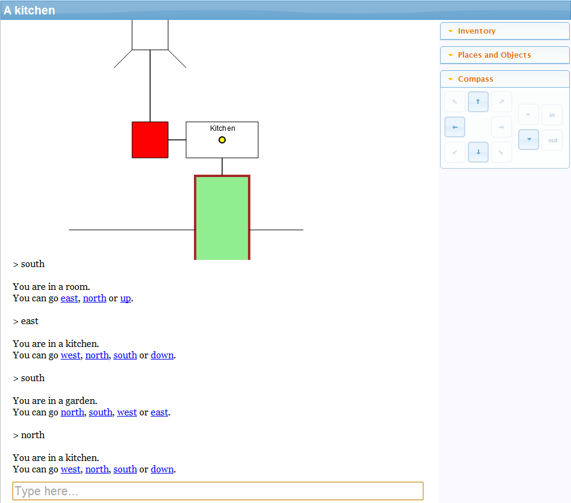

_Cross-posted to [Gamasutra](http://www.gamasutra.com/blogs/AlexWarren/20130129/185609/Text_Adventures_Are_New_Really.php). This blog post is based on part of my AdventureX talk from December - hopefully a video of that will be available soon._

Every couple of weeks, it seems, another games journalist writes an article about how they've rediscovered the long lost art of the text adventure game. After a few minutes looking through Wikipedia, they write an article which will inevitably talk about green screens, clattering keyboards, and grues. Then they will talk about a somehow thriving yet hidden "scene" of people who are still creating and sharing these games like some kind of long-forgotten tribe that had been cut off from the rest of the civilised world.

As the creator of a text adventure engine, [Quest](http://www.textadventures.co.uk/quest/), these pop up in my Google alerts with tedious regularity. They are so boring and predictable. And more importantly, they are utterly short-sighted.

Many people think of text adventures as an old-fashioned game form, something that was maybe [acceptable in the 80s](http://www.youtube.com/watch?v=dOV5WXISM24) but which we have now outgrown and left behind. But I think the opposite is true. Right now, we are early in the history of text adventure games. Their time to shine is just beginning.

The image above is from the film _Le Voyage Dans La Lune_ (A Trip To The Moon), a French science-fiction film from 1902. For me, it's the image that immediately springs to mind when I imagine the very early days of cinema. You can [watch it on YouTube](http://www.youtube.com/watch?v=7JDaOOw0MEE) if you have a spare 10 minutes. If you do, I want you to notice one thing...

It doesn't look very much like a modern film, does it?

That's because it's over 110 years old, of course.

Nearly 40 years later, Orson Welles released his first film, _Citizen Kane_. You can [watch](http://www.youtube.com/watch?v=xbGbqRWwC_Q) [various](http://www.youtube.com/watch?v=ReHAg29c-64) [scenes](http://www.youtube.com/watch?v=Th8cuq9tzZk) on YouTube too. This film [pioneered](http://en.wikipedia.org/wiki/Citizen_kane#Cinematography) many aspects of modern film-making.

It took 40 years to get from _Le Voyage Dans La Lune_ to _Citizen Kane._

Forty. Years.

40 years from the early days of film-making to get to something that even _starts_ to look like a modern film. And this wasn't forty years of hobbyists dabbling with making little movies in their spare time, to be enjoyed only by other hobbyist film fans. This was 40 years during which films were a mainstream entertainment format.

And of course film continues to develop today. _Citizen Kane_ looks somewhat different to [Inception](http://www.youtube.com/watch?v=66TuSJo4dZM), for example (yet I wonder if it's closer to that than _Le Voyage Dans La Lune_?)

The first text adventure was written in about 1975, which makes text adventures only 38 years old. Text adventures have never really been a mainstream entertainment format. [IFDB](http://ifdb.tads.org/) attempts to list every work of interactive fiction, and it currently lists 4,444 games. As a comparison, IMDB currently [lists 48,525](http://www.imdb.com/search/title?year=1902,1941&title_type=feature&sort=moviemeter,asc) films created during the period between _Le Voyage Dans La Lune_ and _Citizen Kane_.

So, there are hardly any text adventure games, really. In that light, it seems completely ridiculous to think of text adventures as some kind of ancient game form. We have barely even begun.

We cannot possibly argue that text adventures have matured. We cannot reasonably declare that we know how a text-based interactive story should work. We will need a lot more games to be written, and a lot more experimental works to be created, before we will be able to see which direction this particular art form is taking.

Therefore when thinking about the future of text adventure games, I like to pretty much ignore the 1980s entirely. Those games have interesting historical value, but will look pretty quaint when we put them next to the text adventure games that will be created over the next few decades.

There is a quote from an [interview with Orson Welles](http://youtu.be/DQCnrPr3qIA?t=6m14s) which I find particularly inspirational:

**Interviewer:** _What I'd like to know is, seeing that you'd never in all your life, ever made a film before Kane, and had never so far as I'm aware been in a studio before Kane ... where did you get the confidence from to make a film with such -_

**Welles:** _Ignorance. Sheer ignorance, there's no confidence to equal it. It's only when you know something about a profession, I think, that you're timid, or careful._

What I take from this is that it doesn't matter if you don't know much about the existing text adventure games - just the vision and desire to create an interactive story will be enough. Don't be afraid to try something new.

And right now is a great time to start reimagining what a text adventure is. Why?

Because this never happened:

And this never happened:

(My Photoshop Masterclass was, coincidentally, another thing that never happened - but you get the idea).

Desktop computers, terminals and laptops were never really the right devices for playing book-like games. Tablets and smartphones are the natural home for interactive fiction - and it's only in the last few years that these devices are in everybody's pockets. People are used to taking their phone out of their pockets to play with something for a few minutes, and text adventures can perfectly fill that need. Apps can bring text adventures where they belong - in front of people who want to read, wherever they are.

Unlike early film, the tools are available to everyone. My own engine, [Quest](http://www.textadventures.co.uk/quest/), is free and open source. You don't need any programming experience to get started with it, and it can run [entirely in a web browser](http://www.textadventures.co.uk/create/) so you don't even need to download anything. The system is open and hackable, with a core library written in Quest itself which defines the default behaviour - so you can change fundamental things about how the system works, even without going into the [source code](http://quest.codeplex.com).

Quest is built upon web technologies, so games can run anywhere, or be packaged with Phonegap and be turned into offline apps. Hyperlinks mean that "guess the verb" is a thing of the past - if you want to, that is, because authors can disable hyperlinks if they choose.

HTML5 opens up a lot of possibilities for experimenting. For example, using Canvas we can dynamically draw maps:

Of course, HTML is designed for laying out text - so there is plenty of room for experimentation here. For example, why not split the screen in two:

The images above are very basic protoypes, but of course you can tap into the full power of CSS and JavaScript to give games your own look, and build your own UI. Perhaps you would want to remove the command bar entirely, or add your own information panes? Maybe change the UI for each scene in the game. Have players type inside a speech bubble, or inside a newspaper column. Make text move, blur, melt away. There are so many possibilities - so many things that have not yet been tried. Some will work, some will not, some will simply inspire other authors to do better.

And even within the writing, there is much experimentation to be done. Text adventures are typically written in the form "You can see... You can go...". Why not in first person, or third person? Why does it have to be the present tense - why not past tense? Maybe the future tense could even work. We just don't know - yet.

What about other technologies and APIs we could get a game to tap into? How could we use geolocation within a game? The ability for players to take photos and record sounds? How can we have players interacting over the internet?

There is so much unexplored potential for text-based games. With new devices and technologies, we are really only just getting started. I think we need a new generation of authors to come along, unhindered by 1980s expectations of what a text adventure should look like, and in the spirit of sheer ignorance, create games that will excite and inspire us all.

I hope that [Quest](http://www.textadventures.co.uk/quest/) is a platform that will enable that - but I'm sure there are many ways it needs to be improved to let that happen. I'm always open to ideas so please get in touch if there's anything I can do to help your vision become reality. You can email me at [alex@textadventures.co.uk](mailto:alex@textadventures.co.uk) or find me on Twitter [@alexwarren](http://twitter.com/alexwarren).
