Scripts are everywhere in Quest. Want to play a sound when the user looks at an object? Choose "Run script" and then you can. Want to let the player pick up an object only if they are already carrying another? Choose "Run script" and you can.

Quest's script editor is easy to use even if you've done no programming before, because you can simply choose from a categorised list of commands. In Quest 5.4, this has been enhanced so that commonly used script commands are quickly available using buttons at the top.

[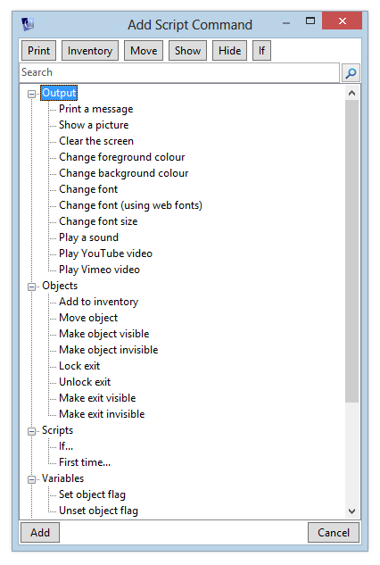](http://blog.textadventures.co.uk/wp-content/uploads/2013/02/script1.png)

As before, after choosing a command, it appears in the script editor, where depending on the command you chose, you can fill in text, choose the image, etc.

[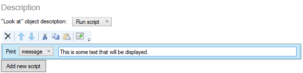](http://blog.textadventures.co.uk/wp-content/uploads/2013/02/script2.png)

More complex script commands have more things to choose from, and may themselves have places where you can add more script commands inside - as with the "if" command:

[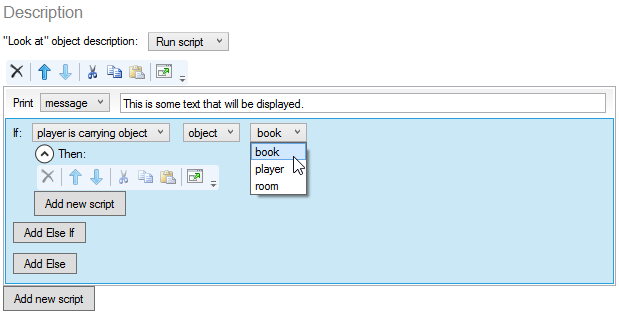](http://blog.textadventures.co.uk/wp-content/uploads/2013/02/script3.png)

This design works well for short scripts, but can become cumbersome if you're trying to code anything more complicated.

The Quest 5 editor has always offered a "Code View" of an entire project, but once your game gets large, it can be a pain to switch back and forth - once you're in Code View, you no longer have the tree view of your game's objects, and the editor has to reload your entire game if you make changes and want to switch back to the normal editor. Also, Code View is only currently available in the Windows desktop version - it is not yet available in the web version.

[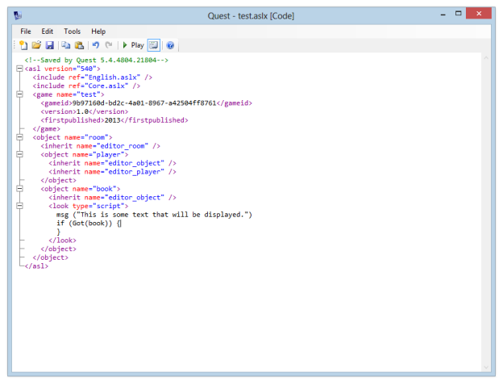](http://blog.textadventures.co.uk/wp-content/uploads/2013/02/script4.png)

These limitations are addressed by a new feature coming to Quest 5.4, in both Windows and web versions - **Script Editor Code View**.

This lets you easily toggle between the friendly English language user interface, and the underlying code. The new button is highlighted below, and appears if you have Simple Mode switched off.

[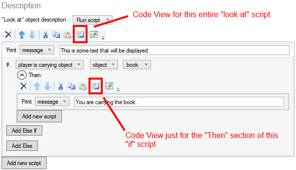](http://blog.textadventures.co.uk/wp-content/uploads/2013/02/script5.png)

This is the effect of turning on Code View for the whole script:

[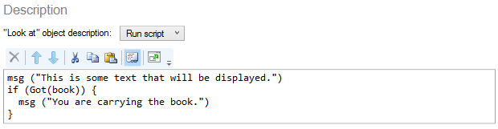](http://blog.textadventures.co.uk/wp-content/uploads/2013/02/script6.png)

You can also turn on Code View just for any nested script section:

[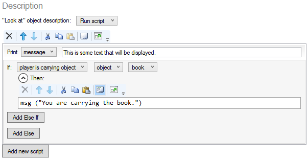](http://blog.textadventures.co.uk/wp-content/uploads/2013/02/script7.png)

You can make changes in the Code View without having to reload the entire game.

[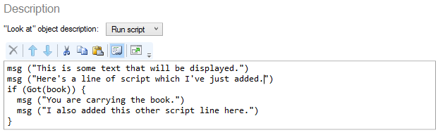](http://blog.textadventures.co.uk/wp-content/uploads/2013/02/script8.png)

If you switch back to the English language UI, your changes are immediately reflected in the friendlier version.

[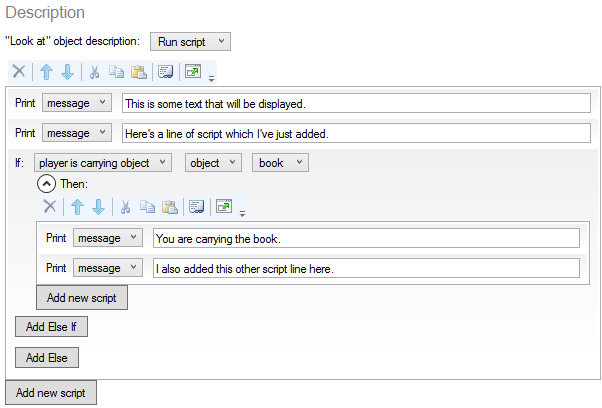](http://blog.textadventures.co.uk/wp-content/uploads/2013/02/script9.png)

What if you make a mistake? The advantage of the friendly English UI is you can't make syntax errors. No such protection in Code View though, so what if you miss off a bracket?

[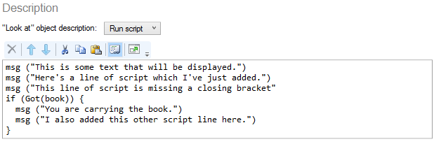](http://blog.textadventures.co.uk/wp-content/uploads/2013/02/script10.png)

Switching out of Code View shows us we made an error, but the rest of the script loads properly. We can easily correct the mistake.

[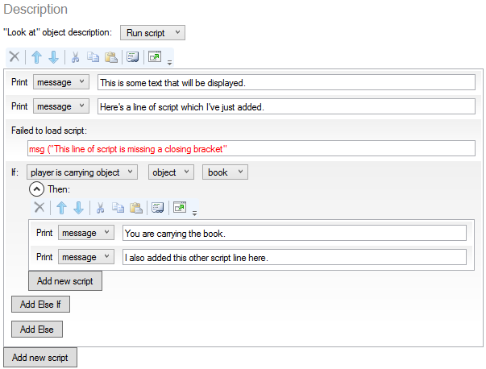](http://blog.textadventures.co.uk/wp-content/uploads/2013/02/script11.png)

All of this works in a very similar way in the web version. The Script Editor now has Code View buttons, allowing you to view the code for a whole script, or any nested section.

[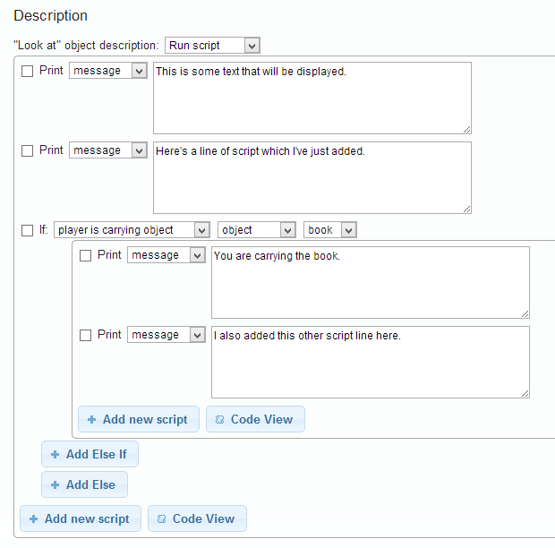](http://blog.textadventures.co.uk/wp-content/uploads/2013/02/script12.png)

The Code View button pops up an editor allowing us to view or change the underlying script code.

[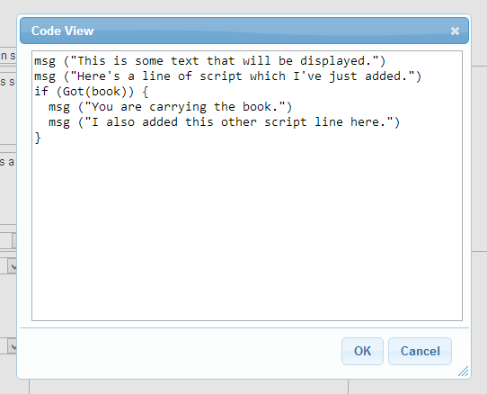](http://blog.textadventures.co.uk/wp-content/uploads/2013/02/script13.png)

I hope these changes will be very useful for people on the forums - you'll now be able to easily copy and paste little script sections, which will be great for people seeking help with a game. When a script has been pasted in, you can toggle back to the normal English view and carry on working as normal. The script you've just pasted in will be displayed in English so will hopefully make more sense! You'll also get a feel for how scripts work in the first place, which I think fits very nicely with Quest's aim to provide a gentle introduction to programming.

A beta version of Quest 5.4 should be available soon, but if you're feeling brave you can download the [nightly build of the Windows desktop version at CodePlex](http://quest.codeplex.com/releases/view/82308).
