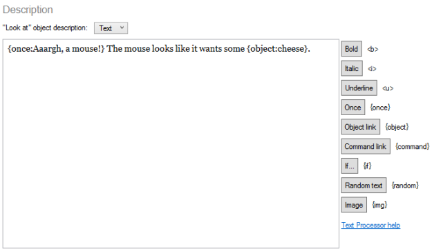
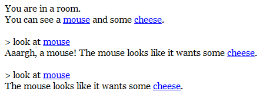

It is very easy to generate and manipulate text with software, which is why text adventures were some of the very first computer games ever to be created. Furthermore, the manipulation of words can make it easier for a text-based game to feel as if it is genuinely responding to the player's actions - it is far simpler for software to tweak a paragraph of text than it is to tweak a graphical environment.

As the player interacts with a game, they can of course make choices which affect the outcome of the story - choosing which branch of a narrative to follow - but it is also possible to construct a game where the player is not so much directing the action as simply telling the game a bit more about themselves. An interactive game doesn't necessarily mean that the player decides on the outcome - the effects could be more subtle than that. A character may say slightly different things to the player depending on what happened earlier in the game, for example, but this may not have any effect on anything else that happens.

So, it's important for a text game engine to make it easy to generate adaptive text. Quest does a lot of this already without an author having to do anything - it will automatically generate a list of objects that are in the current room, for example. But anything more advanced than that generally has required the use of scripts. If you want to show a particular sentence only if the player has performed some action, you have to run an "if" script to print that sentence. The sentence will stand on its own, with a line break before and after, so this is more of a mechanism for complete paragraphs than it is for minor details within text.

It's also harder than it should be to display object hyperlinks. These hyperlinks are a key way that players interact with games, and get displayed automatically as part of the room description, but it's hard to easily "linkify" an object that you make a passing reference to in a paragraph. That's because you have to be running a script again, and use the ObjectLink function in an expression.

Quest 5.4 addresses these issues with a new feature, the **text processor**. This is a core library function, so it's implemented entirely in Quest's own ASL programming language, and it steps in at the last moment, just before text is written to the screen. This means you can include text processor codes anywhere in your game - you can use the codes inside a "print message" script command, but you can also use them inside a plain-text object description. This makes it much easier to have dynamically generated text without having to create a script.

For example, here's how we might write a description of a hungry mouse:

We're just using a text description here, not a script. The editor provides some helpful buttons so we don't have to remember the available codes, and we can also easily add object links by clicking the "Object link" button - we can choose an object from the list that appears.

When we run the game, here's what we see. The "Aaargh, a mouse!" text only appears the first time:

We can easily include conditional text using the {if} code, which allows us to check the value of game or object attributes. For example, if we're looking at an apple and the player's health is low, we might write:

That looks like a tasty apple. {if player.health<10:It would be a very good idea to eat it.}

Using the {command} code, we could actually improve this and give the player an "eat apple" link. You can nest codes inside each other, so the link will only appear if the player's health is low:

That looks like a tasty apple. {if player.health<10:It would be a very good idea to {command:eat apple:eat it}.}

There is also the {random} code which allows you to choose text at random, and {img} lets you include images in-line with text.

The Quest 5.4 Beta release is very close now, but if you just can't wait you can try out the [nightly build](http://quest.codeplex.com/releases/view/82308).
