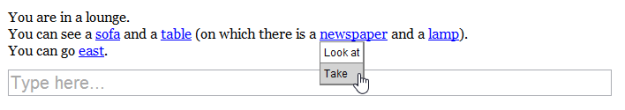
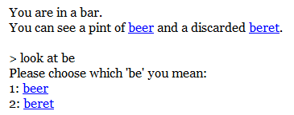
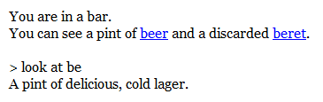

Hyperlinks were introduced in Quest 5.0, and I think they're a great way of navigating a text adventure game - without using any additional UI elements, you can always see what objects you can interact with, and you only see a relevant list of actions for each object.

In Quest 5.4, I have made hyperlinks a bit smarter. Previously, once a hyperlink for an object was displayed, it would remain on screen. So, if Quest told you that you could see "a book", that book link would remain selectable even if you moved somewhere else, set fire to it, etc.

Furthermore, once a hyperlink was displayed, it would always show the same list of verbs. In the book example, the verbs might be the standard set of "Look at" and "Take". But if you picked up the book, the hyperlink would still show you that same set of verbs - even though a more relevant verb set may now be "Read" and "Drop".

Quest 5.4 features what I call **live hyperlinks**. Now, as you move through the game, all hyperlinks activate or deactivating according to what the player can see. Also, clicking a hyperlink now always gives you the current verbs list for the object, even if you select an "old" link.

Let's see it in action. Here's a room with a newspaper that the player can pick up, as well as some other objects:

Now if the player takes the newspaper and moves east, the other hyperlinks are deactivated. The player can still click the "old" newspaper link though, and interact with it using the current set of inventory verbs:

Notice also that the exit hyperlinks "east" and "west" are also activated or deactivated according to whether they're available.

I have also improved how menus are displayed. Quest has a "disambiguation" menu which appears whenever the player isn't specific enough about which object they're referring to - for example, if the player abbreviates an object name, and there are multiple objects that start with the same letters.

Previously, this disambiguation menu was a modal pop-up. Now, I think modal pop-ups are ugly and they don't work very well on smartphones. They also stop the player from scrolling back through the game text - they are forced to choose from the menu before they can continue.

So, in Quest 5.4 I have changed menus so they are shown in-line with the rest of the game text. Like this:

The player can now click the link or type "1" or "2" to make a selection. The menu uses a simple jQuery animation to slide away, and the game continues.

Alternatively, the player could just do something else - if they type another command or interact with a different object, the menu slides away and the game continues.
