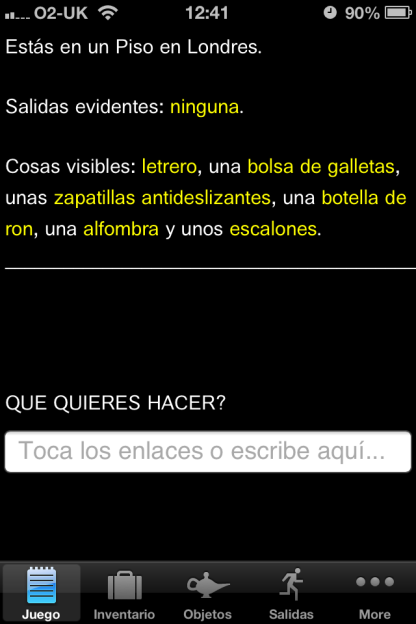
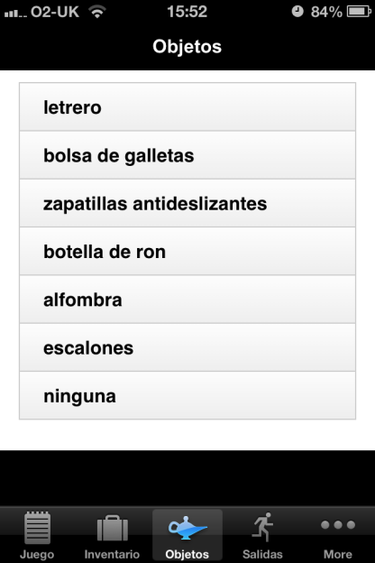
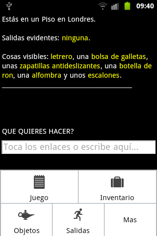

The latest Quest-powered app "Aventura Pirata" is now available from the App Store and Google Play, for smartphones and tablets.

- [Aventura Pirata for iOS](http://itunes.apple.com/app/id596370686)
- [Aventura Pirata for Android](http://market.android.com/details?id=uk.co.textadventures.android.pirata)

Aventura Pirata is a version of Scott Adams's 1978 game [Pirate Adventure](http://en.wikipedia.org/wiki/Pirate_Adventure), translated into Spanish and adapted for the Quest platform by Mauricio Díaz García.

The game supports the usual hyperlinks and tabs to reduce typing. Selecting an object produces a list of verbs, and exits are visible on the Exits tab (Salidas).

I think this game would be a useful and fun aid for anybody teaching or learning Spanish - it would be great to hear from anybody using it in this way.

In other news, [Escape From Byron Bay](http://www.textadventures.co.uk/review/450/) is now available for [Android](http://market.android.com/details?id=uk.co.textadventures.android.byronbay) as well as [iOS](http://itunes.apple.com/app/id581694804).

If you're interested in writing your own text adventure app, please take a look at the [Apps page](http://www.textadventures.co.uk/apps/) on the site. Any Quest game can be converted into an app, and it's great to start making a range of different titles available. More are coming soon, but more are needed, so please get in touch!

Apple have recently introduced a new appstore.com domain, which makes it very easy to find all the Quest text adventure apps for iOS: [appstore.com/textadventures](http://appstore.com/textadventures). The equivalent page for Android is [here](https://play.google.com/store/apps/developer?id=Text+Adventures).
