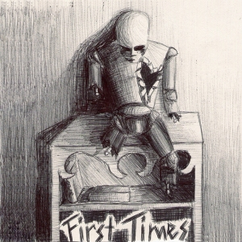

The horror text adventure [First Times](http://www.textadventures.co.uk/review/511/), by Hero Robb, is now available as a free app.

- [iOS version for iPhone, iPad, iPod Touch - App Store](http://itunes.apple.com/app/id609611434)
- [Android version - Google Play](https://play.google.com/store/apps/details?id=uk.co.textadventures.android.firsttimes)

_You awaken in a morgue with no memory of how you arrived. Journey deeper into your fears, regrets, and doubts as you explore the ruins of what appears to be a hospital. Can you survive a psychological trip through a nightmarish dreamscape? But then again, dying is a far cry from the most frightening thing that you will face._

_There are four endings. These are your first times. Open your eyes..._

Here's what some players have said so far...

"_First Times is a fantastic deviation from the classic Text Adventure genre. It utilizes both sound and game timers to give the player the most horrific experience possible. The game play and in-game descriptions are both shocking and intense. It's amazing what Hero Robb accomplishes in his Text Adventure debut. Fans of classic gaming, horror, or anyone looking to experience something strange and different should definitely play First Times. I truly can't wait to see what Hero Robb comes out with next. I don't care what it is, I'm playing it._" - Cody Robinson

"_You do horrible things, because if you don't, you can't progress, which makes the inevitable terribleness feel more like your fault. The use of sound is perfect, and specifically the 'ritual room' is one of the most harrowing places I've ever managed to be. Further, the green eyed doll, despite being rendered purely in text (or possibly even because of it, and having to use my imagination) is the single most disturbing and unnerving thing I've ever had to deal with in a game._" - Krissy

"_THE CHILD DOLL OH GOD, THE CHILD DOLL. Executing something like that in text form doesn't seem easy but you make it scary as hell. The foreshadowing in the red book was awesome as well. Holy shit. And the game is really Silent Hill-esque, especially with the rust, disturbing imagery and the particular type of puzzle solving._" - Vincent

"_This game truly scared the hell outta me_" - John Hernandez

If you dare, download the app now for [iOS](http://itunes.apple.com/app/id609611434) or [Android](https://play.google.com/store/apps/details?id=uk.co.textadventures.android.firsttimes) - it's free, and you might just survive.
