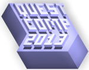

**Update 18th March - now with prize money!**

It's officially the first unofficial Quest competition!

Over [on the forums](http://forum.textadventures.co.uk/viewtopic.php?f=5&t=3506), various people have got together to organise [QuestComp 2013](http://www.textadventures.co.uk/quest/competition/) - a competition to use Quest to create a text adventure game around the theme of "Plague".

Evan Williams a.k.a TriangleGames is organising the competition, and there are no prizes except for the glory of winning thanks to Phillip Zolla for sponsoring a first prize of **£100**.

If you intend to enter, please email Evan by March 31st - full details on the rules, competition timetable and how to enter are at the [QuestComp 2013](http://www.textadventures.co.uk/quest/competition/) page.

Thanks also to Scott Greig for the interesting logo, which I hope I've got the right way up.
