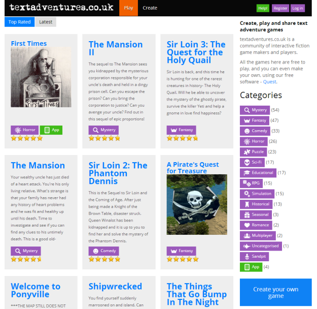

Meet the new [textadventures.co.uk](http://textadventures.co.uk)...

I have completely redeveloped the website from scratch. I've kept the design fairly minimal - the idea is to let the games stand out, make it easy to browse them, and make the site more accessible to smartphone and tablet devices. The large game tiles make the most of games with cover art, and the more easily browsable and tappable category badges hopefully make different kinds of games more discoverable.

The site uses a responsive layout, which means it adjusts depending on the width of your browser. There is no separate mobile version of the site - instead, the content is adjusted so it looks great whether you're browsing from a phone, tablet or larger laptop/desktop screen.

A few other changes and new features:

- You may notice the ranking of games has changed. This is because we're now using a Bayesian ranking instead of a simple average. What this means is that the ranking should now be more accurate - a game with just a couple of 5 star reviews no longer goes straight to the top of the list, as the number of reviews is also now taken into account.
- There are now multiple ways of signing in. In addition to Facebook, you can now log in with a Google or Microsoft account, and you can attach multiple sign-on methods to the same account.
- A new "Activity" view in your "Create" area shows the latest reviews and comments for all of your games in one place.
- You can now delete games from the online editor, as long as you've not published them.
- You can now download your game code from the online editor, so you can switch to using the offline desktop version - or just keep your own backup of your game.

Note that for the first time, usernames must be unique on the site. In the case of username clashes, you'll find a number has been added to the end of your name - if you want to change your username then just let me know.

Hopefully all bookmarks and links should still work and redirect where appropriate - but please let me know if you spot anything that's broken.

The new site should be visible for most people now, but if you get a "Back soon" message, you may have to wait a little longer for the DNS change to propagate to you.

This is just the beginning for improvements to the site - the new site architecture will make it much easier to implement some rather nice features I'm planning, so stay tuned!
