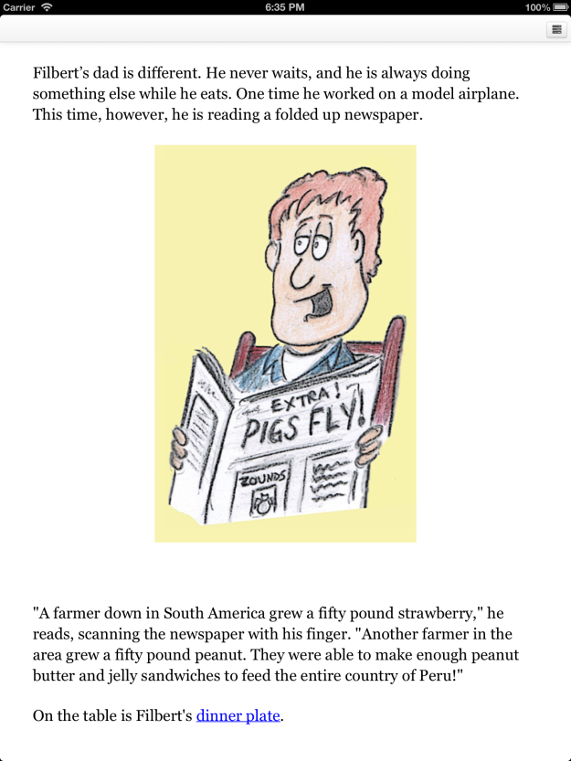

Our latest free app is for iPad is now available - an illustrated interactive children's book called [Filbert and the Broccoli Escape](http://itunes.apple.com/app/id648498789), by Erik Fetler.

> Filbert, the world's laziest boy, always looks for ways to get out of doing what he is supposed to do, like cleaning his room, taking out the trash, or in this case, eating his broccoli!
> 
> When Filbert comes to the dinner table and sees his least favorite vegetable sitting on his plate, he is desperate to get rid of it any way he can.
> 
> Help Filbert find a way to take care of this vegetable dilemma in this interactive adventure!

Erik wrote and illustrated the original book, which you can [read online at the author's website](http://fetworks.net/kids-stuff.html) (or order the printed version). He says:

> I'd just recently finished putting together Filbert and the Broccoli Escape book and wanted to do some kind of audio slideshow, or a "Choose Your Own Adventure" version. Somehow that morphed into making it an interactive adventure. Originally I was going to just string the pages of the book together, but I liked the idea of letting the player use a little more of his or her imagination.

The game was written using Quest's text adventure mode, but I have stripped back the UI so the game is played entirely via hyperlinks, and it looks more like a gamebook. There are no puzzles as such - the interactivity is fairly light, so it's hopefully a nice and easy bedtime read.

If you have young children and an iPad, please [download it](http://itunes.apple.com/app/id648498789) and [let us know what you think](http://textadventures.co.uk/help/contact)!

It would be really helpful to get your feedback of reading this interactive story - there are more books in the "Filbert" series, so any comments will really help with making the sequels as good as they can be.

