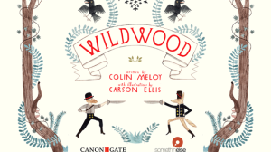
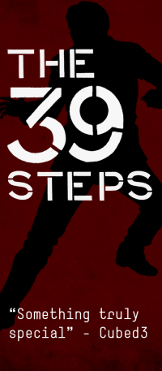
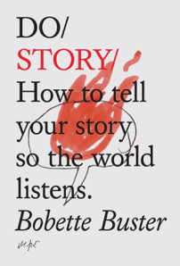

Last Thursday I attended the Futurebook Innovation Workshop, programmed by [The Literary Platform](http://www.theliteraryplatform.com/) - a very interesting afternoon of presentations and workshops on what I will call "digital storytelling" (although one of the recurring themes was that nobody has yet got a clear idea of what to call this, er, stuff).

**Setting the scene - a changing landscape**

[Nick Perrett](https://twitter.com/mrperrett) set the scene. He was in the games industry and has only recently moved into publishing, becoming group strategy and digital director for [HarperCollins](http://www.harpercollins.co.uk/Pages/Home.aspx). He thinks that publishing over the next 6 years will change in the same way the games industry has changed over the last 6 years - moving from packaged games towards live services, with big changes in how users are acquired and products monetised. The ebook is a "dead end", a "closed island" as it doesn't connect to anything else - so publishers should be looking to create more innovative digital products. There will be a new focus not on pricing but on daily active readers and ARPU (average revenue per user).

He also asked, with lowering barriers to entry for creating digital content, how do we shine a light on the good stuff? A question I'm all too familiar with - running [textadventures.co.uk](http://textadventures.co.uk), which allows anybody to submit interactive stories, means I deal with submissions which vary hugely in quality. (My current approach to the problem is fairly simple - leave it to users to post reviews so that good games float to the top - but some games never get any reviews, so that's something I'm planning to address soon)

**Success and failure - creation vs consumption**

Two of the afternoon's presentations were revealing in their contrasts. [Cate Cannon](https://twitter.com/cannoncate), head of marketing and digital content at [Canongate](http://www.canongate.tv/), talked about the [Wildwood Story Map](http://www.somethinelse.com/content/new-wildwood-story-map-app-launches/), and it was interesting to compare this to the talk given by [Sara O'Connor](https://twitter.com/saramoohead), editorial director of print and digital at [Hot Key Books](https://www.hotkeybooks.com/), about [Fleur Hitchcock's Story Adventure](http://www.thestoryadventure.com/).

I really enjoyed both of these presentations and how open both were with their figures. We can learn a lot from success and failure, and there is much more value in these kinds of presentations than in the kind where people just talk about what they did and how marvellous it all was.

Wildwood Story Map is a free iPad app created to promote a trilogy of books - The Wildwood Chronicles by Colin Meloy, targeted at 8 to 12-year olds. The word "disaster" was used to describe how well the app promoted the first book in the trilogy - as it didn't actually launch, due to wrangling with various rights holders who all demanded final approval before it could go live. For the second of the trilogy, the app was launched and marketed alongside the book - the idea being that the app would engage the audience more with the book, even though this effectively meant it had failed its original stated purpose as way of promoting the book itself.

Cate said that "hundreds" of people had downloaded the app. Taking a look at the stats on [App Annie](http://www.appannie.com/), it seems to have achieved similar App Store rankings to my own recent free iPad book app, [Filbert and the Broccoli Escape](http://blog.textadventures.co.uk/2013/05/19/filbert-and-the-broccoli-escape-an-interactive-childrens-book-for-ipad/ "“Filbert and the Broccoli Escape” – an interactive children’s book for iPad") - so a download figure in the low to mid hundreds sounds likely. My app was created for a far tinier budget, and suffers from my own limited marketing skills - so it was interesting to hear that others, even with teams of people working to making them look great, and with established publishers behind them, can suffer from the same problems with finding an audience. Being beautiful and free sadly isn't enough.

Contrasting with Canongate's experience, Sara O'Connor's presentation on Fleur Hitchcock's Story Adventure shows how much can be achieved with a very limited budget. For this project, Hot Key Books used the [NING](http://www.ning.com/) platform to set up community resources - blogs and forums. "It's not beautiful, but it's all about the content". Author Fleur Hitchcock started the story, and children aged between 9 and 12 contributed the details to move it along. Behind the scenes, the project was simply driven by a large spreadsheet.

The total spend was £2200 - this project was low-tech, low-risk and low-cost, yet resulted in high engagement. It got children excited about literacy, and gave a confidence boost to those whose ideas were included. Children are amazingly creative, as I have found when running my own [Quest workshops](http://blog.textadventures.co.uk/2012/07/04/quest-at-games-britannia/ "Quest at Games Britannia") - as Sara said, unlike grown-up authors who can struggle for inspiration, "children are used to having their creativity scheduled". This regular schedule of weekly updates and challenges meant that children kept coming back, as it became part of their routine.

This shows how much can be achieved with very little, and especially how engaged and excited kids are when you get them to create instead of simply consume. And it's so much cheaper to do it this way, as you don't have to create all the content yourself either. Win-win! Could Canongate have saved themselves a lot of money and got kids more excited about the story, simply by getting them to contribute to the content of the app?

**Value for money**

[Jodie Mullish](https://twitter.com/jodiemullish), senior marketing manager of [Pan Macmillan](http://www.panmacmillan.com/Home) talked about a project to promote [Ken Follett](http://www.panmacmillan.com/author/kenfollett)'s book Winter of the World. A map-based app on Facebook allowed fans to post their stories about World War II. To promote the paperback, they released these stories as an ebook, donating revenues to [The Soldier's Charity](http://www.soldierscharity.org/) in exchange for the charity promoting the ebook. This meant that Pan Macmillan paid for neither content nor coverage - so it was more about saving marketing budget than monetising the project itself. Over 3 months they got 50,000 words submitted, from 180 participants in 32 countries, and it resulted in a big increase in the rate of new Facebook fans.

This shows how digital projects can be done successfully without spending lots of money. Similar to Fleur Hitchcock's Story Adventure, this shows how engaging and successful a low-cost project can be by getting people to submit content.

**Publishers getting into Interactive Fiction**

[Dan Franklin](https://twitter.com/digitaldanhouse), digital director at [Random House](http://www.randomhouse.co.uk/), presented the just-released [Black Crown](http://www.blackcrownproject.com/s) alongside [Failbetter](http://about.failbettergames.com/)'s [Alexis Kennedy](https://twitter.com/alexiskennedy) (whose [StoryNexus](http://storynexus.com/s) platform powers it) and author Rob Sherman.

There are various kinds of interactive fiction (IF) which people may be familiar with. There's straightforward branching narrative - "Choose Your Own Adventure" (CYOA) or gamebook-style games. Then there's parser-based text adventures, where you type in commands like "go north" and "open box". Black Crown, like other StoryNexus games, works a bit differently to these. It's kind of hard to explain, so I hope I'm getting this right, but it involves story sections (called "storylets") which are accessed by choosing from a set of cards. The cards that are available to you throughout the game will change based on what you've done before. So, it's sort of like a multiple-choice CYOA, but you can also come back and explore other strands.

Unlike many more game-like works of IF, there is no concept of failure in Black Crown, and there aren't multiple endings to choose from. I think "no failure" is important for any type of IF that hopes to be mainstream - even if you don't quite understand the plot, you can always get to the end of a film or book, so why should it be different for interactive content?

Another way Black Crown differs from other kinds of interactive fiction is that it is monetised. Income comes from "premium" story strands, which are locked away until you pay up. There are also so-called "living stories" - story strands where normally you might have to wait a week before seeing where they lead. If you're impatient, you can pay to expedite these, to see what happens sooner.

Random House see three markets for Black Crown. Sci-fi fans, gamers and so-called "progressives" (which we take to mean "Guardian-reading Twittery types"). This seems a sensible audience for a publisher's first forays into this area, but it makes me wonder how we can reach beyond these people, to create digital interactive stories which appeal to other audiences?

https://twitter.com/MaggieA/status/340101068144910336

https://twitter.com/alexwarren/status/340102609530658816

https://twitter.com/MaggieA/status/340103038628937729

The other interesting thing about Black Crown is how it stands alone. Whereas many people are embarking on digital story projects which either piggy-back off existing IP, or exist solely to promote something else, Black Crown is simply a product in itself. It has to be promoted entirely on its own merits, and it will only make money if people pay for it. This seems a bold and risky experiment. It will be actively developed over at least the next four months - can it find enough of an audience to pay its own way?

**Multiple platforms**

[Simon Meek](https://twitter.com/simon_meek), founder of [The Story Mechanics](http://thestorymechanics.com/), talked about a digital adaptation of [The Thirty-Nine Steps](http://thestorymechanics.com/digital-adaptations/the-thirty-nine-steps/). Using the [Unity](http://unity3d.com/) engine allowed them to bring the game to pretty much every platform you can think of - although this presented its own challenges as they had to handle multiple screen sizes and input types, it also brings the game to the widest possible audience. They have even made the game available as a packaged item via retail channels such as Amazon, Morrisons and WHSmith.

The player can explore the environment, and interact with the world around them - for example by reading newspapers. The world is "infused" with the story - you can experience it but not change it.

They got the game on [Steam](http://store.steampowered.com/) without having to through the "[Greenlight](http://steamcommunity.com/greenlight)" hurdle - showing that Steam know that interactive entertainment is bigger than just games.

Some interesting figures were shared (via pie charts, so these percentages are approximate). Combined iOS and Mac App Store accounted for 50% of sales, of which two thirds was iOS. Steam accounted for 20% and physical retail was 30%. For revenue, Steam and the App Store provide about 40% each, and physical provides hardly anything due to overheads. They have had somewhere between 10,000 and 20,000 sales over the last month or so.

These figures show the importance of multi-platform - if they'd gone for making an iPad-only app, they would only have made half as many sales. But if you want to target multiple platforms, you need to design for that from the outset.

**Art projects**

[Alyson Fielding](https://twitter.com/alysonf) demonstrated a project to modify physical books with electronics such as [Arduinos](http://www.arduino.cc/). By embedding motion sensors into an old hardback, it can wirelessly transmit data to an iPhone which can then play speech, post to Twitter and so on. Alyson plans for this kind of thing not to be just a one-off, but to be able to provide the means to mass produce these "enchanted" books. I like the project as a piece of art, but I struggle to make sense of it as a product in itself - who is this for?

[Lucy Heywood](https://twitter.com/stand_stare), co-artistic director of [Stand and Stare](http://www.standandstare.com/) showed [Turning the Page](http://www.standandstare.com/turning-the-page), which is an installation that brings a used tourist guidebook to life. Sitting at a desk, participants don headphones and as they browse the book, image recognition software hidden in a lamp triggers sound and projections.

[Tim Wright](https://twitter.com/moongolfer) talked about The Haunter, a box of "haunted" electronics that is carried around by audience members. It knows where it is, so media can be triggered at particular locations. It connects to the web and also unlocks in one specific place to reveal its contents. Why not just use a phone or tablet for this? Well, Tim says it changes the experience - it's a theatrical prop that's "not yours", it makes conversation between users, and frees up their phones for other stuff. He also doesn't like the idea of people walking around holding tablets up - I wonder if this is so much worse than people walking around with weird boxes though, and apparently this will all be turned into an app at some point anyway.

It also has the idea of co-creation - participants can leave a layer of audio or memories for subsequent participants. This is an idea I've been mulling over for text-based games too - it seems like the kind of thing that could be added to the server side of [Quest](http://textadventures.co.uk/quest) relatively easily, and could be a very interesting experiment, so do get in touch if you have any ideas for this kind of thing and let's see what we can build.

**The Most Important Thing**

[Bobette Buster](https://twitter.com/bobettebuster) did great workshop on storytelling, and there was a copy of her new book "[Do Story](http://thedobook.co/products/do-story-how-to-tell-your-story-so-the-world-listens)" in the goodie bag, which I look forward to reading this week (I'm currently hiding away in rural Buckinghamshire, working on my own first piece of interactive fiction). Right at the end of the workshop, a key message:

https://twitter.com/LoisBray/status/340133728829452289

For all of us working to do interesting things with technology in games, this should be repeated over and over again. Maybe we should chant this three times before breakfast or something. It's all about the story. It's all about the story. It's all about the story.

If the technology or digital project that we're working on is just a gimmick, there is no long term future - audiences will get bored. Books and films have stuck around because they're great mediums for telling stories. We need to keep experimenting, but we should never lose sight of the fact that it's the story underneath that's important, and if the technology doesn't enhance that, we are probably just wasting our time.

**Thoughts about where we're headed**

My head was absolutely buzzing after a very interesting afternoon of talks with much food for thought - followed by a few more ideas which occurred to me as I chatted with various people over some beers afterwards. I've just about calmed down enough now to note down a few key thoughts, questions and conclusions.

**Terminology**: We're not sure what we call this "stuff" for now, maybe "digital storytelling" is sufficient, but ultimately it doesn't seem like such an important question. Especially as we haven't really worked out what we're doing yet.

**Audience**: How are we going to make this stuff relevant to most people - not just the hipsters with their lattes?

**Creation**: It seems much more effective, and better value for money, to engage the audience by getting them to create content, not just consume it.

**Money**: For digital storytelling to work, there needs to be a way to produce it quickly and cheaply. We're still developing the tools. Plug alert! I have my own - [Quest](http://textadventures.co.uk/quest) (it's free and open source).

**New audiences**: Do these projects actually add to the audience for stories, or are these projects just cannibalising existing book and game audiences? I think it depends - I know from teacher feedback that introducing interactive fiction to a class of children can unlock reading and writing to kids who are otherwise disengaged, so I believe the potential is there to broaden audiences rather than simply giving existing readers/players a new toy.

**Experimentation**: It's a time of great experimentation - will we see more experimentation over the coming years, or will things settle down? Lots of people are trying lots of different things - some things work, some don't, some reach and connect to audiences, some things wither and die. This can mean there is a high risk and low ROI for these kinds of projects. Is it worth it simply for the art?

**Story story story**: It's all about the story. Don't get sidetracked by whizzy technology. Looking at some of the artier stuff, I wonder if they really need all that technology in the first place. A lot of things can be done manually - Lucy Heywood talked about previous iterations of their projects which worked simply with people hidden behind a curtain pulling strings - so a seriously low-tech approach may be the easiest and cheapest way to experiment.

So many things to think about here - it would be great to hear your views in the comments below.

Finally, if you're interested in an easy and low-cost way to build cross-platform interactive stories, or want to do something more strange and experimental, then check out my [Quest platform](http://textadventures.co.uk/quest) - if you want to stretch it to do something which it doesn't currently do, I'm available! Email me at [alex@textadventures.co.uk](mailto:alex@textadventures.co.uk) or find me on Twitter [@alexwarren](https://twitter.com/alexwarren).
