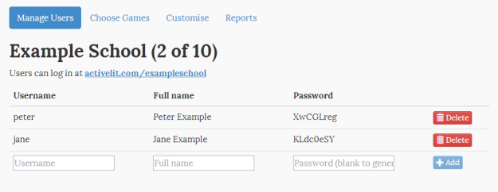
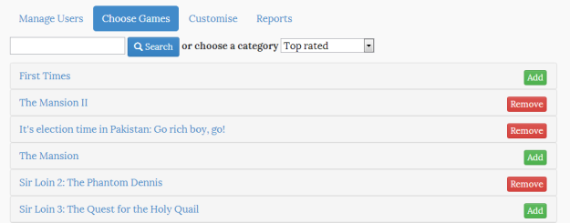
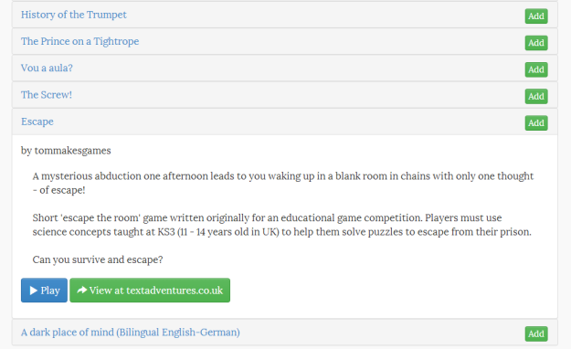
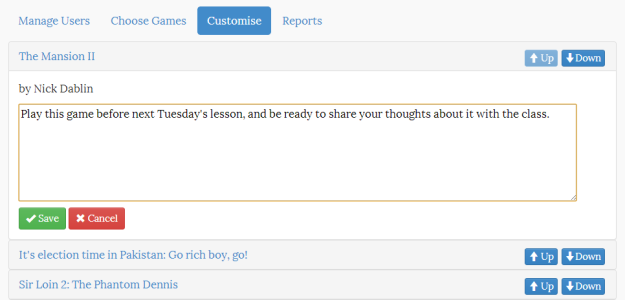
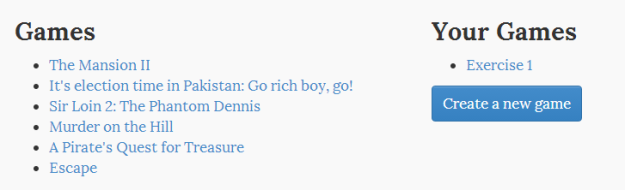
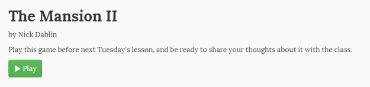
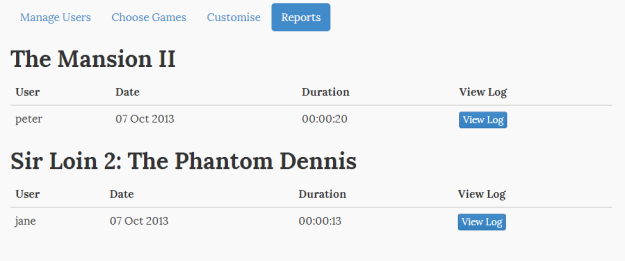
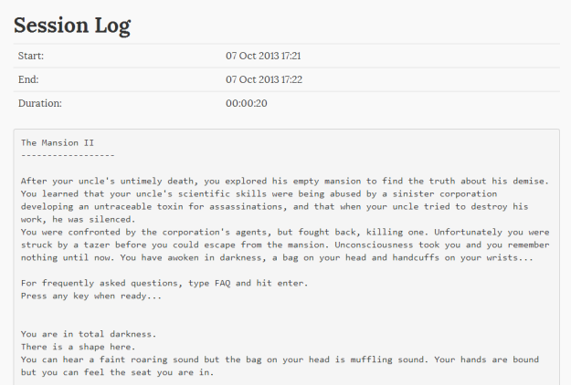

After several months of beta, we have now launched our new service [ActiveLit](http://activelit.com). Many thanks to all of you who have signed up and given us your feedback so far.

ActiveLit provides you with a safe, private, curated area in which to play and create text adventure games and interactive fiction with a group or class. After setting up each of your students or group members with their own login, they can access your ActiveLit area from anywhere - on your own premises or at home. They can play and create their own games and stories directly in their browser, whether that's on a desktop, laptop, phone or tablet - there is no need to download any software.

To get started, [sign up and request an account](http://activelit.com/home/signup). ActiveLit is free for groups of up to 10, and we have various packages available for larger groups - with an introductory half-price offer until 31st December 2013. You can switch to a larger package at any time, so you can try ActiveLit with a free account and then upgrade later.

When we process your request, you'll receive an email with instructions for logging in to your admin area.

The admin area lets you add members to your site. It also shows you the web address where they can log in - it will be something like activelit.com/yourschool. It's quick to add users, and passwords can be generated automatically, but if you have a large number of users to set up, email us and we'll import them for you.

**Playing Games**

Choose the games you want to display to your group. You can choose any game from [textadventures.co.uk](http://textadventures.co.uk). It is easy to search, and you can also browse by category.

Clicking the game name shows you the description of that game, where you can play it and also jump to the listing at textadventures.co.uk to see the reviews and comments.

Once you have chosen the games you want to display, you can customise how they are shown.

You can choose which order they appear in, and you can also give them your own description - for example, to set a particular game as homework.

When group members log in to the area, they will see the list of games you have selected.

They can click on the game to view your description, and play the game in their browser.

After playing a game online, as the group administrator you'll be able to see session transcripts in the Reports area.

**Creating Games**

Group members can build their own interactive stories online using [Quest](http://textadventures.co.uk/quest). When they've finished creating their interactive story, they can publish their game to the area to share it with other group members.

**More coming soon**

[Sign up](http://activelit.com/home/signup) and give us your feedback! Stay tuned for more updates - we'll be continuing to add functionality over the coming months, so do [get in touch](http://activelit.com/help/contact) and let us know what will help you with using interactive fiction in your group.
