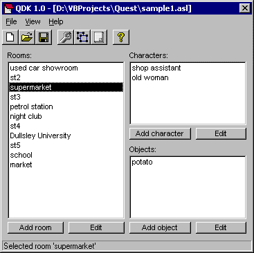
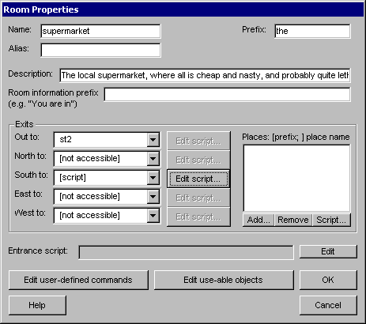
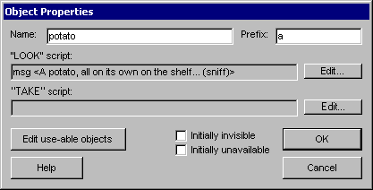
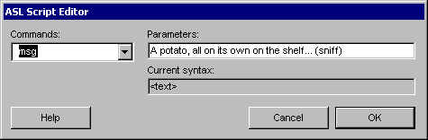
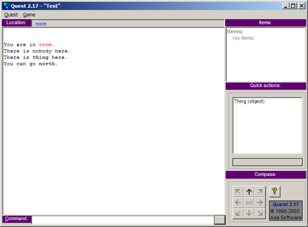

This is part 2 of a look back at 15 years of Quest - [part 1 is here](http://blog.textadventures.co.uk/2013/11/07/quest-is-15/ "Quest is 15").

Immediately after releasing Quest 1.0, in November 1998, I got started working on Quest 2.0 - the first alpha version was released only a month later, in December 1998. This version incorporated the early feedback I'd received from v1.0 - making room descriptions more customisable, adding functions, numeric variables and "for" loops, improving the in-game debugging information, and fixing various bugs.

It seems surprising to me now that I didn't ever do a bug-fix release of v1.0 - I guess that so few people were actively using it, and there were so many rough edges anyway, it must have made more sense just to plough on and pour everything into v2.0. And this was before I'd ever heard of [source control](http://en.wikipedia.org/wiki/Revision_control) anyway - in fact, I doubt I'd have even had any kind of backup copy of the Quest code at the time. (It was a time when I was constantly running out of hard disk space, when floppy disks were too small, before I had a CD writer, and before any significant amount of online storage space was easily available).

Over the following months I added more features - more text formatting options, allowing objects to moved and hidden, and libraries to allow Quest functions to be re-used between games.

It was all a nice break from working on my A-levels and filling in my UCAS form.

Quest 2.0 was released in August 1999, and for the first time included a beta version of a new visual Quest game editor called "QDK" - meaning finally you no longer had to code games using a text editor. (I would have called the editor "QED" but there was already a Quake editor of that name).

The script editor was very basic:

The main player interface for Quest 2.0 still looked pretty much exactly the same as v1.0 - which is to say, hideous. This was finally rectified in November 1999 with the release of Quest 2.1, which has a layout which is awfully similar even to the current version of Quest:

Quest 2.0 is the first version for which at least one actual game was made - and it's still on textadventures.co.uk, and it still works today, whether you download it or use the web-based player - [The Adventures of Koww the Magician](http://textadventures.co.uk/games/view/nalydifu9eqbcgy0pcyceq/the-adventures-of-koww-the-magician).

There are a total of 28 games on [textadventures.co.uk](http://textadventures.co.uk) which were written for Quest 2.x - see if you can find them... (the column to the right of the game listing will tell you the version of Quest used to build the game).

The "libraries" feature got some early use, with Alan Bampton creating a "Standard" library to add some features, including containers - which Quest was still years away from supporting natively. This library was included with Quest itself as of v2.11. (10 years later, when redesigning Quest for v5.0, libraries became _the_ way to add _all_ functionality to Quest - without its Core library, Quest 5 does very little at all).

By early 2000 my thoughts were turning to Quest 3.0, which would be a huge update - I was getting lots of suggestions from users, and there were various aspects of Quest I wanted to tidy up - things which didn't make sense to me at all any more, such as: why was "an object in a room" a separate concept to "an item you can carry"? It was time for the first of many overhauls of Quest. In the mean-time I carried on releasing bug-fixed versions of v2.1 up until Quest 2.19, which was released in January 2001.

Next time I'll carry on with a look back at version 3.0 and beyond. If you want to peruse some archive material, the [forums from 1998-2000](http://www.network54.com/Forum/9821/) are still online.
