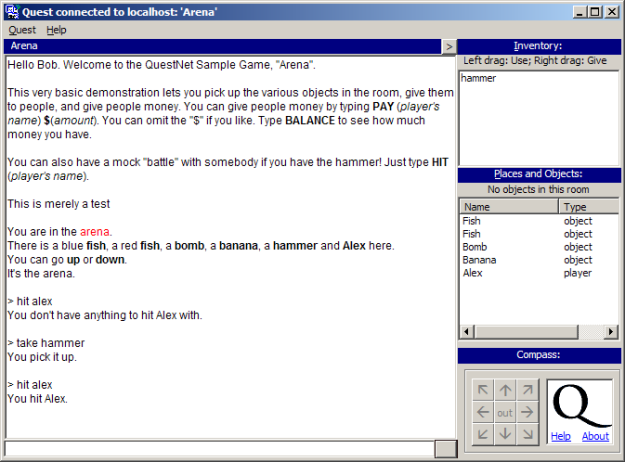
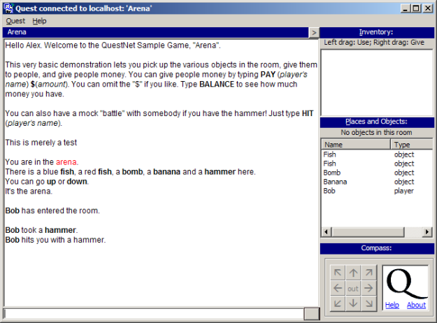
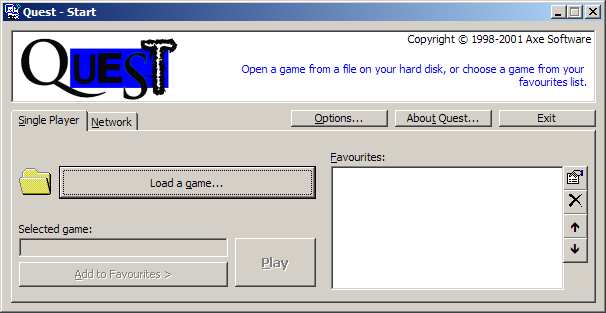
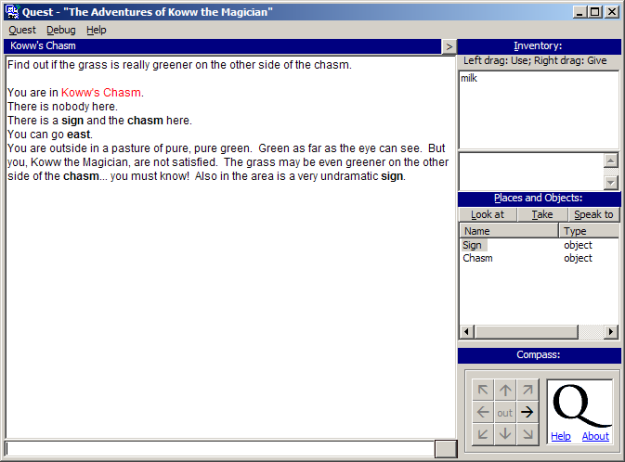
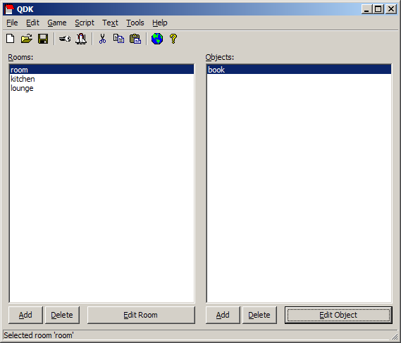
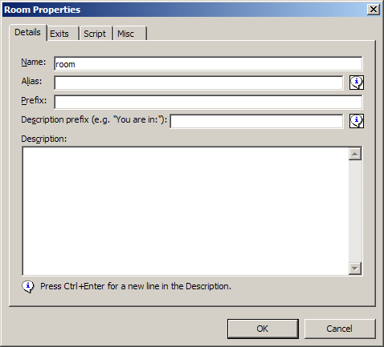
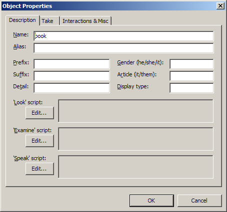
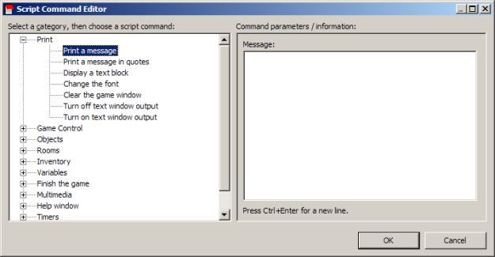

This is part 3 of a look back at 15 years of Quest. Here are links to the previous posts: [part 1](http://blog.textadventures.co.uk/2013/11/07/quest-is-15/ "Quest is 15"), [part 2](http://blog.textadventures.co.uk/2013/11/26/15-years-of-quest-part-2-1999-2000/ "15 years of Quest, part 2: 1999-2000").

The first alpha build Quest 3.0 was released in March 2000, and fixed one of the weird design flaws of previous versions by unifying "items" and "objects". Objects now had to have unique names, but they could have aliases, which would be displayed to the player instead of the code name. This version also introduced a disambiguation menu to allow the player to distinguishing between different objects which had same the alias. This is fundamentally the same approach to object handling that Quest still uses today.

That first alpha of Quest 3.0 also added timers. The second alpha in July 2000 added support for a truly experimental feature that never quite took off - online multi-player play. This allowed Quest to connect to a new bit of software I was working on, which started out with the name "QX3" and was later renamed "QuestNet Server".

The idea was that the game ran entirely on the server, and players would connect to it using the Quest software. This would allow multiple players to connect to the same game world, where they would each have their own inventories and be able to interact with other players.

You can get some idea of how it worked by looking at some screenshots for the basic "Arena" demo. Multiple players would appear in the same room, and they could pick up objects, give them to each other, and even hit each other. For example, here's what Bob might see if he joins Alex in the room:

And here's what Alex sees while this is happening:

I thought this was rather nifty, myself, and although it got a reasonable amount of interest from Quest users, it ultimately failed to really get anywhere. I've come across a [forum post from 2002 by MaDbRiT](http://www.axeuk.com/ubb/Forum3/HTML/000030.html) which sums it up:

> Questnet is a good idea that is kind of struggling to get off the ground. There are no games because there are no players and no one wants to spend aged writing a game if there are no players. What came first, the Chicken or the Egg? The technical demands of hosting a QuestNet game are out of realistic reach of most of us too - even if I wrote a QuestNet game, I couldn't "serve" it - I just don't have the facilities.

In the days when most of us were still using dial-up, the idea of running a server on your home internet connection just didn't make a whole lot of sense.

QuestNet Server would hang around for a while, never getting much use or ever seeing its full potential. I still think there's something in the idea of multi-player interactive fiction, and maybe it's something to revisit some day. Watch this space!

The second alpha of Quest 3.0 also got rid of the separate concept of "characters" - they were now just objects too. It added support for arrays, and arbitrary object properties allowing any kind of data to be attached to an object (although these were separate to the built-in properties or "tags", which meant that you couldn't easily read or update data like an object's "look" description - this flaw was resolved when Quest was rewritten for v5.0, when all object data was finally stored as properties).

A third alpha build followed in September 2000, which added object types - allowing object properties to be inherited. This also added support for creating rooms on-the-fly via script.

In October 2000, I moved to London and started university, so progress with Quest slowed down quite a bit.

In March 2001, Quest 3.0 reached its first beta release. This added support for dynamically creating objects and exits, and added script properties ("actions"). The second beta followed in April, featuring various minor tweaks to get it closer to a releasable version. Quest 3.0 was finally released in September 2001, and QDK was updated at the same time to get a cleaner interface and to support all the new Quest features. It also gained a new script editor.

The new-look start screen allowed you to load a game file, or connect to a multi-player network game:

The main player interface was relatively unchanged from Quest 2.1, although you could now toggle the panes off: 

QDK was still looking rather plain:

The Room and Object editors were now grouped into tabs:

The new Script Editor presented a plain English way of editing scripts. It's not dissimilar to Quest 5's script editor, although it did involve opening a pop-up window every time you wanted to edit any individual command, which some people found a bit tiring:

A few bug-fix releases followed very shortly afterwards, and then I started working on v3.1. This added support for [MOD music files](http://en.wikipedia.org/wiki/Module_file) - something I was into creating myself, but a feature I think was never actually used by anybody. There were various other tweaks, including improvements to the parser. Libraries gained the ability to add panes to QDK (here again is an example of a feature that was added which is now a core part of how Quest works - as of v5.0, all panes in Quest's editor are defined by libraries). Quest 3.1 was released in June 2002.

The next update was version 3.5, released in December 2003, featuring the ability to translate the player interface (although not on a per-game basis - it was a player setting), plus support for text-to-speech and opening ZIP files. Following slightly later in January 2004 was the first non-beta release of QuestNet Server - although, as it would turn out, it would never get another significant release after that, simply keeping pace with features as they were added to the single-player version Quest.

The pace of change was clearly slowing down, as I was keeping busy with my Physics degree. It got even worse after I graduated in 2004, and started working - I didn't really touch Quest for almost two years. But when I finally came back to it, I dived into it in a big way. More on that next time!

For a trip down memory lane, all posts from the old forums from 2000-2003 are available: [Quest Forum](http://www.axeuk.com/ubb/oldthreads1.htm), [QuestNet Forum](http://www.axeuk.com/ubb/oldthreads2.htm), [Games and Chat Forum](http://www.axeuk.com/ubb/oldthreads3.htm). Posts from 2003 onwards are all part of the [current forums](http://forum.textadventures.co.uk/).
