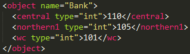
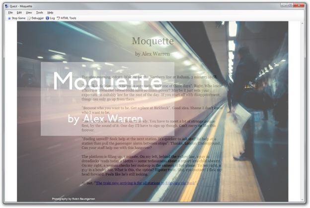
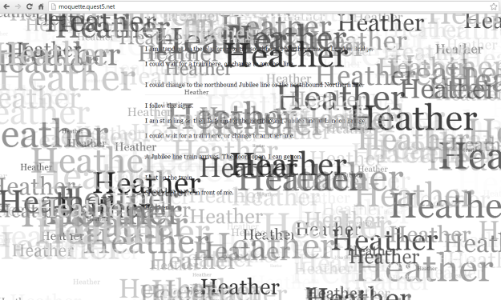

Following on from the previous blog post ([Moquette Post-Mortem and Review Roundup](http://blog.textadventures.co.uk/2013/11/19/moquette-in-the-ifcomp-post-mortem-and-review-roundup/ "Moquette in the IFComp – Post-Mortem and Review Roundup")), here's a look at how some of it was implemented.

[Moquette](http://textadventures.co.uk/games/view/zbzfpcnknu_vdjog-cbihw/moquette) was entered into the [IFComp](http://ifcomp.org/) not under the Quest category, but as a web-based game only. Why? Because I used my latest development version - [Quest 5.5](https://quest.codeplex.com/releases/view/99971), which is currently available only as an unsupported pre-beta "nightly" build. A downloadable .quest file was submitted to the IFComp for archive purposes, and will be made available from the [Moquette page on textadventures.co.uk](http://textadventures.co.uk/games/view/zbzfpcnknu_vdjog-cbihw/moquette) when a beta version of Quest 5.5 is ready - which should be in the next month or two.

Some reviewers supposed that the text effects in Moquette might be a preview of new features in v5.5, but actually they're not - you can do them in [Quest 5.4](http://textadventures.co.uk/quest) using the same JavaScript, which I'll go into later in this blog post.

The changes in v5.5 as far as they apply to Moquette are cosmetic - I needed the ability to completely hide the location bar and game border, and to set a custom screen width. I also needed the ability to disable a command link after it's clicked, and I implemented some changes to how scrolling works so there is a nice smooth transition when new game text is added.

**Simulating the Tube**

Moquette is full of contradictions. It's a game, but it's not a game. It has many choices, yet no choices. And on a technical level, it has many locations (a full tube map) and yet it really only has _two_ locations - the train and the platform.

Everything else is just labelling of scenery. Get off one train, change to another line, get on a different train - as far is Quest is concerned, you're just right back where you started.

The train has attributes to represent the line it's travelling on and the station it's at (or, if it's in a tunnel, the station it was most recently at). It also counts turns - there is an overall turn counter, used to trigger plot events, and there is a rolling counter - every three turns, it triggers the next station on the line.

The platform has attributes to represent the lines that stop there, the direction trains go in for each line, and its location (station). At many stations, there is one platform in each direction for each line - but that's not true for e.g. the Circle and District lines which share platforms.

There are objects for each tube line, and objects for each tube station. Tube station objects may contain hand-crafted data for platforms (if any platforms are for multiple lines), but otherwise the platform data is generated simply using data about which lines stop at that station. The format is simple - one attribute for each line which stops at that station. For example, Bank station is stored like this:

[](http://blog.textadventures.co.uk/wp-content/uploads/2013/11/bank.png)

I started in the top-left of the tube map, at Paddington, giving the station an index of 100 for each line that stops there. Then I went along each line counting up or down. So, Bank ends up at index 110 on the Central line, 105 on the Bank branch of the Northern line, and 101 on the Waterloo & City line.

(I should really have added some code for the special case of Bank being linked to Monument, but I didn't get round to it - few people noticed. Almost as if that was completely irrelevant to the plot...)

So, the code for moving around the tube network is pretty straightforward. But it wouldn't be a journey on the London Underground with people. Lots and lots of people. Too many people.

Well, there are only 36 passengers in total in Moquette. Even if they were all on one tube carriage, you would still just about find a seat.

They are randomly assigned to each train when you get on. If you interact with them, that is recorded so that they won't appear again. Every time the train enters a station, some of the passengers might get off and some new ones may get on - if you didn't interact with them the first time, they may reappear later. This is why they tend to have fairly generic names such as "a man" or "a middle-aged woman". I wanted you to get the impression that there were many more passengers than you were given the chance to properly look at.

In addition to the train and platform, there are locations for each of the plot events - the introductory part of the game is implemented as a sequence of rooms, as are the "visions" (the two smoking visions and the clay), the interaction with Heather and the interaction with Private Rod.

**Text Effects**

Quest has supported embedding JavaScript for a while now, and I wanted to show how this could be used for some effects to add a little bit of polish but without being too overblown.

A JavaScript effect is, in fact, the very first thing you see in the game. Quest's function to initialise the user interface calls the following ASL:

```
JS.introScreen (GetFileURL("intro.jpg"))
```

This calls this JavaScript function:

```
function introScreen(url) {
     $("#gameBorder").hide();
     $("<div/>", {
         id: "introScreen"
     }).css({
         position: "fixed",
         top: 0,
         left: 0,
         width: "100%",
         height: "100%",
         overflow: "hidden",
         "text-align": "center",
         display: "none",
     }).appendTo("body")
     .html("");
     $("#introScreenImg").load(function() {
         $("#introScreen").fadeIn(4000);
         setTimeout(function() {
             finishIntroScreen();
         }, 7500);
     });
 }

function finishIntroScreen() {
     $("#gameBorder").show();
     $("#introScreen").fadeOut(7000, function() {
         $("#introScreen").remove();
     });
 }
```

The introScreen function hides Quest's game output (which is entirely in the gameBorder div), then adds a new hidden div called introScreen containing the intro image. Once this has loaded, the function inside the call to jQuery's .load() method is run - this ensures the image has always fully loaded before we show it. This fades the introScreen div into view over 4 seconds, and 7.5 seconds later calls finishIntroScreen to fade it out again.

finishIntroScreen first re-shows the gameBorder div containing the Quest output (which by now will contain the introductory game text), and then it fades out introScreen - to reveal the game text underneath.

[](http://blog.textadventures.co.uk/wp-content/uploads/2013/11/intro.png)

The next effects occur in the first few turns - after Zoran gets on the first train, the text is nicely scrolled up and out of the screen, leaving it blank. The next effect occurs after the player makes the choice for Zoran to do something different than take his usual train today (or if Zoran makes that choice himself) - it's the same effect again really, but this time the screen text is whisked off to the left.

Both of these make use of [jQuery UI effects](http://jqueryui.com/effect/). These can be applied to any element, and the "drop" effect is the one used here. Quest calls:

```
JS.act0Clear ()
```

which simply calls this JavaScript:

```
function act0Clear() {
     $("#divOutput").effect("drop", {direction: "up"}, 1000);
     setTimeout(function() {
         EndOutputSection ("intro")
         HideOutputSection ("intro")
         HideOutputSection ("title")
         ASLEvent("FinishAct0Clear", "");
     }, 1500);
 }
```

This calls the "drop" effect on divOutput, which contains the game output text (we could have used its parent, gameBorder, again I suppose as we're not displaying an actual border around it). After this has run, the screen is empty, which means we can empty divOutput by hiding all the output sections on it (looking at this now with fresh eyes, that might be some old code as we clear the screen in a moment anyway).

We then call the FinishAct0Clear ASL function, which looks like this:

```
ClearScreen
JS.reshowOutput ()
JS.StartOutputSection ("act01")
MoveObject (player, Act 0 Balham to Clapham South)
```

The reshowOutput JavaScript function is simply:

```
$("#divOutput").show()
```

which gets us our Quest output back so we can start writing to it again. We start a new output section and move the player to the next location.

This is a pattern I use in most of the text effects - the ASL code triggers some JavaScript, the JavaScript does something pretty, then the JavaScript can call another ASL function when it's done to continue the game.

The next effect is meeting Heather, which looks like this:

[](http://blog.textadventures.co.uk/wp-content/uploads/2013/11/effect.png)

The JavaScript for this is:

```
var _heatherTextCount = 0;

function heatherText() {
    $("<div/>", {
        id: "heatherText"
    }).css({
        position: "fixed",
        top: 0,
        left: 0,
        width: "100%",
        height: "100%",
        overflow: "hidden"
    }).appendTo("body");
    doHeatherText();
}

function doHeatherText() {
    _heatherTextCount++;
    if (_heatherTextCount < 150) {
        setTimeout(function() {
            doHeatherText();
        }, 20);
    }
    else {
        $("#heatherText").fadeOut(2000, function() {
            $(this).remove();
        });
        setTimeout(function() {
            ASLEvent("JSFinish_HeatherText", "");
        }, 500);
    }
    var minLeft = -100;
    var minTop = -100;
    var maxLeft = $(window).width();
    var maxTop = $(window).height();
    for (var i = 0; i < 3; i++) {
        $("<div/>", {
            text: "Heather"
        }).css({
            position: "absolute",
            left: getRandomInt(minLeft, maxLeft),
            top: getRandomInt(minTop, maxTop),
            "font-size": getRandomInt(8, 100) + "px",
            "font-family": "Georgia, serif",
            color: getRandomGrey(),
            opacity: Math.random(),
        }).appendTo("#heatherText");
    }
}

function getRandomInt(min, max) {
    return Math.floor(Math.random() * (max - min + 1)) + min;
}

function getRandomGrey() {
    var hex = Math.floor(Math.random() * 256).toString(16);
    return "#" + hex + hex + hex;
}
```

This places a new div over the game output, then calls a function at regular intervals to write the word "Heather" at a random location, size, greyness and opacity. After doing that a certain number of times, it triggers the ASL function JSFinish\_HeatherText, which moves the player to the next location to start the conversation. Then it fades out the "Heather" div and removes it.

After meeting Heather, the "speckly" blackout works similarly - there are really two effects happening at once here. The blackout itself is simply a full-screen black div that fades in, fades out, then triggers the next part of the game. The speckles effect runs at the same time, and is similar to the previous "Heather" effect except with random letters - and they increase in size as the animation runs.

The final two animations are designed to evoke the feeling of sitting on a tube train while it enters and leaves a station. On the Underground, station names often appear on platforms above people's heads, spaced quite close together. When you're sat on a train looking out of the window as it pulls into a station, this gives something similar to the classic HTML "marquee" effect, but with the text scrolling past too rapidly to read at first, then slowing down and eventually coming to a stop.

For our final meeting with Heather, before she leads us to Private Rod, the text "HEATHER" appears in this way, using this JavaScript:

```
function heatherTube() {
     setTimeout(function () {
         $("body").css("overflow-x", "hidden");
         $("<div/>", {
             id: "heathertube",
             text: "HEATHER"
         }).css({
             position: "relative",
             left: "1200px",
             top: "0px",
             "font-size": "36pt",
             "font-family": "Georgia, serif"
         }).appendTo(getCurrentDiv());
         animateHeatherTube(200);
     }, 2000);
 }

 function animateHeatherTube(duration) {
     if (duration >= 2000) {
         $("#heathertube").animate({
             left: "0px"
         }, duration, "swing", function () {
             $("body").css("overflow-x", "inherit");
             $("#heathertube").fadeOut(3000, function() {
                 ASLEvent("JSFinish_HeatherTube", "");
             });
         });
     }
     else {
         $("#heathertube").animate({
             left: "-1200px"
         }, duration, "linear", function () {
             $("#heathertube").css("left", "1200px");
             duration = duration * 1.5;
             animateHeatherTube(duration);
         });
     }
 }
```

This temporarily sets overflow-x to "hidden", which means we can have HTML elements off to either side of the screen without showing a horizontal scrollbar. Now all we need to do is animate a div containing the text "HEATHER" from off-screen on the right, to off-screen on the left. We do this with a duration that starts at 200ms and exponentially increases, to give the feeling of deceleration.

The final animation does the same thing, but with the whole of divOutput - so the entire game text. We do it the other way around, starting from a long duration and decreasing it each time (by dividing it by 1.3). Once duration reaches a value less than 500ms, we keep it constant and slowly fade out divOutput.

Hopefully I've shown you that these effects are _reasonably_ simple to achieve, if you're happy playing around with JavaScript and jQuery. Contrary to what some reviewers thought, these are not pointers to new Quest features at all - it just uses the same JavaScript integration features that have been there for a couple of years now, although not many people have exploited the full potential of these yet, which is why I wanted to play around with them in Moquette.

I'm not sure it would make too much sense for these kinds of effects to be more "built-in" to Quest - they would quickly become annoying through overuse. But if you need any advice on how to achieve a particular effect, post a message on the forums and I'll be happy to advise - I can also do this kind of thing for you as part of the [customisation service](http://textadventures.co.uk/services).
