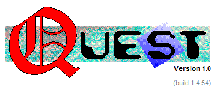
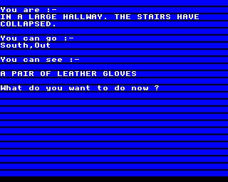
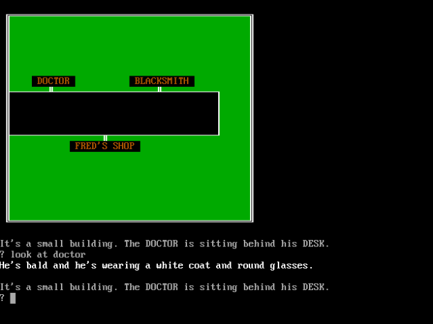
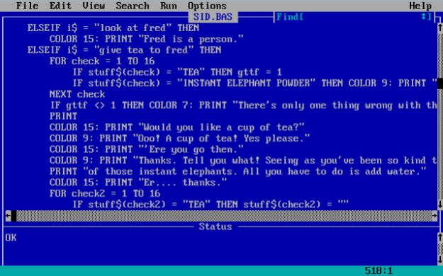
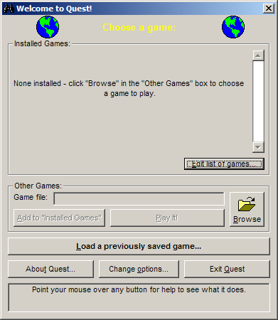
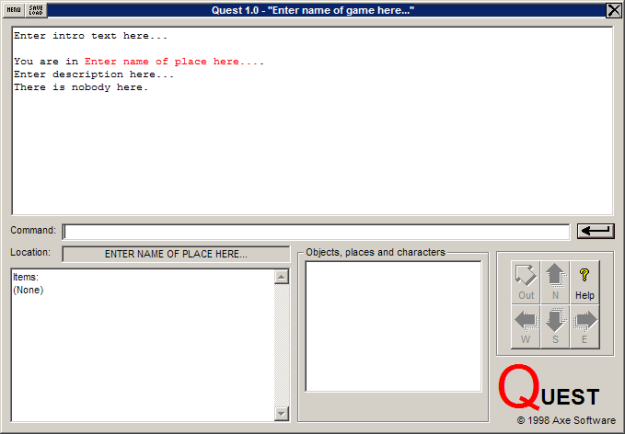

Quest is 15 years old today! I posted the [announcement of Quest 1.0](https://groups.google.com/d/msg/rec.arts.int-fiction/EP4N9x3fBs4/iznybxPCt4sJ) on the rec.arts.int-fiction newsgroup on Saturday 7th November 1998. (And the original link in that post still gets you to the right place today, eventually)

[](http://blog.textadventures.co.uk/wp-content/uploads/2013/10/quest1.png)

So Quest is itself now almost as old as I was when I started writing it. But what got me started on it in the first place?

You're probably expecting me to say something like this... I'd been interested in text adventure games since their heyday in the 1980s. On my family's home computer, I got hooked by classic games like _Zork_, _Hitchhiker's Guide To The Galaxy_ and _Planetfall._ Such wonderful worlds of the imagination! Such crafty puzzles! I would spend hours drawing maps on squared paper and looking out for grues and giving myself eye strain and...

Well, no. That's not how it happened. I never played any of those. In fact, I was never really into text adventures at all.

But then, they were before my time. I was just a bit too young. I first dabbled with a computer in, oh, about 1990 or so. We had an [Acorn Electron](http://en.wikipedia.org/wiki/Acorn_Electron) in our house. We _did_ have a couple of text adventures for that - we had a copy of [Acornsoft](http://en.wikipedia.org/wiki/Acornsoft)'s [Sphinx Adventure](http://www.acornelectron.co.uk/info/acornsoft/i-sphi.html) (never really played it, couldn't get anywhere, found it boring) and my dad had typed in the listing of a game called [Necromancer](http://solutionarchive.com/game/id,2310/) from [Electron User](http://www.acornelectron.co.uk/mags/eu/top_lvl.html) magazine. Which never quite worked properly, as something had been mis-typed somewhere along the line.

[](http://blog.textadventures.co.uk/wp-content/uploads/2013/11/necromancer.gif)

So I was just never that interested in text adventures. I was more into playing whatever shareware games had found their way onto my PC - _Commander Keen_, _Wolfenstein_, _Doom_ and so on. But what I was much more interested in was creating my own. I probably spent more time in front of [QBasic](http://en.wikipedia.org/wiki/QBasic) than any game. And that is where it all begins, really.

**Schoolboy Humour**

In 1994, at the age of 12 I started secondary school. The IT lab there was open at lunchtime for anybody to use. So instead of running around getting exercise, or loitering somewhere else, me and my friends played around with the computers. They were probably 486s, running MS-DOS 6 and Windows 3.1. They were connected to some kind of network but there was no internet access - we'd barely heard of this internet thing anyway back then. There wasn't a whole lot to do other than write silly little programs using QBasic (or Visual Basic 3.0, which was also installed) so that's what we did.

After my schoolfriend Martyn moved house and went to a different school, we kept in touch by writing letters to each other - this being a time before either of us had an email address. We would enclose 3.5" floppy disks to share our latest programming efforts. It was in fact in Martyn's first letter, around January 1995, that he sent me a game he'd written called "_Sid Snibble and the Curse of the Curry Stain_".

I still have a copy, in a heavily nested folder full of archives of archives, and I can still run it today using [QB64](http://www.qb64.net/). It looks like this:

[](http://blog.textadventures.co.uk/wp-content/uploads/2013/10/sid.png)

It was a text adventure, but even this had a graphical element to it - you didn't walk around the game by typing NORTH, SOUTH etc., you moved an ASCII face around with the arrow keys. When you entered a location, you could look at things, speak to characters, pick up items and so on - all in an attempt to solve the mystery of what happened the night before, and why you woke up in the middle of the road in a strange town with a large curry stain down your shirt.

[](http://blog.textadventures.co.uk/wp-content/uploads/2013/10/sidbas.png)

This looked fun. I could write something like this. It would be hilarious! And so I set to work, doing what I'd always done - copying Martyn's ideas, but doing them a lot worse.

So, in April 1995 I wrote my first text adventure game.

It was called... well, there's no easy way to put this. I don't want to rewrite history or tell a lie. I was young and the game was only for me and my friends. It was called "_Where's My Nob?!_"

How I wish that weren't true. How I wish I could sit here and tell you the story of how I poured my soul into a creative work of genius, a work of art, a literary masterpiece. With a title like that, maybe I could claim that it was an earnest work exploring gender issues. But it wasn't. I was 12. The game was an excuse for a load of the kind of sophisticated humour that 12 year olds are known for. Featuring locations such as Dracula's castle, a teacher's house, a corner shop, a dairy, a Skoda dealer and Potato World.

So, a throwaway game that should be played by nobody. But for me, a 12 year old boy who didn't do any kind of creative writing, it was a fun thing to do that got some kind of creative juices flowing.

\[Aside: Although it's not a work that I would ever want anybody to see - indeed, I would be absolutely horrified - I think what it _represents_ is something that still persists as I develop Quest today. Specifically, although I want Quest to be a useful tool for building very high quality works of interactive fiction, there is still a need for something that allows people to create their own _Sid Snibble_s (and, er, to find their own _Nob_? I think deep down my sense of humour remains the same). To give people a way to express themselves, to allow them to develop their artistic sense, to allow them to get started, and then to improve their craft. It's easy to be snobbish about this kind of thing, and to moan about low-quality games, but if we didn't have bad text adventures, it's unlikely we would have very many good ones either.\]

Anyway, back to my, er, game. I sent it to Martyn on a floppy disk together with a second one called "_Make Mrs Booth Friendly!_", a game about my French teacher. Also on that disk, I included a terrible chatbot, "Dr Mad!" who would diagnose your illness, and a fortune teller called "Sadistic Smeg".

Over the following months I wrote some more text adventure games, always full of in-jokes about school, only ever written for my friends, and never to be seen by anybody else ever, certainly not now. "_It's Mad!_", "_Fantasy Land!_", "_Park Parade Adventure!_" and "_The Town of Terror_". It seems the running theme was titles with exclamation marks.

**Making Text Adventures for Windows 95**

Fast forward a few years to 1998, when I'd started dabbling with Visual Basic 5.0 - which meant I was no longer stuck writing programs for DOS, I could create programs for Windows instead, featuring buttons and menus and message boxes and pictures and everything. I was rather stuck for ideas though. I'd spent some time working on a virtual pet, which were all the rage back then, but wanted to try something a bit meatier. I'd just finished my GCSE exams and was looking for something to keep me occupied over the summer break before I started sixth form. I thought back to the text adventures I'd written, and wondered - what would a text adventure game for Windows look like?

I decided to write myself a little engine before writing a game, so I wouldn't have to hard-code everything like I'd done in QBasic. I started coding something that would take in a simple text file which would define all aspects of the game, and handle things such as allowing players to save their progress.

It turned out that I was actually far more interested in creating the engine than I was in writing a game anyway, and I was interested to see what other people might come up with if they used my system. At the time, I was fairly ignorant of any pre-existing systems which would do a similar thing to mine, until somebody suggested I take a look at the rec.arts.int-fiction newsgroup. I started checking out the competition, and reading about [Inform](http://inform-fiction.org/) and [TADS](http://www.tads.org/). It was clear to me that they were difficult for newcomers to use (this was before Inform had a natural language syntax - the syntax of Inform 6 still looks bizarre to me), so it looked like I should be able to get people interested in what I was doing.

I released Quest 1.0, and it looked like this:

[](http://blog.textadventures.co.uk/wp-content/uploads/2013/11/quest.png)

(Those two globes were animated and bounced back and forth between the edges of the screen. For some reason.)

Quest 1.0 loaded text files which were in a simple format I'd devised, called ASL - Adventure Scripting Language. The syntax was simple, designed to be coded by hand using Notepad or similar - there was no visual editor yet ("QDK" appeared the following year).

Here's the Quest 1.0 [Readme file](http://files.textadventures.co.uk/archive/1.0/Readme.rtf) and [ASL Reference](http://files.textadventures.co.uk/archive/1.0/ASL.rtf) if you're interested in some historical detail. You would create games by using Notepad to edit the included template.asl file, which looked like this:

```
' Quest ASL Template
' All sections must exist in the game, though the text sections may be empty
' if desired.
define game <Enter name of game here...>
    asl-version <100>
    game version <1.0>
    game author <You>
    game copyright <© 1998...>
    game info <Enter game info here...>
    start <Enter name of place here...>
    possitems <Enter items separated by commas here...>
    startitems <Enter start items here...>
end define

define room <Enter name of place here...>
    look <Enter description here...>
end define

define text <intro>
Enter intro text here...
end define

define text <win>
Enter win text here...
end define

define text <lose>
Enter lose text here...
end define
```

This file format lasted a long time. It was used right up until Quest 4.x, the last version of which was released in 2011 - albeit heavily extended and changed in various ways over the years.

The empty template looks like this when loaded in Quest 1.0:

[](http://blog.textadventures.co.uk/wp-content/uploads/2013/11/quest-main.png)

The user interface is still very similar to what Quest offers now - in fact, after it was rearranged in Quest 2.1 it has effectively remained an identical layout. There is the game text of course, a command box, a space to show what items you're carrying, and a list of things you can see in the current location (which would show "Look at" and "Take" buttons if something was selected). There are also the compass buttons for easier navigation.

Quest 1.0 supported rooms, characters, objects, things you could pick up ("items"), quantities of things ("collectables"), string variables and some basic script commands. It could play WAV files, show images and display pop-up menus. It supported text formatting, and let you set up your own custom commands using a syntax like "eat #object#" - the same format that is still used in Quest 5 today.

There was a small sample game distributed with Quest 1.0, "_A day in the life of a salesman_". It is of a very similar standard to my QBasic efforts - which is to say stupid, crude and borderline offensive in places. So no, you can't have a copy, but yes, it does still run in Quest 5.4!

What happened next? We'll pick up the story in the next blog post, where I'll talk about how Quest grew, changed and even shrunk over the years to become what it is today.
