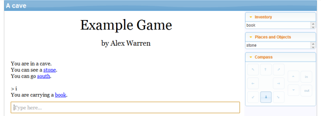
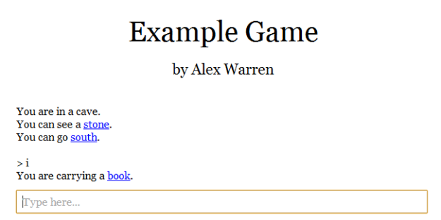

The Windows desktop version of Quest 5.5 Beta is [now available for download](http://textadventures.co.uk/quest/desktop).

This is a relatively small update, with a focus on refining the player interface, and a few other tweaks and enhancements here and there.

**Improving the player interface**

This version features some enhancements to make it easier to create games that look a little more elegant. The location bar and screen border can be toggled off, and you can set a custom display width and padding. There are new display themes, so you can easily change from the Quest Standard theme:

to the simpler "Novella" theme:

And there are a few more fun bonus themes too.

In gamebook mode, the new default is to not to clear the previous page when clicking a link - instead, new text is added to the bottom. (The option to have the screen clear between pages is still available).

**Drawing**

Support has been added for drawing SVG graphics in the custom drawing layer. There are new functions for drawing arrows and arbitrary many-sided shapes. The automatically generated grid map now works when multiple player POV objects are used.

**Tweaks**

Various tweaks have been submitted by Quest users:

- **Pertex** added more gamebook counter functions, as well as contributing some bug fixes.
- **Jay Nabonne** has contributed a tweak to the "invoke" script command.
- **The Pixie** has added a "select" command to the text processor, and updated the text processor's "{if}" to allow not-equals.

**Translations**

- **Pertex** has started work on allowing the Editor to be translated.
- **Guillaume Poulain** has contributed an updated French translation.
- **Katzy** submitted corrections for Dutch.

**Other changes**

- The "return" statement now immediately exits the function.
- The "Pause" request is no longer supported for games written for Quest 5.5 or later.
- You can now create a blank JavaScript file straight from the editor.
- There is a new "Features" tab for both the game and objects, making it easier to toggle Quest features on and off, so you only see the editor tabs you care about.

Thanks to everybody who contributed towards this release - please [download it now](http://textadventures.co.uk/quest/desktop) and submit any bug reports to the [issue tracker](https://quest.codeplex.com/workitem/list/advanced).
