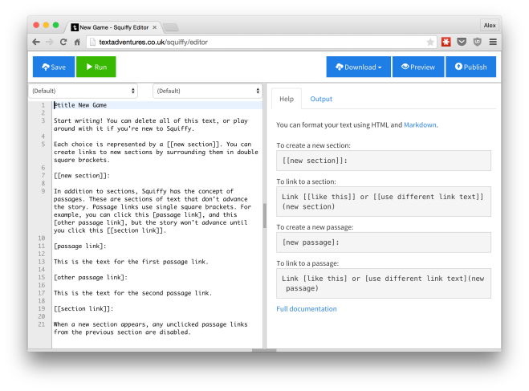

The third release of [Squiffy](http://textadventures.co.uk/squiffy) is now available. The big new feature in this version is **you no longer have to download anything!**

Previously, the only way to use Squiffy was by creating a file in a text editor and compiling it from the command line. You can [still do that](http://docs.textadventures.co.uk/squiffy/install.html), but you can now just [use your web browser instead](http://textadventures.co.uk/squiffy/editor).

In-keeping with the philosophy of trying not to do too many new things in any one release, this first iteration of the editor is intentionally very simple. It's pretty much a text editor in the cloud, with a few Squiffy-specific bells and whistles to make editing a game easier.

You can use the editor without logging in, in which case all changes are automatically saved to your browser (and are automatically re-loaded the next time you come back). Or if you're logged in, you can hit the Save button to sync your game to your account, so you can access it from anywhere.

You can publish your game directly to textadventures.co.uk, or you can export it as HTML and JavaScript to upload to any website (or even wrap with something like PhoneGap to turn it into a mobile app).

As you create sections and passages, the drop-down lists above the editor automatically update. These provide an easy way for you to find your way around your game.

When you run your game, it appears on the right-hand side of the screen, so you don't need to switch between tabs or windows.

If you set [attributes](http://docs.textadventures.co.uk/squiffy/attributes.html) in your game, you can keep track of them by looking at the pane at the bottom of the screen, which logs all attribute changes.

Try it out now at [http://textadventures.co.uk/squiffy/editor](http://textadventures.co.uk/squiffy/editor).

**Open source, of course...**

Both Squiffy and the editor are open source and on GitHub:

- [Squiffy](https://github.com/textadventures/squiffy)
- [Squiffy Editor](https://github.com/textadventures/squiffy-editor)

For Squiffy 4, I'm planning to wrap this HTML-based editor with [Electron](http://electron.atom.io/) (formerly Atom Shell), to create an offline downloadable app that will work on Windows, Mac and Linux. After that, we can start fleshing out the editor with more features - a graphical overview of your game's sections would be an important feature, I think. I'm open to more suggestions!

Enjoy! If you have any questions, post in the [forum](http://forum.textadventures.co.uk/viewforum.php?f=24) or ask at [IF Answers](http://ifanswers.com).
