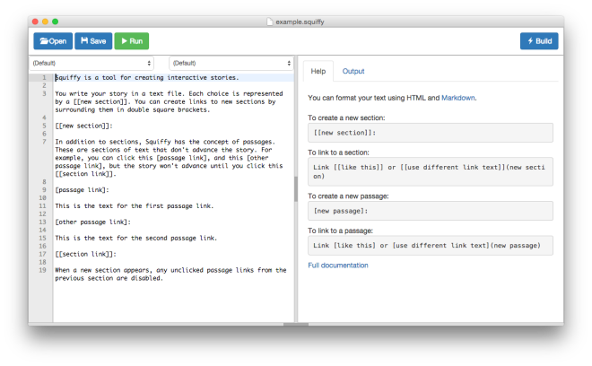

[Squiffy 4 is now available](http://textadventures.co.uk/squiffy). This release brings the editor to Windows, OS X and Linux, so you can now create and edit games offline.

Squiffy is a simple system for writing multiple-choice interactive fiction. It publishes to HTML so you can upload your game anywhere. The quickest way to see it in action is to check out the [documentation](http://docs.textadventures.co.uk/squiffy/), which has a load of live examples - you can see the code and the results in the same place, and play around by editing the examples in the ScratchPad.

With this release, you now have three options for using Squiffy:

- Use your [web browser](http://textadventures.co.uk/squiffy/editor)
- [Download](http://textadventures.co.uk/squiffy) the app for Windows, OS X or Linux
- Use a text editor with the [command-line version](http://docs.textadventures.co.uk/squiffy/cli.html)

The new desktop version of the Squiffy editor takes the web-based editor (created for [Squiffy 3](http://blog.textadventures.co.uk/2015/04/25/squiffy-3-a-new-web-based-editor-for-interactive-fiction/)) and wraps it up using [Electron](http://electron.atom.io/). It's exactly [the same code](https://github.com/textadventures/squiffy-editor), so all future improvements will be available in both the web and desktop versions.

What sort of future improvements? Well, we're nearly at the end of my [Squiffy Roadmap](http://docs.textadventures.co.uk/squiffy/roadmap.html) now, but this is just the beginning. Now we have a fairly simple editor across all platforms for what is still a fairly simple system, we can start to flesh out the features a bit. I'd like to add a graphical view showing how a game's sections and passages connect to each other, and I've got various ideas for how the editor could assist you with building a game - making it a one-click operation to add new sections and passages, showing you which sections and passages are empty or missing, etc.

Both the Squiffy Compiler and Squiffy Editor are open source on GitHub:

- [textadventures/squiffy](https://github.com/textadventures/squiffy)
- [textadventures/squiffy-editor](https://github.com/textadventures/squiffy-editor)

All feedback, suggestions and pull requests are welcome!
