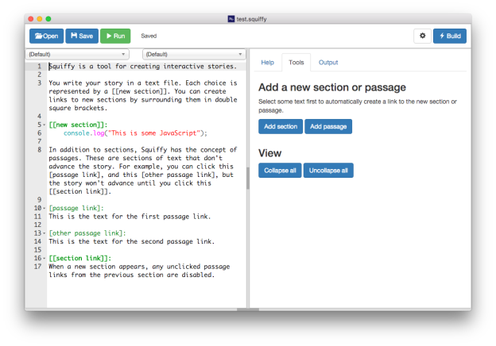

Squiffy 5 is now available - you can use it [in your web browser](http://textadventures.co.uk/squiffy/editor), or download it for [Windows](https://github.com/textadventures/squiffy-editor/releases/download/v5.0/Squiffy.5.0.Windows.exe), [OS X](https://github.com/textadventures/squiffy-editor/releases/download/v5.0/Squiffy.5.0.OS.X.dmg) and [Linux](https://github.com/textadventures/squiffy-editor/releases/download/v5.0/Squiffy.5.0.Linux.zip).

This release makes various enhancements to the Squiffy Editor. The number one request by far has been to add an option to **change the font size** - so that is now done!

There's also improved **syntax highlighting**. Section and passage headers are now highlighted, and in-line JavaScript code gets its own highlighting.

It's now easier to work on larger games. You can **collapse sections and passages**, so it's easier to focus on just the one you're currently editing. The section and passage lists at the top of the screen are now searchable.

You'll find shortcuts to collapse and uncollapse all sections and passages on the new Tools tab. This also features new **shortcut buttons** allowing you to easily add new sections and passages. Let's say you've written a paragraph of text and want to add a link to it. Now you can simply select the text you want to link, hit "Add section" or "Add passage", and a new section or passage of that name will be created, with the text linked to it.

Try it out... Squiffy works [in your web browser](http://textadventures.co.uk/squiffy/editor) without downloading anything, or you can download versions for [Windows](https://github.com/textadventures/squiffy-editor/releases/download/v5.0/Squiffy.5.0.Windows.exe), [OS X](https://github.com/textadventures/squiffy-editor/releases/download/v5.0/Squiffy.5.0.OS.X.dmg) and [Linux](https://github.com/textadventures/squiffy-editor/releases/download/v5.0/Squiffy.5.0.Linux.zip).

Squiffy is free and open source, and you can find both the compiler and editor on GitHub:

- [textadventures/squiffy](https://github.com/textadventures/squiffy)
- [textadventures/squiffy-editor](https://github.com/textadventures/squiffy-editor)
